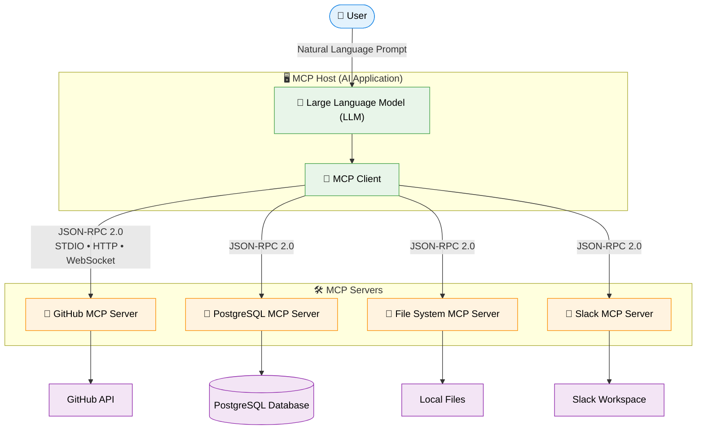
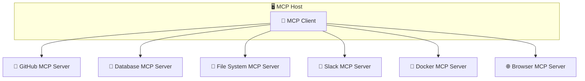
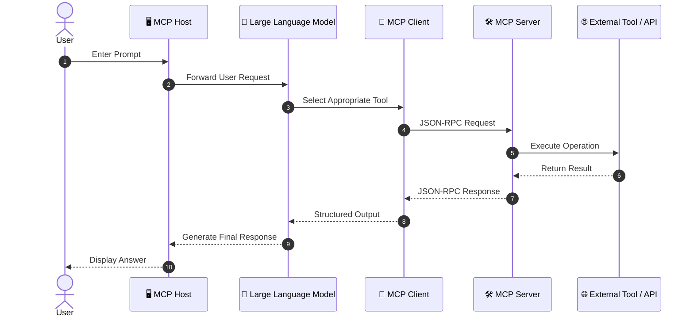

# MCP Architecture

> The **Model Context Protocol (MCP)** follows a **Client–Host–Server architecture** that enables AI applications to securely communicate with external tools, resources, and services using a standardized protocol. This architecture separates AI reasoning from tool execution, making AI applications more modular, secure, and scalable.

Unlike traditional software integrations where applications communicate directly with APIs or databases, MCP introduces an intermediate layer called the **MCP Server**, which acts as a bridge between AI applications and external systems.

---

# Why Does MCP Need an Architecture?

Large Language Models (LLMs) are excellent at understanding and generating natural language, but they cannot directly:

- Access local files
- Query databases
- Call APIs
- Execute terminal commands
- Read project directories
- Manage cloud resources

Instead of giving an AI model unrestricted access to these systems, MCP provides a structured architecture that ensures secure and controlled communication.

The architecture defines **who is responsible for what** during an AI interaction.

---

# High-Level Architecture

The following diagram illustrates how a user request flows through the **MCP Host**, reaches the **MCP Client**, communicates with one or more **MCP Servers** using **JSON-RPC 2.0**, and finally interacts with external systems such as databases, APIs, and file systems.



# Components of MCP Architecture

The MCP architecture consists of three primary components:

1. MCP Host
2. MCP Client
3. MCP Server

Each component has a specific responsibility.

---

# 1. MCP Host

The **MCP Host** is the application that users interact with.

It is responsible for:

- Running the Large Language Model
- Managing conversations
- Displaying responses
- Discovering MCP Servers
- Coordinating tool execution

Think of the Host as the "brain" of the AI application.

Examples of MCP Hosts include:

- Claude Desktop
- Cursor IDE
- VS Code Extensions
- Zed Editor
- Windsurf
- Custom AI Applications

---

### Responsibilities of the Host

The Host is responsible for:

- Managing conversations
- Maintaining context
- Connecting to MCP Servers
- Asking permission before sensitive operations
- Selecting the appropriate server
- Sending requests to MCP Clients
- Returning results to users

The Host **does not directly execute tools**.

Instead, it delegates those tasks to MCP Servers.

---

# 2. MCP Client

The **MCP Client** acts as the communication layer between the Host and MCP Servers.

It is responsible for:

- Discovering available servers
- Establishing connections
- Sending requests
- Receiving responses
- Handling protocol communication

The Client speaks the MCP protocol.

Think of it as a translator that converts AI requests into standardized MCP messages.

---

### Responsibilities of the MCP Client

- Establish server connections
- Discover available tools
- Discover resources
- Discover prompts
- Execute tool requests
- Handle JSON-RPC communication
- Receive execution results
- Forward results back to the Host

---

### One Client, Multiple Servers

An **MCP Client** can connect to **multiple MCP Servers** at the same time. Each server provides a specific capability (such as GitHub, databases, files, or messaging platforms). The AI selects the appropriate server based on the user's request.


This enables AI applications to combine information from multiple systems.

---

# 3. MCP Server

The **MCP Server** is a lightweight application that exposes external capabilities to AI applications.

Instead of connecting directly to GitHub, PostgreSQL, or your file system, the AI communicates with an MCP Server that manages those interactions.

Each MCP Server is responsible for a specific domain or service.

Examples include:

- GitHub MCP Server
- PostgreSQL MCP Server
- Filesystem MCP Server
- Google Drive MCP Server
- Slack MCP Server
- Docker MCP Server

---

### Responsibilities of an MCP Server

An MCP Server can:

- Read files
- Write files
- Query databases
- Call APIs
- Execute terminal commands
- Return resources
- Provide prompts
- Expose tools
- Authenticate users
- Protect credentials

The AI model never directly accesses these systems.

---

# Communication Flow

Every interaction in the **Model Context Protocol (MCP)** follows a well-defined request-response lifecycle. The AI doesn't directly access external tools—it communicates through the **MCP Client**, which exchanges **JSON-RPC 2.0** messages with one or more **MCP Servers**.

## End-to-End Communication Flow



---

## Simplified Flow

```text
👤 User
    │
    ▼
🖥️ MCP Host
    │
    ▼
🤖 Large Language Model (LLM)
    │
    ▼
🔌 MCP Client
    │
    │ JSON-RPC 2.0
    ▼
🛠️ MCP Server
    │
    ▼
🌐 External Tool / API / Database
    │
    ▲
    │ Result
🛠️ MCP Server
    ▲
    │ JSON-RPC Response
🔌 MCP Client
    ▲
🤖 LLM
    ▲
🖥️ MCP Host
    ▲
👤 User
```

---

## Step-by-Step Workflow

| Step | Description |
|------|-------------|
| **1️⃣ User Prompt** | The user submits a request in natural language. |
| **2️⃣ LLM Analysis** | The LLM understands the intent and determines whether an external tool is needed. |
| **3️⃣ Tool Selection** | The MCP Client discovers and selects the appropriate MCP Server. |
| **4️⃣ JSON-RPC Request** | The client sends a structured JSON-RPC request to the selected server. |
| **5️⃣ Tool Execution** | The MCP Server interacts with an external API, database, or local resource. |
| **6️⃣ Response Generation** | The server returns structured data to the client. |
| **7️⃣ Final Answer** | The LLM combines the tool output with its reasoning and generates a natural-language response for the user. |

> **Key Idea:** The **LLM never communicates directly with external tools**. All communication flows through the **MCP Client** using the standardized **Model Context Protocol (MCP)**.
# Communication Protocol

MCP uses **JSON-RPC 2.0** as its communication protocol.

JSON-RPC is lightweight, language-independent, and easy to implement.

A typical request looks like this:

```json
{
  "jsonrpc": "2.0",
  "id": 1,
  "method": "tools/list"
}
```

Example response:

```json
{
  "jsonrpc": "2.0",
  "id": 1,
  "result": {
    "tools": [
      {
        "name": "read_file",
        "description": "Read a local file"
      }
    ]
  }
}
```

---

# Transport Layer

MCP supports multiple transport mechanisms.

## STDIO

Standard Input/Output is commonly used when the MCP Server runs locally.

```
Host
 │
STDIN / STDOUT
 │
Server
```

Advantages:

- Fast
- Simple
- Local execution
- No network configuration

---

## Server-Sent Events (SSE)

Used when the MCP Server runs remotely.

```
Host
 │
HTTP
 │
SSE
 │
Remote MCP Server
```

Advantages:

- Remote communication
- Cloud deployment
- Multi-user support

---

# Resources, Tools, and Prompts

An MCP Server can expose three primary capabilities.

---

## Resources

Resources provide information to the AI.

Examples:

- Files
- Database records
- Logs
- Documentation
- API responses

Resources are read-only context.

---

## Tools

Tools perform actions.

Examples:

- Execute SQL
- Send email
- Create GitHub issue
- Run terminal command
- Upload files

Tools change the external world.

---

## Prompts

Prompts are reusable templates.

Examples:

- Code review template
- Documentation template
- Bug report template
- SQL assistant template

Prompts help standardize workflows.

---

# Example Workflow

Suppose a developer asks:

> "Find all open GitHub issues assigned to me."

Step 1

The Host receives the request.

↓

Step 2

The LLM determines that it needs GitHub data.

↓

Step 3

The Client sends a `tools/list` request.

↓

Step 4

The GitHub MCP Server returns available tools.

↓

Step 5

The model chooses:

```
get_assigned_issues
```

↓

Step 6

The Client sends:

```
tools/call
```

↓

Step 7

GitHub Server communicates with GitHub API.

↓

Step 8

Issues are returned.

↓

Step 9

The Host formats the response.

↓

Step 10

The user receives the answer.

---

# Security Architecture

One of MCP's biggest strengths is security.

```
AI Model
     │
     ▼
MCP Client
     │
     ▼
MCP Server
     │
     ▼
External API
```

Notice that:

- API keys stay inside the MCP Server.
- Database credentials remain private.
- Authentication is managed by the Server.
- The AI only receives the information it needs.

This architecture significantly reduces security risks.

---

# Advantages of MCP Architecture

| Feature | Benefit |
|----------|---------|
| Modular Design | Components are independent and reusable |
| Standard Protocol | Works across multiple AI applications |
| Secure Communication | Credentials remain protected |
| Scalability | Multiple servers can be connected simultaneously |
| Extensibility | Easy to add new tools and services |
| Interoperability | Different AI applications can use the same MCP Servers |

---

# Architecture Summary

The MCP architecture is built around three key components:

| Component | Role |
|-----------|------|
| **Host** | Runs the AI application and manages conversations |
| **Client** | Communicates with MCP Servers using the MCP protocol |
| **Server** | Exposes external tools, resources, and prompts |

Together, these components create a secure, modular, and scalable system that allows AI applications to interact with the real world without directly accessing sensitive resources.

---

# Key Takeaways

- MCP follows a **Client–Host–Server architecture**.
- The **Host** manages the AI application and user interaction.
- The **Client** handles communication using the MCP protocol.
- The **Server** exposes external tools, resources, and prompts.
- Communication uses **JSON-RPC 2.0** over **STDIO** or **SSE**.
- MCP Servers securely interact with external systems such as GitHub, databases, cloud services, and local files.
- This architecture improves security, scalability, interoperability, and maintainability for modern AI applications.