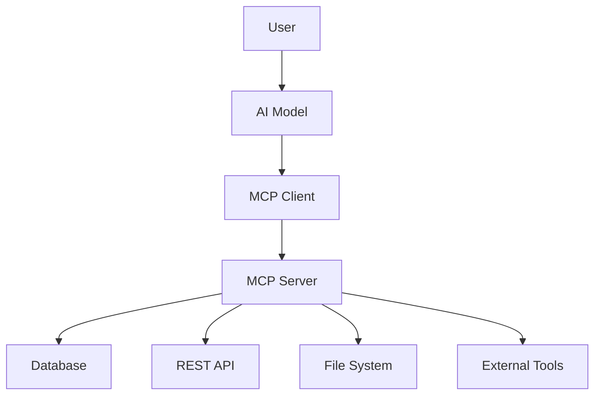
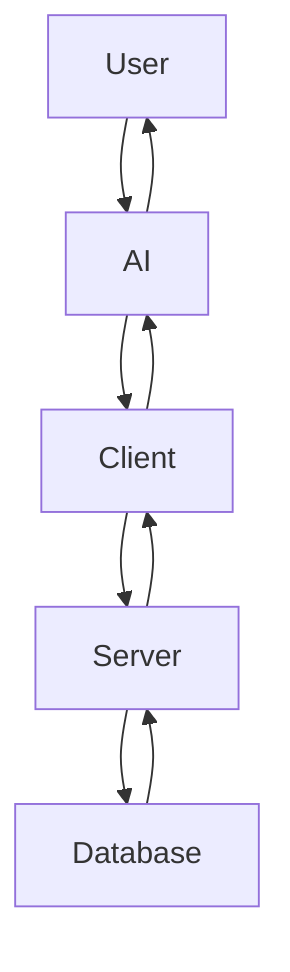
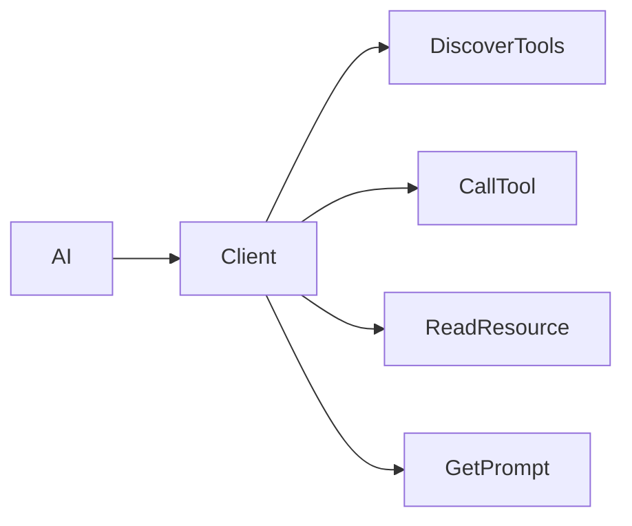
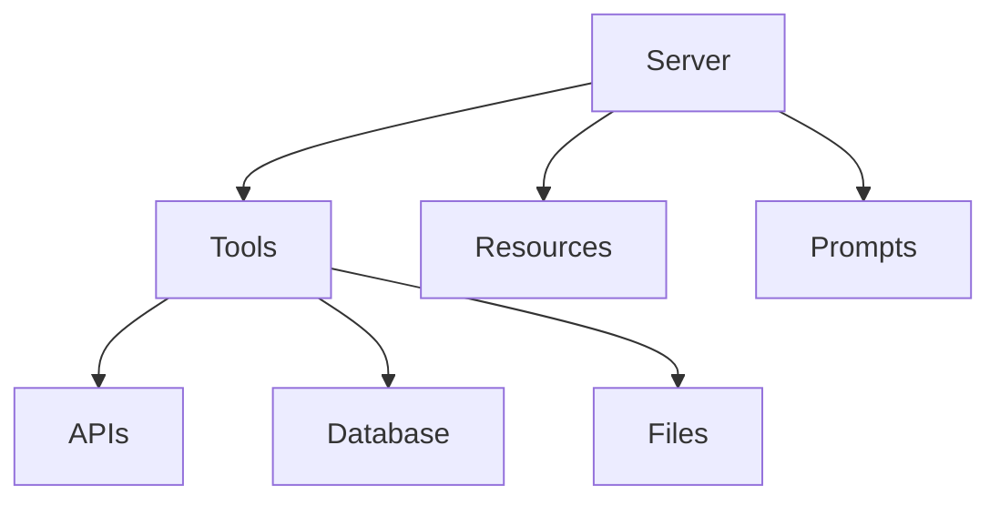
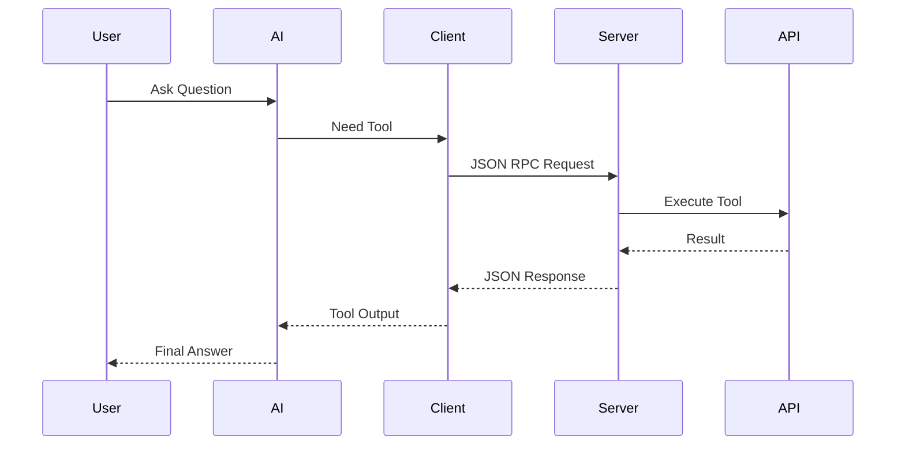
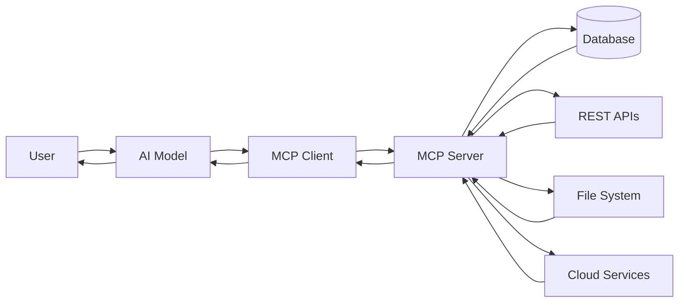

# Module 02 - MCP Architecture

> Learn how the Model Context Protocol (MCP) works internally and understand how AI models communicate with tools, databases, APIs, and external applications.

---

# Table of Contents

- What is MCP Architecture?
- High-Level Architecture
- Components of MCP
- User Flow
- Client
- Server
- Transport Layer
- Communication Flow
- Request Lifecycle
- Types of MCP Servers
- Stateless vs Stateful Communication
- Security
- Architecture Diagram
- Sequence Diagram
- Real World Example
- Advantages
- Summary

---

# What is MCP Architecture?

The **Model Context Protocol (MCP)** architecture defines how an AI model communicates with external tools and applications.

Instead of giving AI direct access to APIs, databases, or operating systems, MCP introduces a standardized architecture that acts as a bridge between the AI model and external resources.

Think of MCP as:

> **USB-C for AI**

Just as USB-C allows different devices to communicate using one standard, MCP allows AI models to communicate with any tool using one protocol.

---

# High-Level Architecture


---

# Mermaid Architecture Diagram



---

# User Request Flow

Suppose the user asks:

> "What is my account balance?"

The flow is:

```
User

↓

AI Model

↓

MCP Client

↓

MCP Server

↓

Bank Database

↓

MCP Server

↓

MCP Client

↓

AI Model

↓

User receives answer
```

---

# Request Flow Diagram



---

# Main Components of MCP

MCP architecture consists of four major components.

1. User/Host
2. MCP Client
3. MCP Server
4. External Resources

Let's understand each one.

---

# 1. User

The user interacts with the AI using natural language.

Example:

```
Find today's weather.
```

or

```
Create a GitHub repository.
```

The user never communicates directly with the MCP server.

Instead:

```
User
↓

AI Model
↓

MCP Client
```

---

# 2. AI Model

The AI model understands the user's intent.

Example:

User:

```
Show me my calendar.
```

The AI understands:

```
Intent:
Retrieve calendar events
```

But the AI itself does not access Google Calendar.

Instead it asks the MCP Client.

---

# 3. MCP Client

The MCP Client is the bridge between the AI model and the MCP server.

It performs several important tasks.

Responsibilities:

- Sends requests
- Receives responses
- Starts servers
- Maintains connection
- Discovers tools
- Calls tools
- Handles errors
- Converts responses

Example:

```
AI:
Need weather information

↓

Client

↓

Calls Weather Server
```

---

## Client Responsibilities

```
User Request

↓

Understand Tool Needed

↓

Connect to MCP Server

↓

Send JSON-RPC Request

↓

Receive Response

↓

Return to AI
```

---

# MCP Client Diagram



---

# 4. MCP Server

The MCP Server exposes capabilities.

It tells the AI:

- What tools exist
- What resources exist
- What prompts exist

The server contains business logic.

Example:

Weather Server

```
Tool:

get_weather(city)
```

GitHub Server

```
Tool:

create_repository(name)
```

Database Server

```
Tool:

fetch_user(id)
```

---

## Server Responsibilities

- Register tools
- Register prompts
- Register resources
- Execute logic
- Connect databases
- Call APIs
- Return structured responses

---

# MCP Server Diagram



---

# Transport Layer

The transport layer carries communication between the client and server.

Think of it as a communication channel.

Without transport:

```
Client ❌ Server
```

With transport:

```
Client ===== Transport ===== Server
```

---

# Supported Transports

MCP currently supports multiple transports.

Common ones include:

- STDIO
- HTTP
- WebSocket
- Streamable HTTP

---

## STDIO

```
Client

↓

stdin

↓

Server

↓

stdout

↓

Client
```

Used when:

- Running locally
- Desktop apps
- Claude Desktop
- Cursor

Advantages:

- Fast
- Easy
- Secure

---

## HTTP

```
Client

↓

HTTP Request

↓

Server

↓

HTTP Response
```

Used for:

- Cloud services
- Remote servers
- APIs

---

## WebSocket

Provides persistent communication.

```
Client

⇄

Server
```

Useful for:

- Live chat
- Streaming
- Real-time updates

---

# Communication Protocol

MCP uses **JSON-RPC 2.0**.

Example request

```json
{
  "jsonrpc": "2.0",
  "id": 1,
  "method": "tools/call",
  "params": {
    "name": "get_weather",
    "arguments": {
      "city": "Mumbai"
    }
  }
}
```

---

Example response

```json
{
  "jsonrpc": "2.0",
  "id": 1,
  "result": {
    "temperature": "30°C"
  }
}
```

---

# Communication Flow



---

# Request Lifecycle

```
User asks question

↓

AI understands request

↓

Client selects server

↓

Server executes tool

↓

Tool accesses API

↓

Result returned

↓

AI generates response

↓

User receives answer
```

---

# Tool Discovery

Before calling tools, the client asks:

```
What tools are available?
```

Server replies:

```
Search

Weather

Calculator

GitHub

Database
```

The AI then decides which tool to use.

---

# Resources

Resources are read-only information.

Examples:

- PDF
- Markdown
- CSV
- Logs
- Database Records

Example:

```
read://company_handbook.md
```

---

# Prompts

Servers can also provide reusable prompts.

Example:

```
Summarize Meeting

Explain Code

Review PR

Translate Text
```

The AI can reuse these prompts.

---

# External Resources

The MCP Server can communicate with many external systems.

Examples:

```
Database

REST API

Filesystem

Cloud Storage

GitHub

Slack

Google Drive

Notion

Jira

Docker

Kubernetes
```

---

# Types of MCP Servers

### Database Server

Connects AI with databases.

Examples:

- PostgreSQL
- MySQL
- SQLite
- MongoDB

---

### File Server

Reads and writes files.

Examples:

- Markdown
- Images
- PDFs
- CSV

---

### API Server

Communicates with REST APIs.

Examples:

- Weather API
- GitHub API
- Stripe API
- OpenAI API

---

### Local Tool Server

Runs local applications.

Examples:

- Terminal
- VS Code
- Docker
- Git

---

# Stateless vs Stateful Communication

## Stateless

Each request is independent.

```
Request 1

↓

Done

Request 2

↓

Done
```

---

## Stateful

The server remembers previous interactions.

Useful for:

- Chat sessions
- Authentication
- Long-running workflows

---

# Security

MCP servers should follow security best practices.

Examples:

- Authentication
- Authorization
- Permission checks
- Input validation
- Encrypted communication
- Secret management
- Rate limiting
- Logging

Never expose:

- API Keys
- Passwords
- Database credentials

---

# Advantages of MCP Architecture

✅ Standard communication

✅ Reusable tools

✅ Easy integration

✅ AI model independent

✅ Modular design

✅ Secure architecture

✅ Easy maintenance

✅ Scalable

✅ Extensible

---

# Real World Example

Imagine asking:

> "Create a GitHub repository named MCP-Learning."

Flow:

```
User

↓

AI Model

↓

MCP Client

↓

GitHub MCP Server

↓

GitHub API

↓

Repository Created

↓

Server

↓

Client

↓

AI

↓

User
```

---

# Complete Architecture Overview



---

# Module Summary

In this module, you learned:

- What MCP Architecture is
- How the User interacts with AI
- Role of the MCP Client
- Role of the MCP Server
- Transport Layer
- JSON-RPC Communication
- Request Lifecycle
- Tool Discovery
- Resources and Prompts
- External Integrations
- Security Best Practices
- Complete End-to-End Architecture

---

# What's Next?

➡️ **Module 03 - MCP Components**

In the next module, you will explore:

- Tools
- Resources
- Prompts
- Sampling
- Roots
- Logging
- Capabilities
- Initialization Process

These are the core building blocks that every MCP server provides.