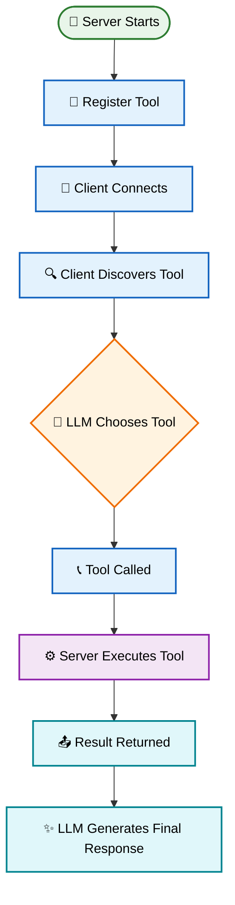
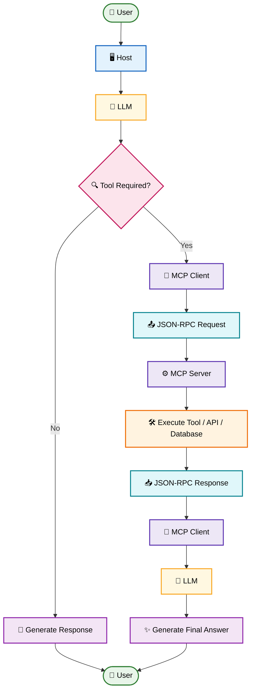

# MCP Tools - Theory

> A complete theoretical guide to understanding **Tools** in the **Model Context Protocol (MCP)**.

---

# Table of Contents

1. Introduction
2. What is an MCP Tool?
3. Why Do We Need Tools?
4. How Tools Work
5. Tool Lifecycle
6. Tool Metadata
7. Tool Input & Output Schemas
8. Tool Discovery
9. Tool Selection by the LLM
10. Tool Invocation
11. Tool Execution Flow
12. Stateless Nature of Tools
13. Multiple Tool Calls
14. Tool Categories
15. Benefits of MCP Tools
16. Limitations
17. Best Practices
18. Common Mistakes
19. Real-World Examples
20. Summary

---

# Introduction

Large Language Models (LLMs) are excellent at understanding and generating natural language. However, they have one major limitation:

- They cannot directly interact with external systems.
- They cannot access live information.
- They cannot modify files on your computer.
- They cannot call APIs on their own.
- They cannot execute arbitrary code by themselves.

This is where **MCP Tools** become essential.

A Tool gives an AI model a safe and standardized way to interact with the outside world.

Instead of embedding custom integrations into every AI application, MCP provides a common protocol that allows AI assistants to discover and use tools from any compatible MCP server.

---

# What is an MCP Tool?

An **MCP Tool** is an executable function exposed by an MCP Server that performs a specific task on behalf of an AI model.

Think of a tool as a remote function that the AI can invoke whenever it needs external capabilities.

Examples include:

- Reading files
- Writing files
- Searching the web
- Calling REST APIs
- Running SQL queries
- Executing Python code
- Performing calculations
- Sending emails
- Generating images

A tool does **one well-defined job** and returns structured results.

---

# Simple Analogy

Imagine the AI is a chef.

The chef knows recipes but cannot leave the kitchen.

Whenever the chef needs ingredients, someone else must fetch them.

```
Chef (LLM)

↓

Assistant (Tool)

↓

Grocery Store

↓

Ingredients

↓

Chef
```

The assistant represents the MCP Tool.

The chef decides **what** is needed.

The assistant performs **how** to obtain it.

---

# Why Do We Need Tools?

Without tools, an AI is limited to its training data.

For example:

User:

```
What is today's weather?
```

The AI cannot know the current weather.

Instead, it requests a Weather Tool.

```
User

↓

LLM

↓

Weather Tool

↓

Weather API

↓

Temperature

↓

LLM

↓

Answer
```

The same idea applies to:

- Databases
- Cloud Services
- Local Files
- Browsers
- Git
- Docker
- Operating System
- External APIs

---

# How Tools Work

An MCP Tool is never executed directly by the language model.

Instead, the model creates a structured request.

```
LLM

↓

Tool Request

↓

MCP Client

↓

JSON-RPC

↓

MCP Server

↓

Tool Function

↓

Result

↓

LLM
```

The language model never accesses your system directly.

Everything passes through the MCP protocol.

---

# Tool Lifecycle

Every tool in the **Model Context Protocol (MCP)** follows a consistent lifecycle—from server startup to returning the final AI response.



## Lifecycle Stages

| Stage | Description |
|--------|-------------|
| 🚀 **Server Starts** | The MCP server launches and initializes its environment. |
| 📝 **Register Tool** | Tools are registered with names, descriptions, and input schemas. |
| 🔗 **Client Connects** | An MCP client establishes a connection with the server. |
| 🔍 **Client Discovers Tool** | The client retrieves the list of available tools and their capabilities. |
| 🧠 **LLM Chooses Tool** | Based on the user's request, the AI decides whether a tool should be invoked. |
| 📞 **Tool Called** | The MCP client sends a JSON-RPC request with the required arguments. |
| ⚙️ **Server Executes Tool** | The server validates inputs and executes the requested tool or function. |
| 📤 **Result Returned** | The execution result is sent back to the client using a JSON-RPC response. |
| ✨ **LLM Generates Final Response** | The AI combines the tool output with reasoning to generate the final answer for the user. |

> **Note:** Every MCP tool invocation follows this same lifecycle, regardless of whether the tool accesses an API, database, filesystem, AI model, or any other external service.
---

# Tool Metadata

Every MCP Tool contains metadata that describes what it does.

Typical metadata includes:

| Property | Description |
|----------|-------------|
| Name | Unique identifier |
| Description | Human-readable explanation |
| Input Schema | Required parameters |
| Output Schema | Response structure |
| Function | Actual implementation |

Example:

```
Tool Name

weather
```

Description

```
Returns current weather information.
```

Input

```json
{
  "city": "London"
}
```

Output

```json
{
  "temperature": 27,
  "condition": "Sunny"
}
```

Metadata helps the AI understand when and how to use the tool.

---

# Tool Input Schema

A schema defines the data the tool expects.

Example:

```json
{
  "type": "object",
  "properties": {
    "city": {
      "type": "string"
    }
  },
  "required": [
    "city"
  ]
}
```

This tells the AI:

- The input must be an object.
- It must contain a string called `city`.
- The field is required.

Schemas prevent invalid tool calls.

---

# Tool Output Schema

Tools return structured data.

Example:

```json
{
  "temperature": 30,
  "humidity": 78,
  "condition": "Cloudy"
}
```

Structured outputs are easier for the AI to understand and combine with other tools.

---

# Tool Discovery

Before a model can use a tool, it must know that the tool exists.

The MCP Client asks the server for available tools.

```
Client

↓

tools/list

↓

Server
```

Example response:

```
Weather

Calculator

Search

Read File

Write File

SQL Query

Git Status
```

The LLM now knows the available capabilities.

---

# Tool Selection by the LLM

The AI does not call every tool.

It first decides whether a tool is necessary.

Example:

User:

```
What is 2 + 2?
```

No tool required.

The AI answers directly.

---

User:

```
Read report.pdf
```

A File Tool is required.

---

User:

```
Search today's AI news.
```

A Search Tool is required.

The LLM selects the appropriate tool based on the user's intent.

---

# Tool Invocation

After selecting a tool, the model prepares the required arguments.

Example:

```
Tool

Weather
```

Arguments

```json
{
  "city": "Tokyo"
}
```

The MCP Client sends this request to the server.

The server validates the arguments before execution.

---

# Tool Execution Flow



## Execution Steps

| Step | Component | Description |
|------|-----------|-------------|
| 1 | 👤 User | Sends a prompt or request. |
| 2 | 🖥️ Host | Receives the prompt and forwards it to the LLM. |
| 3 | 🧠 LLM | Understands the request and decides whether a tool is needed. |
| 4 | 🔍 Tool Decision | Determines if external capabilities are required. |
| 5 | 🔌 MCP Client | Creates a JSON-RPC request. |
| 6 | ⚙️ MCP Server | Receives the request and routes it to the appropriate tool. |
| 7 | 🛠️ Execute Tool | Runs an API, database query, filesystem operation, or custom function. |
| 8 | 📥 JSON-RPC Response | Returns the execution result. |
| 9 | 🧠 LLM | Interprets the tool output and combines it with reasoning. |
| 10 | ✨ Final Answer | Generates the final response and sends it back to the user. |

> **Key Idea:** The Model Context Protocol (MCP) standardizes communication between AI models and external tools using **JSON-RPC**, making tool execution reliable, interoperable, and platform-independent.

> **Note:**  
> Model Context Protocol (MCP) uses the JSON-RPC standard to provide reliable, secure, and standardized communication between AI models and external tools, enabling seamless interoperability across different applications.

# Stateless Nature of Tools

Most MCP tools are **stateless**.

This means each call is independent.

Example:

Call 1

```
Read notes.txt
```

Call 2

```
Read report.pdf
```

The second call does not automatically remember the first.

If memory is required, it must be managed by the Host or Server.

---

# Multiple Tool Calls

Complex tasks often require several tools.

Example request:

```
Search today's Bitcoin price and save it to a file.
```

Execution:

```
Search Tool

↓

Bitcoin API

↓

Price

↓

Write File Tool

↓

bitcoin.txt

↓

Response
```

The AI coordinates multiple tool invocations to complete the task.

---

# Tool Categories

## File Tools

Examples:

- Read File
- Write File
- Delete File
- Rename File

---

## Database Tools

Examples:

- SELECT
- INSERT
- UPDATE
- DELETE

---

## API Tools

Examples:

- REST API
- GraphQL
- SOAP

---

## Search Tools

Examples:

- Google Search
- Enterprise Search
- Documentation Search

---

## Browser Tools

Examples:

- Open Website
- Fill Forms
- Click Buttons
- Download Files

---

## Programming Tools

Examples:

- Python
- JavaScript
- Shell
- Bash

---

## Cloud Tools

Examples:

- AWS
- Azure
- Google Cloud
- Firebase

---

## AI Tools

Examples:

- Image Generation
- Speech Recognition
- Translation
- OCR

---

# Benefits of MCP Tools

## Standardized Communication

Every tool follows the same protocol.

---

## Language Independent

Servers can be written in:

- Python
- JavaScript
- Go
- Rust
- Java
- C#

---

## Secure

The AI cannot directly execute arbitrary code.

Only approved tools are exposed.

---

## Modular

Each tool performs one responsibility.

This makes systems easier to maintain.

---

## Scalable

New tools can be added without modifying the AI model.

---

## Reusable

The same tool can serve multiple AI applications.

---

# Limitations

Tools are powerful, but they have some limitations.

- Network latency
- API failures
- Permission restrictions
- Invalid arguments
- Rate limits
- Authentication requirements
- Server downtime

Developers should always handle these cases gracefully.

---

# Best Practices

✔ Keep each tool focused on one responsibility.

✔ Write clear descriptions.

✔ Validate all inputs.

✔ Return structured outputs.

✔ Handle errors consistently.

✔ Avoid exposing dangerous operations.

✔ Keep execution fast.

✔ Log tool activity for debugging.

✔ Design tools to be reusable.

---

# Common Mistakes

❌ Creating one tool that does everything.

❌ Returning plain text instead of structured data.

❌ Missing input validation.

❌ Using ambiguous tool names.

❌ Ignoring error handling.

❌ Returning inconsistent response formats.

❌ Exposing sensitive operations without permission checks.

---

# Real-World Examples

## Example 1 — Weather Assistant

User:

```
What's the weather in Paris?
```

Workflow:

```
LLM

↓

Weather Tool

↓

Weather API

↓

Forecast

↓

LLM

↓

Answer
```

---

## Example 2 — File Assistant

User:

```
Open README.md
```

Workflow:

```
LLM

↓

Read File Tool

↓

File System

↓

Contents

↓

LLM
```

---

## Example 3 — Database Assistant

User:

```
Show all employees.
```

Workflow:

```
LLM

↓

Database Tool

↓

SQL Server

↓

Rows

↓

LLM
```

---

## Example 4 — Coding Assistant

User:

```
Run this Python script.
```

Workflow:

```
LLM

↓

Python Tool

↓

Python Runtime

↓

Output

↓

LLM
```

---

# Key Takeaways

- Tools extend the capabilities of an LLM beyond its training data.
- MCP provides a standardized way to expose and use tools.
- Tools are discovered dynamically by the client.
- The LLM decides when a tool is needed.
- Tools receive structured inputs and return structured outputs.
- Multiple tools can work together to solve complex tasks.
- Security, validation, and modularity are core design principles.

---

# Summary

MCP Tools are the bridge between an AI model and the external world. They enable language models to interact with files, databases, APIs, browsers, cloud services, and countless other systems in a secure and standardized way.

By separating reasoning (handled by the LLM) from execution (handled by tools), MCP creates AI applications that are more powerful, extensible, maintainable, and interoperable across different platforms and programming languages.

Understanding how tools are defined, discovered, selected, invoked, and executed is a foundational step toward building robust MCP-based AI systems.