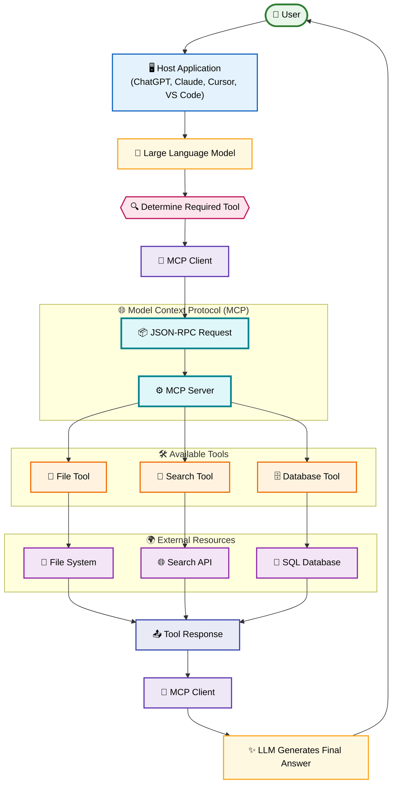

# MCP Tools - Architecture

> A comprehensive guide to understanding the architecture of **Tools** in the **Model Context Protocol (MCP)**.

---

# Table of Contents

1. Introduction
2. High-Level Architecture
3. Core Components
4. How Tool Architecture Works
5. Architecture Layers
6. Tool Registration
7. Tool Discovery
8. Tool Invocation
9. Tool Execution
10. Response Flow
11. Internal Communication
12. JSON-RPC Communication
13. Security Architecture
14. Error Handling
15. Architecture Example
16. Complete Architecture Diagram
17. Best Practices
18. Summary

---

# Introduction

In the Model Context Protocol (MCP), **Tools** are not directly executed by the AI model. Instead, they follow a structured architecture where multiple components work together to safely execute external actions.

This layered architecture ensures:

- Standardized communication
- Security
- Scalability
- Extensibility
- Language independence
- Easy integration

The AI focuses only on **reasoning**, while the MCP Server is responsible for **execution**.

---

# High-Level Architecture

```
                    User
                      │
                      ▼
             AI Host Application
      (Claude Desktop / VS Code / Cursor)
                      │
                      ▼
              Large Language Model
                      │
      Decides whether a Tool is needed
                      │
                      ▼
                 MCP Client
          (JSON-RPC Communication)
                      │
══════════════════════╪══════════════════════
                MCP Protocol Boundary
══════════════════════╪══════════════════════
                      │
                      ▼
                 MCP Server
                      │
             Tool Execution Engine
                      │
      ┌───────────────┼────────────────┐
      │               │                │
      ▼               ▼                ▼
 File System      Database         REST APIs
      │               │                │
      ▼               ▼                ▼
 Browser        Python Runtime     Cloud APIs
```

Every component has a specific responsibility.

---

# Core Components

The architecture consists of six primary components.

```
User
 ↓
Host
 ↓
LLM
 ↓
MCP Client
 ↓
MCP Server
 ↓
External Resources
```

Each component communicates with the next using well-defined interfaces.

---

# Component 1 — User

The user initiates a request.

Example:

```
Read README.md

Search today's weather

Calculate 245 × 87

Create report.pdf
```

The user never interacts directly with tools.

---

# Component 2 — Host Application

The Host is the application that embeds the language model.

Examples include:

- Claude Desktop
- Cursor
- VS Code
- ChatGPT Desktop
- AI IDEs
- Custom Applications

Responsibilities:

- Receives user input
- Maintains conversation
- Displays responses
- Connects to MCP Client

---

# Component 3 — Large Language Model (LLM)

The LLM analyzes the user's request.

Its responsibilities include:

- Understanding intent
- Deciding if a tool is required
- Selecting the appropriate tool
- Generating tool arguments
- Interpreting tool responses
- Producing the final answer

The LLM **never executes tools directly**.

---

# Component 4 — MCP Client

The MCP Client acts as the bridge between the LLM and the MCP Server.

Responsibilities:

- Discover available tools
- Send JSON-RPC requests
- Receive responses
- Validate communication
- Handle protocol messages

Think of it as a translator between the AI model and external services.

---

# Component 5 — MCP Server

The MCP Server hosts all available tools.

Responsibilities:

- Register tools
- Advertise available tools
- Validate requests
- Execute tool functions
- Return structured results
- Handle execution errors

The server owns the actual implementation of each tool.

---

# Component 6 — External Resources

Tools often interact with external systems.

Examples:

```
File System

Database

REST API

Operating System

Python Runtime

Docker

Git

Cloud Services

IoT Devices
```

These systems perform the actual work requested by the tool.

---

# Overall Tool Architecture

```
                     User
                       │
                       ▼
              "Read report.pdf"
                       │
                       ▼
                Host Application
                       │
                       ▼
              Large Language Model
                       │
     Determines File Tool is required
                       │
                       ▼
                 MCP Client
                       │
         JSON-RPC Tool Request
                       │
                       ▼
                 MCP Server
                       │
              Read File Tool
                       │
                       ▼
                 File System
                       │
                 Reads report.pdf
                       │
                       ▼
                File Contents
                       │
                       ▼
                 MCP Server
                       │
                JSON-RPC Response
                       │
                       ▼
                 MCP Client
                       │
                       ▼
                      LLM
                       │
                Final Explanation
                       │
                       ▼
                     User
```

---

# Architecture Layers

The architecture can be viewed as five logical layers.

```
──────────────────────────────
Presentation Layer
──────────────────────────────

User

Host

──────────────────────────────
Reasoning Layer
──────────────────────────────

LLM

──────────────────────────────
Communication Layer
──────────────────────────────

MCP Client

JSON-RPC

──────────────────────────────
Execution Layer
──────────────────────────────

MCP Server

──────────────────────────────
Resource Layer
──────────────────────────────

Files

Database

APIs

Cloud

Browser

Operating System
```

Each layer has a clearly defined role.

---

# Tool Registration

When the MCP Server starts, it registers all available tools.

Example:

```
Server Starts

↓

Register read_file()

↓

Register write_file()

↓

Register search()

↓

Register calculator()

↓

Server Ready
```

Only registered tools are available to clients.

---

# Tool Discovery

Before using a tool, the client must know which tools exist.

The discovery process works as follows:

```
Client

↓

tools/list

↓

Server

↓

Returns:

Weather

Search

Read File

Write File

Database

Calculator
```

The LLM uses this information to decide which tool to invoke.

---

# Tool Invocation

Once the LLM selects a tool, it prepares the arguments.

Example:

```
Tool

read_file
```

Arguments

```json
{
    "path": "README.md"
}
```

The MCP Client sends the request using JSON-RPC.

---

# Tool Execution

The MCP Server performs several steps before executing the tool.

```
Receive Request

↓

Validate Tool Exists

↓

Validate Parameters

↓

Execute Function

↓

Collect Result

↓

Return JSON
```

If validation fails, execution stops immediately.

---

# Response Flow

After execution, the result flows back through the architecture.

```
Tool

↓

MCP Server

↓

JSON-RPC Response

↓

Client

↓

LLM

↓

Natural Language Answer

↓

User
```

The LLM transforms structured data into human-readable text.

---

# Internal Communication

Inside the MCP ecosystem, components exchange structured messages.

```
Host

↓

Client

↓

Server

↓

Tool

↓

Server

↓

Client

↓

Host
```

This communication is transparent to the user.

---

# JSON-RPC Communication

MCP uses **JSON-RPC 2.0** as its communication protocol.

Example request:

```json
{
    "jsonrpc": "2.0",
    "id": 1,
    "method": "tools/call",
    "params": {
        "name": "calculator",
        "arguments": {
            "a": 5,
            "b": 7
        }
    }
}
```

Example response:

```json
{
    "jsonrpc": "2.0",
    "id": 1,
    "result": {
        "answer": 12
    }
}
```

Using JSON-RPC makes MCP language-independent and easy to integrate.

---

# Security Architecture

One of the key goals of MCP is safe execution.

```
User

↓

LLM

↓

MCP Client

↓

Permission Check

↓

Tool Validation

↓

Execute

↓

Return Result
```

Security mechanisms include:

- Tool isolation
- Input validation
- Permission checks
- Restricted capabilities
- Controlled execution
- Error isolation

The LLM never has unrestricted access to the operating system.

---

# Error Handling

Errors can occur at various stages.

```
Invalid Tool

↓

Unknown Method Error

----------------------

Invalid Parameters

↓

Validation Error

----------------------

Execution Failure

↓

Runtime Error

----------------------

API Failure

↓

Network Error
```

The MCP Server returns structured error messages so the client can respond appropriately.

---

# Architecture Example

### User Request

```
Search today's Bitcoin price and save it to a file.
```

Architecture Flow

```
User

↓

LLM

↓

Search Tool

↓

Bitcoin API

↓

Price

↓

Write File Tool

↓

bitcoin.txt

↓

LLM

↓

Final Response
```

Here, multiple tools collaborate to complete a single request.

---

# Complete MCP Architecture

The following diagram illustrates how a request flows through the **Model Context Protocol (MCP)** ecosystem, from the user to external tools and back.



## Architecture Overview

```text
                AI Layer
┌─────────────────────────────────────────┐
│             User                        │
│              │                          │
│              ▼                          │
│        Host Application                 │
│              │                          │
│              ▼                          │
│        Large Language Model             │
│              │                          │
│              ▼                          │
│          MCP Client                     │
└──────────────┬──────────────────────────┘      
               │
               ▼
═══════════════════════════════════════════
       🌐 MODEL CONTEXT PROTOCOL
═══════════════════════════════════════════
               │
               ▼
┌─────────────────────────────────────────┐
│    MCP Server                           │
└──────┬────────────┬────────────┬────────┘
       │            │            │
       ▼            ▼            ▼
  📂 File Tool   🔎 Search    🗄️ Database
       │            │            │
       ▼            ▼            ▼
 📁 Filesystem   🌐 APIs      💾 SQL/NoSQL
       │            │            │
       └────────────┴────────────┘
                    │
                    ▼
           📤 Tool Response
                    │
                    ▼
              🔌 MCP Client
                    │
                    ▼
        🧠 LLM Generates Answer
                    │
                    ▼
                👤 User
```

> **Key Idea:** The **MCP Client** and **MCP Server** communicate using the **JSON-RPC protocol**, allowing AI models to interact with external tools such as filesystems, APIs, databases, and custom services through a standardized interface.

---

# Best Practices

## Keep Tools Independent

Each tool should perform one specific task.

Example:

✔ Good

```
read_file()
```

```
write_file()
```

❌ Bad

```
manage_everything()
```

---

## Validate Inputs

Always verify arguments before execution.

---

## Return Structured Data

Prefer JSON instead of plain text.

Good:

```json
{
    "temperature": 31,
    "condition": "Sunny"
}
```

---

## Handle Errors Gracefully

Return meaningful error messages instead of crashing.

---

## Minimize Side Effects

Tools should only modify external systems when explicitly requested.

---

## Keep Descriptions Clear

The LLM relies on tool descriptions to decide when to use them.

---

# Summary

The architecture of MCP Tools separates **reasoning** from **execution**.

- The **User** provides the request.
- The **Host Application** manages the interaction.
- The **LLM** understands intent and decides whether a tool is required.
- The **MCP Client** communicates using JSON-RPC.
- The **MCP Server** validates and executes tools.
- **External Resources** perform the requested operations.
- Results travel back through the same architecture, allowing the LLM to generate a natural-language response.

This layered design makes MCP secure, scalable, modular, and language-independent, enabling AI assistants to safely interact with real-world systems while maintaining a standardized communication model.