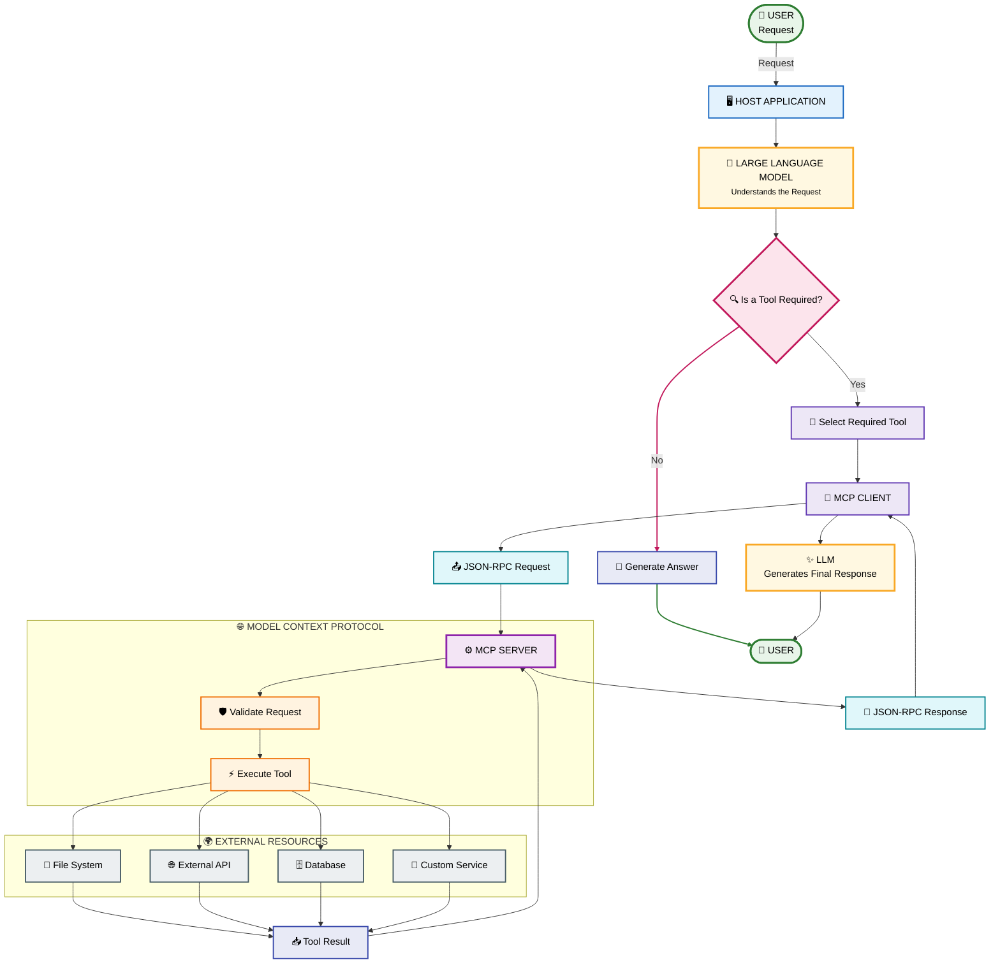

# MCP Tools - Communication Flow

> A detailed explanation of how an MCP Tool is discovered, selected, invoked, executed, and returned to the user.

---

# Table of Contents

1. Introduction
2. Complete Tool Flow
3. Step 1 - User Sends Request
4. Step 2 - Host Receives Request
5. Step 3 - LLM Understands Intent
6. Step 4 - Tool Discovery
7. Step 5 - LLM Selects Tool
8. Step 6 - Generate Tool Arguments
9. Step 7 - MCP Client Sends Request
10. Step 8 - MCP Server Receives Request
11. Step 9 - Validate Tool Request
12. Step 10 - Execute Tool
13. Step 11 - External System Interaction
14. Step 12 - Generate Tool Result
15. Step 13 - Return Result
16. Step 14 - LLM Processes Result
17. Step 15 - Final Response
18. Complete Request Flow
19. Tool Discovery Flow
20. Tool Execution Flow
21. Multiple Tool Flow
22. Error Flow
23. Example - Calculator Tool
24. Example - File Tool
25. Example - Weather Tool
26. Example - Database Tool
27. Example - Multiple Tools
28. Important Concepts
29. Summary

---

# 1. Introduction

MCP Tools allow an AI model to interact with external systems.

The communication process follows a structured flow:

```text
User
  ↓
Host
  ↓
LLM
  ↓
MCP Client
  ↓
MCP Server
  ↓
Tool
  ↓
External System
  ↓
Tool Result
  ↓
MCP Client
  ↓
LLM
  ↓
User
```

The important idea is:

> The LLM decides what needs to be done, while the Tool performs the actual operation.

---

# 2. Complete Tool Flow

The complete MCP tool execution flow can be represented as follows:



---

# 3. Step 1 - User Sends Request

Everything starts with the user.

Example:

```text
Calculate 25 + 75.
```

The user does not need to know:

- Which tool should be used
- Where the MCP server is located
- How JSON-RPC works
- How the calculation is performed

The user simply provides a natural-language request.

---

# 4. Step 2 - Host Receives Request

The Host Application receives the user's request.

Example:

```text
User
  ↓
AI Application
```

The Host is responsible for managing the conversation between the user and the AI system.

Examples of host applications include:

- AI assistants
- AI coding environments
- Desktop applications
- IDE integrations
- Custom AI applications

---

# 5. Step 3 - LLM Understands Intent

The request is passed to the LLM.

The LLM analyzes:

```text
Calculate 25 + 75.
```

The model determines:

```text
Intent:
Perform arithmetic calculation.
```

It then checks the available capabilities.

If a calculator tool is available, the model can use it.

---

# 6. Step 4 - Tool Discovery

Before a tool can be used, the MCP Client needs to know what tools are available.

The client can request the server's tool list.

Conceptually:

```text
MCP Client
     │
     │ tools/list
     ▼
MCP Server
     │
     │ Available Tools
     ▼
MCP Client
```

Example tool list:

```text
calculator
weather
read_file
write_file
search
database_query
```

The tool descriptions and input schemas allow the LLM to understand how each tool can be used.

---

# 7. Step 5 - LLM Selects Tool

The LLM compares the user's intent with the available tools.

User:

```text
Calculate 25 + 75.
```

Available tools:

```text
weather
calculator
read_file
search
```

The LLM selects:

```text
calculator
```

because it matches the requested operation.

---

# 8. Step 6 - Generate Tool Arguments

After selecting the tool, the LLM generates the required arguments.

For example:

```json
{
  "a": 25,
  "b": 75
}
```

The tool definition determines which parameters are required.

Example:

```text
Tool:
calculator

Parameters:
a → number
b → number
```

The LLM must generate arguments that match the expected schema.

---

# 9. Step 7 - MCP Client Sends Request

The MCP Client receives the tool request and communicates with the MCP Server.

Conceptually:

```text
LLM
 │
 │ Tool Call
 ▼
MCP Client
 │
 │ JSON-RPC
 ▼
MCP Server
```

The communication is structured rather than plain text.

---

# 10. Step 8 - MCP Server Receives Request

The MCP Server receives the tool invocation.

The request contains information such as:

```text
Tool Name:
calculator

Arguments:
a = 25
b = 75
```

The server identifies the requested tool.

---

# 11. Step 9 - Validate Tool Request

Before executing the function, the server should validate the request.

Validation may include:

```text
Does the tool exist?
        ↓
Are required parameters present?
        ↓
Are parameter types correct?
        ↓
Are values allowed?
        ↓
Does the caller have permission?
```

Example:

```text
calculator

a = 25
b = 75
```

Validation succeeds.

---

# 12. Step 10 - Execute Tool

The server executes the actual function.

Example:

```python
def add_numbers(a, b):
    return a + b
```

Execution:

```text
add_numbers(25, 75)
```

Result:

```text
100
```

---

# 13. Step 11 - External System Interaction

Some tools need to interact with external resources.

For example:

```text
Weather Tool
     ↓
Weather API
```

Or:

```text
Database Tool
     ↓
PostgreSQL
```

Or:

```text
File Tool
     ↓
File System
```

The tool acts as a controlled interface to the external system.

---

# 14. Step 12 - Generate Tool Result

After execution, the tool produces a result.

For the calculator example:

```json
{
  "result": 100
}
```

For a weather tool:

```json
{
  "city": "Pune",
  "temperature": 29,
  "condition": "Cloudy"
}
```

For a database tool:

```json
{
  "rows": [
    {
      "id": 1,
      "name": "John"
    },
    {
      "id": 2,
      "name": "Alice"
    }
  ]
}
```

---

# 15. Step 13 - Return Result

The result travels back through the MCP architecture.

```text
Tool
 ↓
MCP Server
 ↓
MCP Client
 ↓
LLM
```

The MCP Client receives the tool result and makes it available to the model.

---

# 16. Step 14 - LLM Processes Result

The LLM receives the result.

Example:

```json
{
  "result": 100
}
```

The model interprets the result and determines what to tell the user.

---

# 17. Step 15 - Final Response

The LLM generates the final response.

```text
100
```

or:

```text
25 + 75 = 100.
```

The Host displays the response to the user.

Complete flow:

```text
User
 ↓
Host
 ↓
LLM
 ↓
MCP Client
 ↓
MCP Server
 ↓
Calculator Tool
 ↓
Result
 ↓
MCP Client
 ↓
LLM
 ↓
Host
 ↓
User
```

---

# 18. Complete Request Flow

The entire process can be summarized as:

```text
1. User sends request
        ↓
2. Host receives request
        ↓
3. LLM analyzes request
        ↓
4. LLM determines whether a tool is needed
        ↓
5. MCP Client provides available tool information
        ↓
6. LLM selects appropriate tool
        ↓
7. LLM generates tool arguments
        ↓
8. MCP Client sends tool request
        ↓
9. MCP Server receives request
        ↓
10. Server validates request
        ↓
11. Server executes tool
        ↓
12. Tool interacts with external resource
        ↓
13. Tool generates result
        ↓
14. Server returns result
        ↓
15. MCP Client receives result
        ↓
16. LLM interprets result
        ↓
17. Host displays final response
        ↓
18. User receives answer
```

---

# 19. Tool Discovery Flow

Tool discovery happens before the model can effectively use the available tools.

```text
                 MCP Client
                     │
                     │
                     │ Request Tool List
                     ▼
                 MCP Server
                     │
                     │
              Registered Tools
                     │
          ┌──────────┼──────────┐
          │          │          │
          ▼          ▼          ▼
      Calculator   Weather   Read File
          │          │          │
          └──────────┼──────────┘
                     │
                     ▼
                Tool Metadata
                     │
                     ▼
                 MCP Client
                     │
                     ▼
                    LLM
```

The metadata helps the LLM understand:

- What the tool does
- When it should be used
- What arguments it accepts
- What type of result it returns

---

# 20. Tool Execution Flow

A simplified execution flow is:

```text
LLM
 │
 │ Select Tool
 ▼
MCP Client
 │
 │ tools/call
 ▼
MCP Server
 │
 │ Validate
 ▼
Tool Function
 │
 ▼
External Resource
 │
 ▼
Result
 │
 ▼
MCP Server
 │
 ▼
MCP Client
 │
 ▼
LLM
```

---

# 21. Multiple Tool Flow

A single user request may require multiple tools.

Example:

```text
Find the current temperature in Pune
and save it to weather.txt.
```

The LLM may perform:

```text
                    USER
                      │
                      ▼
                     LLM
                      │
             ┌────────┴────────┐
             ▼                 ▼
        Weather Tool      Write File Tool
             │                 │
             ▼                 │
       Weather API             │
             │                 │
             ▼                 │
       Temperature             │
             │                 │
             └────────┬────────┘
                      ▼
                  Final Result
                      │
                      ▼
                     LLM
                      │
                      ▼
                    USER
```

A more sequential representation:

```text
User
 ↓
LLM
 ↓
Weather Tool
 ↓
Weather Result
 ↓
LLM
 ↓
Write File Tool
 ↓
File Saved
 ↓
LLM
 ↓
User
```

---

# 22. Error Flow

Not every tool call succeeds.

Errors may occur during:

- Tool discovery
- Argument validation
- Authentication
- Network communication
- Tool execution
- External API calls
- Database queries
- File operations

Example:

```text
LLM
 ↓
MCP Client
 ↓
MCP Server
 ↓
Weather Tool
 ↓
Weather API
 ↓
API Error
```

The error should travel back:

```text
API Error
 ↓
Tool
 ↓
MCP Server
 ↓
MCP Client
 ↓
LLM
```

The LLM can then explain the problem.

Example:

```text
I couldn't retrieve the current weather
because the weather service is unavailable.
```

---

# 23. Example - Calculator Tool

## User Request

```text
What is 125 × 8?
```

## Flow

```text
User
 ↓
Host
 ↓
LLM
 ↓
Calculator Tool
 ↓
MCP Client
 ↓
MCP Server
 ↓
Calculator Function
 ↓
125 × 8
 ↓
1000
 ↓
MCP Client
 ↓
LLM
 ↓
User
```

## Tool Arguments

```json
{
  "a": 125,
  "b": 8
}
```

## Result

```json
{
  "result": 1000
}
```

---

# 24. Example - File Tool

## User Request

```text
Read README.md.
```

## Flow

```text
User
 ↓
LLM
 ↓
Read File Tool
 ↓
MCP Client
 ↓
MCP Server
 ↓
File System
 ↓
README.md
 ↓
File Contents
 ↓
MCP Server
 ↓
MCP Client
 ↓
LLM
 ↓
User
```

The tool receives something similar to:

```json
{
  "path": "README.md"
}
```

The file system returns the content.

---

# 25. Example - Weather Tool

## User Request

```text
What is the weather in Pune?
```

## Flow

```text
User
 ↓
LLM
 ↓
Weather Tool
 ↓
MCP Client
 ↓
MCP Server
 ↓
Weather API
 ↓
Weather Data
 ↓
MCP Server
 ↓
MCP Client
 ↓
LLM
 ↓
User
```

Example result:

```json
{
  "city": "Pune",
  "temperature": 29,
  "condition": "Cloudy"
}
```

The LLM converts this structured result into a natural-language response.

---

# 26. Example - Database Tool

## User Request

```text
Show me all employees from the IT department.
```

## Flow

```text
User
 ↓
LLM
 ↓
Database Tool
 ↓
MCP Client
 ↓
MCP Server
 ↓
Database
 ↓
SQL Query
 ↓
Rows
 ↓
MCP Server
 ↓
MCP Client
 ↓
LLM
 ↓
User
```

Example SQL:

```sql
SELECT *
FROM employees
WHERE department = 'IT';
```

The database tool should control which queries are allowed rather than blindly executing arbitrary SQL.

---

# 27. Example - Multiple Tools

Consider:

```text
Search for the latest Python version,
create a text file containing the result,
and calculate how many characters it contains.
```

The task requires multiple tools.

Possible flow:

```text
                         USER
                           │
                           ▼
                          LLM
                           │
                           ▼
                    Search Tool
                           │
                           ▼
                    Search Result
                           │
                           ▼
                          LLM
                           │
                           ▼
                  Write File Tool
                           │
                           ▼
                     File System
                           │
                           ▼
                       File Saved
                           │
                           ▼
                          LLM
                           │
                           ▼
                  Character Count Tool
                           │
                           ▼
                         Result
                           │
                           ▼
                          LLM
                           │
                           ▼
                         USER
```

This demonstrates that MCP Tools can be combined to perform complex workflows.

---

# 28. Important Concepts

## Tool Discovery

The client learns which tools are available.

```text
tools/list
```

---

## Tool Invocation

A specific tool is requested.

```text
tools/call
```

---

## Tool Arguments

Structured parameters are sent to the tool.

```json
{
  "city": "Pune"
}
```

---

## Tool Execution

The server executes the registered function.

---

## Tool Result

The function returns structured information.

```json
{
  "temperature": 29
}
```

---

## Error Handling

Failures are returned through structured protocol responses.

---

# 29. Summary

The MCP Tool flow connects an AI model with external capabilities.

The complete process is:

```text
User
 ↓
Host
 ↓
LLM
 ↓
Tool Selection
 ↓
MCP Client
 ↓
JSON-RPC
 ↓
MCP Server
 ↓
Tool Execution
 ↓
External System
 ↓
Tool Result
 ↓
MCP Client
 ↓
LLM
 ↓
Final Response
 ↓
User
```

The most important principle is:

> **The LLM decides what should happen; the MCP Tool performs the operation.**

This separation allows MCP applications to remain modular, secure, scalable, and easier to maintain.

---

# Quick Revision

```text
User Request
     ↓
LLM Understands
     ↓
Tool Needed?
     ↓
Select Tool
     ↓
Generate Arguments
     ↓
MCP Client
     ↓
MCP Server
     ↓
Validate
     ↓
Execute
     ↓
External Resource
     ↓
Result
     ↓
MCP Client
     ↓
LLM
     ↓
Final Answer
```

---

# Key Terms

| Term | Meaning |
|---|---|
| Tool | Executable capability exposed by an MCP Server |
| Host | Application that manages the AI interaction |
| LLM | Model that understands requests and decides when tools are needed |
| MCP Client | Component that communicates with MCP Servers |
| MCP Server | Component that exposes tools |
| Tool Call | Request to execute a specific tool |
| Arguments | Input parameters supplied to a tool |
| Tool Result | Output returned by the tool |
| JSON-RPC | Structured communication mechanism used by MCP |
| External Resource | System accessed by a tool |

---

# Final Concept

Think of MCP Tools as a bridge:

```text
                 AI WORLD
                    │
                    │
                   LLM
                    │
                    ▼
              MCP Protocol
                    │
                    ▼
               MCP Server
                    │
                    ▼
             ┌──────┼──────┐
             │      │      │
             ▼      ▼      ▼
           Files   APIs   Database
```

The LLM provides the **reasoning**.

The MCP Tool provides the **action**.

Together, they allow AI applications to move from simply generating responses to actually interacting with external systems.