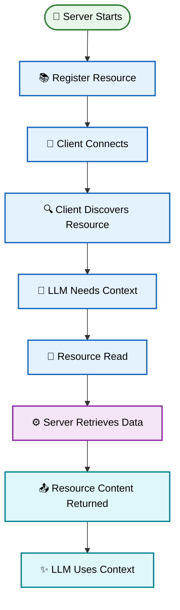

# MCP Resources - Theory

> A complete theoretical guide to understanding **Resources** in the **Model Context Protocol (MCP)**.

---

# Table of Contents

1. Introduction
2. What is an MCP Resource?
3. Why Do We Need Resources?
4. How Resources Work
5. Resource Lifecycle
6. Resource Metadata
7. Resource URI
8. Resource Content
9. Resource Discovery
10. Resource Reading
11. Resource Templates
12. Static vs Dynamic Resources
13. Resource Updates
14. Resource Subscriptions
15. Resource Types
16. Benefits of MCP Resources
17. Limitations
18. Best Practices
19. Common Mistakes
20. Real-World Examples
21. Summary

---

# Introduction

Large Language Models (LLMs) are excellent at understanding and generating
natural language. However, they do not automatically have access to the
private or current information stored in external systems.

For example:

- They cannot automatically read your project files.
- They cannot automatically access your private database.
- They cannot automatically retrieve internal documentation.
- They cannot automatically access application state.
- They cannot automatically retrieve private knowledge-base content.

This is where **MCP Resources** become important.

A Resource provides an AI application with a standardized way to access
external information and context through an MCP Server.

---

# What is an MCP Resource?

An **MCP Resource** is a piece of data or contextual information exposed by
an MCP Server that can be accessed by an MCP Client.

Resources can represent:

- Files
- Documents
- Database records
- API responses
- Application state
- Configuration
- Logs
- Documentation
- Knowledge-base content

A resource is identified using a URI.

Example:

```text
file:///project/README.md
```

Another example:

```text
database://users/123
```

A Resource primarily provides **information**, while a Tool performs an
**action**.

---

# Simple Analogy

Imagine the AI is a student.

The student knows how to understand information but does not have every
book available.

Whenever the student needs additional information, a librarian provides
the required book.

```text
Student (LLM)

↓

Librarian (MCP Server)

↓

Book / Document (Resource)

↓

Information

↓

Student (LLM)
```

The student represents the LLM.

The librarian represents the MCP Server.

The book represents the MCP Resource.

---

# Why Do We Need Resources?

Without Resources, an AI application may not have access to information
stored outside its existing context.

For example:

User:

```text
Explain the architecture of my project.
```

The model may need access to:

```text
README.md
Architecture.md
main.py
database.py
```

An MCP Resource can provide these files.

```text
User

↓

LLM

↓

MCP Client

↓

MCP Resource

↓

Project Files

↓

Project Context

↓

LLM

↓

Answer
```

The same concept applies to:

- Databases
- Documentation
- APIs
- File systems
- Logs
- Knowledge bases
- Application state

---

# How Resources Work

An MCP Resource is not directly accessed by the LLM.

Instead, the communication passes through the MCP Client and MCP Server.

```text
LLM

↓

Resource Request

↓

MCP Client

↓

JSON-RPC

↓

MCP Server

↓

Resource Provider

↓

Resource Content

↓

MCP Client

↓

LLM
```

The MCP Server handles the actual interaction with the underlying
resource provider.

---

# Resource Lifecycle

Every MCP Resource follows a lifecycle from registration/discovery to
retrieval and use by the AI application.



## Lifecycle Stages

| Stage | Description |
|--------|-------------|
| 🚀 **Server Starts** | The MCP server launches and initializes its environment. |
| 📚 **Register Resource** | Resources are registered with URIs and metadata. |
| 🔗 **Client Connects** | An MCP client establishes a connection with the server. |
| 🔍 **Client Discovers Resource** | The client discovers available resources. |
| 🧠 **LLM Needs Context** | The AI determines that external information is required. |
| 📖 **Resource Read** | The client requests the required resource. |
| ⚙️ **Server Retrieves Data** | The server obtains the resource content. |
| 📤 **Content Returned** | The resource content is returned to the client. |
| ✨ **LLM Uses Context** | The AI uses the retrieved information to generate a response. |

> **Note:** Resources provide contextual information to the AI application
> through the MCP Client and MCP Server.

---

# Resource Metadata

Every MCP Resource contains information that describes the resource.

Typical metadata includes:

| Property | Description |
|----------|-------------|
| URI | Unique resource identifier |
| Name | Human-readable resource name |
| Description | Explanation of the resource |
| MIME Type | Type of resource content |
| Metadata | Additional information |

Example:

```text
Resource URI

docs://mcp/resources
```

Description:

```text
Documentation about MCP Resources.
```

MIME Type:

```text
text/markdown
```

Metadata helps the MCP Client understand what a resource represents.

---

# Resource URI

A Resource is identified using a URI.

Example:

```text
file:///project/README.md
```

Another example:

```text
database://users/123
```

Another:

```text
docs://mcp/resources
```

A URI provides a consistent identifier for a resource.

---

# Resource Content

Resources can contain different types of information.

## Text

```text
MCP Resources provide contextual information.
```

## Markdown

```markdown
# MCP Resources

Resources provide information to AI applications.
```

## JSON

```json
{
  "id": 101,
  "name": "Swapnil",
  "status": "active"
}
```

## Other Content

Resources can also represent:

- Images
- PDFs
- Audio
- Video
- Documents

The appropriate MIME type should be provided where applicable.

---

# Resource Discovery

Before a client can read a resource, it needs to know which resources are
available.

```text
Client

↓

Resource Discovery

↓

MCP Server

↓

Available Resources

↓

Client
```

Example:

```text
Documentation
Repository Files
Database Records
Application Configuration
```

The client can then identify the resource it needs.

---

# Resource Reading

Once a resource has been identified, the MCP Client can request its
contents.

```text
MCP Client

↓

Read Resource

↓

MCP Server

↓

Resource Provider

↓

Data

↓

MCP Server

↓

MCP Client

↓

LLM
```

The returned information becomes available as context for the AI application.

---

# Resource Templates

A Resource Template allows a server to represent multiple resources using
a URI pattern.

Example:

```text
database://users/{user_id}
```

The client can request:

```text
database://users/101
```

or:

```text
database://users/202
```

Instead of registering every user individually, the server can use one
resource template.

---

# Static vs Dynamic Resources

## Static Resources

Static resources have known URIs.

Example:

```text
docs://mcp/introduction
```

The resource is known by the server ahead of time.

---

## Dynamic Resources

Dynamic resources represent information that may change.

Example:

```text
database://orders/123
```

The URI stays the same, but the underlying order information can change.

```text
Pending
   ↓
Processing
   ↓
Shipped
   ↓
Delivered
```

---

# Resource Updates

Some resources can change over time.

For example:

```text
system://server/status
```

The resource may contain:

```text
Healthy
```

and later:

```text
Warning
```

The MCP protocol provides mechanisms for clients to become aware of
resource changes when supported by the server and client.

```text
Resource

↓

Changed

↓

MCP Server

↓

Notification

↓

MCP Client

↓

Updated Resource
```

---

# Resource Subscriptions

For resources that change frequently, clients can subscribe to updates.

```text
MCP Client

↓

Subscribe

↓

MCP Server

↓

Resource

↓

Resource Changes

↓

MCP Server

↓

Notification

↓

MCP Client
```

This can be useful for:

- Monitoring
- Application state
- Live documents
- Logs
- Dynamic database information

---

# Resource Types

## File Resources

Examples:

```text
file:///project/README.md
file:///project/src/main.py
```

---

## Database Resources

Examples:

```text
database://users/123
database://orders/456
```

---

## Documentation Resources

Examples:

```text
docs://python/functions
docs://mcp/resources
```

---

## API Resources

Examples:

```text
api://weather/current
api://system/status
```

---

## Application Resources

Examples:

```text
app://configuration
app://system/status
```

---

# Resources vs Tools

Resources and Tools have different responsibilities.

| Feature | Resources | Tools |
|----------|-----------|-------|
| Purpose | Provide information | Perform actions |
| Operation | Read | Execute |
| Example | Read file | Write file |
| Example | Read database record | Update database |
| Example | Read API data | Send API request |

Simple rule:

```text
Resource → "Give me information"

Tool → "Do something"
```

---

# Resources vs Prompts

Resources and Prompts also serve different purposes.

```text
Resource

↓

Provides Context
```

while:

```text
Prompt

↓

Provides Instructions / Interaction Template
```

Therefore:

```text
Resources → Information
Tools     → Actions
Prompts   → Instructions
```

---

# Benefits of MCP Resources

## Standardized Access

MCP provides a common way for AI applications to access external context.

---

## Reusable

The same Resource can be accessed by different MCP-compatible clients.

---

## Modular

Resources are separated from the LLM's reasoning logic.

---

## Flexible

Resources can represent files, APIs, databases, documentation, and other
sources.

---

## Context-Aware

Resources allow AI applications to retrieve information when required.

---

## Language Independent

MCP Servers can be implemented using different programming languages.

Examples:

- Python
- JavaScript
- TypeScript
- Go
- Rust
- Java
- C#

---

# Limitations

Resources are powerful, but they also have limitations.

- Large resource sizes
- Network latency
- Database latency
- Permission restrictions
- Resource availability
- Stale information
- Authentication requirements
- External API failures
- Security concerns

Developers should design resources carefully.

---

# Best Practices

✔ Use meaningful resource URIs.

✔ Provide clear descriptions.

✔ Use appropriate MIME types.

✔ Keep resources focused.

✔ Validate resource access.

✔ Protect sensitive information.

✔ Return only required data.

✔ Handle resource errors gracefully.

✔ Consider resource freshness.

✔ Avoid unnecessarily large resources.

✔ Use templates for dynamic resource patterns.

✔ Implement access control where required.

---

# Common Mistakes

❌ Exposing sensitive information without authorization.

❌ Using unclear resource URIs.

❌ Returning unnecessarily large resources.

❌ Treating Resources like Tools.

❌ Ignoring resource updates.

❌ Not validating resource access.

❌ Exposing entire databases unnecessarily.

❌ Ignoring errors from external data sources.

---

# Real-World Examples

## Example 1 — Documentation Assistant

User:

```text
Explain MCP Resources.
```

Workflow:

```text
LLM

↓

Documentation Resource

↓

MCP Documentation

↓

Resource Content

↓

LLM

↓

Answer
```

---

## Example 2 — File Assistant

User:

```text
Explain README.md
```

Workflow:

```text
LLM

↓

File Resource

↓

README.md

↓

File Contents

↓

LLM
```

---

## Example 3 — Database Assistant

User:

```text
Show customer 101.
```

Workflow:

```text
LLM

↓

Customer Resource

↓

Database

↓

Customer Record

↓

LLM
```

---

## Example 4 — Coding Assistant

User:

```text
Explain the authentication code.
```

Workflow:

```text
LLM

↓

Repository Resource

↓

authentication.py

↓

Source Code

↓

LLM

↓

Explanation
```

---

# Key Takeaways

- Resources provide external information and context to AI applications.
- MCP standardizes resource access.
- Resources are identified using URIs.
- Resources can represent files, databases, APIs, documentation, and
  application state.
- Resource metadata describes available resources.
- Clients can discover and read resources.
- Resource templates support dynamic resource patterns.
- Resources can be static or dynamic.
- Resources may support update notifications and subscriptions.
- Resources are different from Tools.
- Security and access control are important.
- Resource size and freshness should be considered carefully.

---

# Summary

MCP Resources provide a standardized way for AI applications to access
external information and context.

They act as a bridge between the AI application and sources such as files,
databases, APIs, documentation, and application state.

```text
External Data

↓

MCP Server

↓

MCP Resource

↓

MCP Client

↓

LLM

↓

AI Response
```

Understanding Resources is essential for building MCP applications that can
work with real-world information beyond the model's built-in knowledge.

The next step is understanding how these Resources fit into the complete
MCP architecture.
