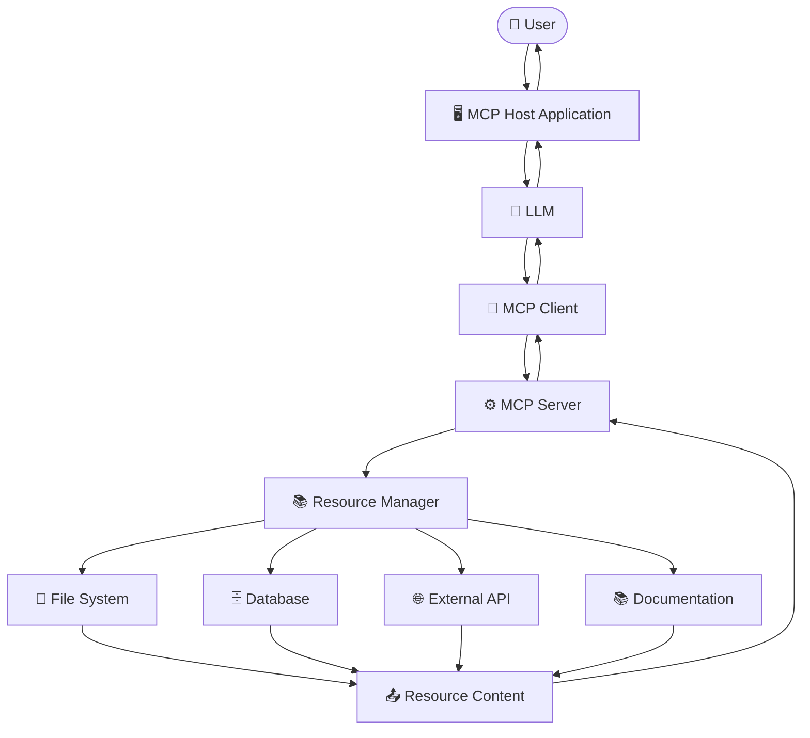
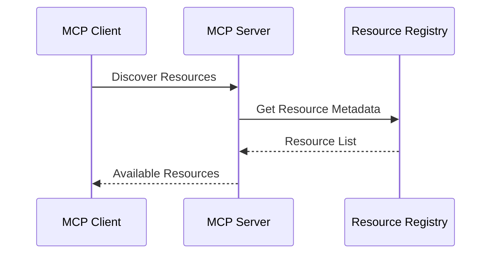
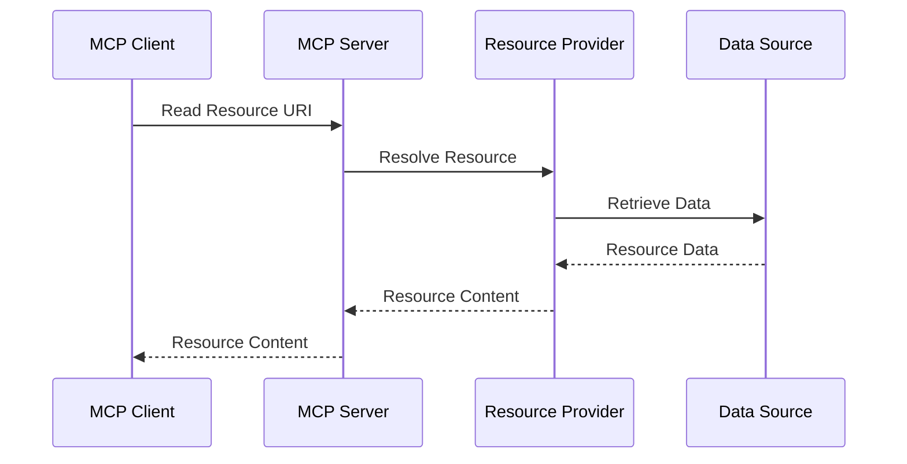
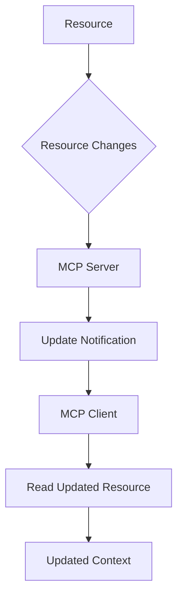
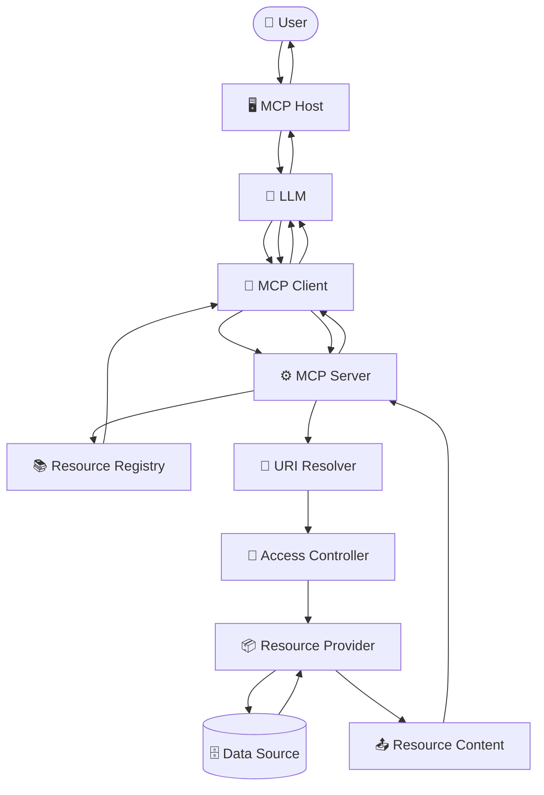
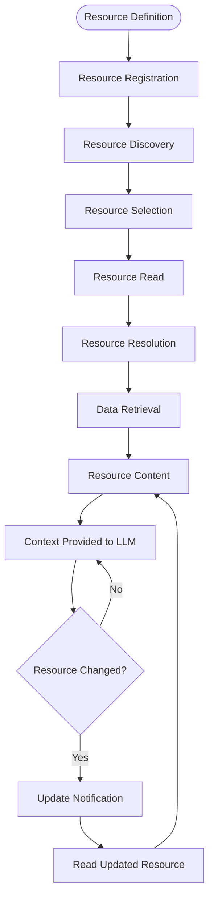

# MCP Resources - Architecture

> A complete architectural guide to understanding how **Resources** work inside the **Model Context Protocol (MCP)** ecosystem.

---

# Table of Contents

1. Introduction
2. MCP Resource Architecture Overview
3. High-Level Architecture
4. Main Components
5. MCP Host
6. MCP Client
7. MCP Server
8. Resource Manager
9. Resource Provider
10. External Data Sources
11. Resource URI Layer
12. Resource Metadata Layer
13. Resource Content Layer
14. Resource Discovery Architecture
15. Resource Read Architecture
16. Resource Template Architecture
17. Static Resource Architecture
18. Dynamic Resource Architecture
19. Resource Update Architecture
20. Resource Subscription Architecture
21. Complete Resource Communication Flow
22. Resource Architecture with LLM
23. Resource Architecture with Tools
24. Resource Architecture with Prompts
25. File-Based Resource Architecture
26. Database Resource Architecture
27. API-Based Resource Architecture
28. Documentation Resource Architecture
29. Multi-Resource Architecture
30. Security Architecture
31. Error Handling Architecture
32. Performance Architecture
33. Scalability Architecture
34. Resource Lifecycle Architecture
35. Recommended Architecture
36. Common Architectural Mistakes
37. Real-World Architecture Example
38. Key Takeaways
39. Summary

---

# Introduction

The **Model Context Protocol (MCP)** provides a standardized architecture for connecting AI applications with external systems.

One of the important MCP primitives is the **Resource**.

Resources allow an MCP Server to expose contextual information such as:

- Files
- Documents
- Database records
- API responses
- Documentation
- Application state
- Configuration
- Logs
- Knowledge-base content

The architecture separates the AI model from the underlying data source.

Instead of allowing the LLM to directly access a database, filesystem, or API, the MCP architecture introduces an MCP Client and MCP Server.

```text
LLM

↓

MCP Client

↓

MCP Server

↓

Resource Provider

↓

External Data Source
```

This separation provides a standardized architecture for accessing external context.

---

# MCP Resource Architecture Overview

The basic MCP Resource architecture can be represented as:

```text
                         USER
                           │
                           ▼
                    MCP HOST APPLICATION
                           │
                           ▼
                          LLM
                           │
                           │ Needs Context
                           ▼
                       MCP CLIENT
                           │
                           │ Resource Request
                           ▼
                      MCP SERVER
                           │
                    Resource Manager
                           │
             ┌─────────────┼─────────────┐
             │             │             │
             ▼             ▼             ▼
        File Provider  DB Provider   API Provider
             │             │             │
             ▼             ▼             ▼
        File System     Database      External API
```

The LLM does not directly access the external data source.

The MCP Server provides the controlled interface.

---

# High-Level Architecture

The complete architecture contains several layers.



---

# Main Components

| Component | Responsibility |
|----------|----------------|
| User | Provides the request |
| MCP Host | Runs the AI application |
| LLM | Understands the request |
| MCP Client | Communicates with MCP Server |
| MCP Server | Exposes MCP capabilities |
| Resource Manager | Manages resource access |
| Resource Provider | Retrieves underlying data |
| External Data Source | Stores or provides actual information |

Each component has a different responsibility.

---

# MCP Host

The **MCP Host** is the AI application that interacts with the user and the LLM.

Conceptually:

```text
User
 │
 ▼
MCP Host
 │
 ▼
LLM
```

The host manages the overall AI interaction.

The host can contain:

- User interface
- LLM integration
- MCP Clients
- Conversation state
- Permission controls
- Context management

---

# MCP Client

The **MCP Client** is responsible for communication between the MCP Host and MCP Server.

```text
MCP Host
   │
   ▼
MCP Client
   │
   ▼
MCP Server
```

The client can:

- Connect to MCP Servers
- Discover resources
- Request resource contents
- Handle server responses
- Manage protocol communication
- Receive resource update notifications when supported

The client acts as the communication layer.

---

# MCP Server

The **MCP Server** exposes resources to the MCP Client.

```text
MCP Client
    │
    ▼
MCP Server
    │
    ▼
Resources
```

The MCP Server is responsible for:

- Resource registration
- Resource discovery
- URI handling
- Resource validation
- Resource retrieval
- Metadata management
- Access control
- Error handling
- Communication with external systems

---

# Resource Manager

The Resource Manager is an architectural concept used to organize resource handling inside the MCP Server.

```text
MCP Server
     │
     ▼
Resource Manager
     │
     ├── Resource Registry
     ├── URI Resolver
     ├── Metadata Manager
     ├── Access Controller
     └── Resource Provider
```

The exact implementation depends on the MCP Server framework.

The Resource Manager can coordinate:

- Registered resources
- Resource templates
- URI resolution
- Resource retrieval
- Metadata
- Permissions
- Caching

---

# Resource Provider

The Resource Provider is the component responsible for obtaining the actual resource data.

```text
MCP Server
     │
     ▼
Resource Provider
     │
     ├── File System
     ├── Database
     ├── API
     └── Documentation
```

For example:

```text
Resource URI:

database://users/123
```

The Resource Provider may translate that URI into a database query.

---

# External Data Sources

Resources can be backed by different systems.

## File System

```text
MCP Server
    │
    ▼
File Provider
    │
    ▼
File System
```

## Database

```text
MCP Server
    │
    ▼
Database Provider
    │
    ▼
Database
```

## API

```text
MCP Server
    │
    ▼
API Provider
    │
    ▼
External API
```

The MCP Server hides these implementation details from the MCP Client.

---

# Resource URI Layer

The URI provides the identity of a resource.

Example:

```text
file:///project/README.md
```

Database example:

```text
database://users/123
```

Documentation example:

```text
docs://mcp/resources
```

Architecture:

```text
Client
  │
  │ Resource URI
  ▼
MCP Server
  │
  │ Resolve URI
  ▼
Resource Provider
```

The URI acts as the identifier used to locate the requested resource.

---

# Resource Metadata Layer

Resource metadata describes a resource before its contents are retrieved.

Typical metadata can include:

```text
URI
Name
Description
MIME Type
Annotations
```

Architecture:

```text
Resource
   │
   ├── URI
   ├── Name
   ├── Description
   ├── MIME Type
   └── Metadata
```

Metadata is particularly important during resource discovery.

---

# Resource Content Layer

The actual resource content is the information retrieved by the server.

Example:

```text
Resource URI:

docs://mcp/resources
```

Content:

```markdown
# MCP Resources

Resources provide contextual information
to AI applications.
```

Architecture:

```text
Resource URI
     │
     ▼
Resource Provider
     │
     ▼
Resource Content
     │
     ▼
MCP Client
     │
     ▼
LLM
```

---

# Resource Discovery Architecture

Before a resource can be read, the client needs to discover available resources.



The returned resource information allows the client to understand what resources are available.

Example:

```text
Resources

1. docs://mcp/introduction
2. docs://mcp/resources
3. repo://README.md
4. database://users/123
```

---

# Resource Read Architecture

After discovery, the client can request a resource.



The MCP Client receives the resource contents and can provide them to the LLM as context.

---

# Resource Template Architecture

Resource templates allow dynamic resources to be represented through URI patterns.

Example:

```text
customer://{customer_id}
```

Architecture:

```text
MCP Client
     │
     │ customer://101
     ▼
MCP Server
     │
     ▼
URI Template Resolver
     │
     │ customer_id = 101
     ▼
Database Provider
     │
     ▼
Customer Record
```

This avoids registering every customer as a separate static resource.

---

# Static Resource Architecture

Static resources have known URIs.

Example:

```text
docs://mcp/introduction
```

Architecture:

```text
MCP Server
    │
    ├── docs://mcp/introduction
    ├── docs://mcp/resources
    ├── docs://mcp/tools
    └── docs://mcp/prompts
```

The server knows these resources ahead of time.

Static resources are useful for:

- Documentation
- Configuration
- Fixed files
- Static knowledge
- Project metadata

---

# Dynamic Resource Architecture

Dynamic resources retrieve data at runtime.

Example:

```text
database://orders/123
```

Architecture:

```text
MCP Client
     │
     ▼
MCP Server
     │
     ▼
Database Provider
     │
     ▼
Database
     │
     ▼
Current Order
```

The same resource URI can return different content as the underlying data changes.

---

# Resource Update Architecture

Some resources change after they have been discovered or read.

Conceptually:



This architecture is useful for resources backed by live systems.

---

# Resource Subscription Architecture

A client may subscribe to resource changes when the server and client support resource subscriptions.

```text
MCP Client
     │
     │ Subscribe
     ▼
MCP Server
     │
     ▼
Resource
     │
     │ Changes
     ▼
MCP Server
     │
     │ Notification
     ▼
MCP Client
     │
     ▼
Updated Context
```

This can be useful for:

- Live monitoring
- Application state
- Dynamic documents
- Logs
- Frequently changing information

---

# Complete Resource Communication Flow

The complete communication architecture can be represented as:



This shows the separation between:

```text
User
   ↓
AI Application
   ↓
MCP Client
   ↓
MCP Server
   ↓
Resource Layer
   ↓
External Data
```

---

# Resource Architecture with LLM

The LLM is responsible for understanding the user's request and determining what context may be required.

```text
                         USER
                           │
                           ▼
                         HOST
                           │
                           ▼
                          LLM
                           │
                    Needs Information
                           │
                           ▼
                      MCP CLIENT
                           │
                           ▼
                      MCP SERVER
                           │
                           ▼
                       RESOURCE
                           │
                           ▼
                    External Data
```

The LLM does not directly communicate with the external data source.

---

# Resource Architecture with Tools

Resources and Tools can work together.

For example, a coding assistant may:

1. Read source code using a Resource.
2. Analyze the source code.
3. Modify the source using a Tool.

```text
User
 │
 ▼
LLM
 │
 ├───────────────┐
 │               │
 ▼               ▼
Resource        Tool
 │               │
 ▼               ▼
Read Code      Modify Code
 │               │
 └───────┬───────┘
         ▼
       Result
```

Resources provide information.

Tools perform actions.

---

# Resource Architecture with Prompts

Prompts can guide the LLM on how to use retrieved resource information.

```text
Prompt
  │
  ▼
LLM
  │
  ▼
Resource
  │
  ▼
Context
  │
  ▼
LLM
  │
  ▼
Response
```

The three MCP primitives can therefore work together:

```text
Resources → Information
Tools     → Actions
Prompts   → Instructions
```

---

# File-Based Resource Architecture

A file-based resource exposes information from a filesystem.

```text
MCP Client
     │
     ▼
MCP Server
     │
     ▼
File Resource Provider
     │
     ▼
File System
     │
     ├── README.md
     ├── main.py
     ├── config.json
     └── docs/
```

Example URI:

```text
file:///project/README.md
```

Flow:

```text
Client
  ↓
Read URI
  ↓
MCP Server
  ↓
File Provider
  ↓
File System
  ↓
File Content
  ↓
Client
```

---

# Database Resource Architecture

A database resource provides database-backed information.

```text
MCP Client
     │
     ▼
MCP Server
     │
     ▼
Database Resource Provider
     │
     ▼
Database
     │
     ├── Users
     ├── Orders
     ├── Products
     └── Transactions
```

Example:

```text
database://users/123
```

The Resource Provider resolves the URI and retrieves the appropriate database record.

---

# API-Based Resource Architecture

An MCP Server can expose API-backed resources.

```text
MCP Client
     │
     ▼
MCP Server
     │
     ▼
API Resource Provider
     │
     ▼
External API
     │
     ▼
JSON Response
     │
     ▼
Resource Content
```

Example:

```text
api://weather/current
```

The MCP Server can retrieve the latest API information and expose it through the resource interface.

---

# Documentation Resource Architecture

Documentation systems are a natural use case for resources.

```text
MCP Client
     │
     ▼
MCP Server
     │
     ▼
Documentation Provider
     │
     ├── Python Docs
     ├── MCP Docs
     ├── Project Docs
     └── API Docs
```

Example:

```text
docs://mcp/resources
```

This can allow an AI assistant to retrieve relevant documentation when answering a question.

---

# Multi-Resource Architecture

A single MCP Server can expose many resource types.

```text
                         MCP SERVER
                              │
              ┌───────────────┼───────────────┐
              │               │               │
              ▼               ▼               ▼
          File Resources  DB Resources   API Resources
              │               │               │
              ▼               ▼               ▼
          File System      Database       External APIs
```

For example:

```text
Resources

repo://README.md
repo://src/main.py

customer://101
order://500

api://weather/current
api://system/status
```

The client can discover and read the required resource.

---

# Security Architecture

Security is an important part of Resource architecture.

A resource may contain sensitive information.

Examples:

```text
Customer Data
Financial Records
Private Files
API Responses
Internal Logs
Configuration
```

A secure architecture should look like:

```text
MCP Client
     │
     ▼
MCP Server
     │
     ▼
Authentication
     │
     ▼
Authorization
     │
     ▼
URI Validation
     │
     ▼
Resource Access
     │
     ▼
Filtered Data
```

---

# Resource Access Control

The server should verify whether the client is allowed to access the requested resource.

```text
Resource Request
      │
      ▼
Identity Check
      │
      ▼
Permission Check
      │
      ├── ❌ Denied
      │
      └── ✅ Allowed
              │
              ▼
        Resource Provider
```

Access control is especially important when resources expose private data.

---

# Resource URI Security

Resource URIs should be validated before accessing the underlying system.

For example:

```text
file:///project/docs/README.md
```

should not allow unauthorized traversal such as:

```text
file:///project/docs/../../secrets.txt
```

A secure architecture should validate:

```text
URI
 ↓
Path
 ↓
Allowed Directory
 ↓
Permission
 ↓
Resource
```

---

# Error Handling Architecture

Resource access can fail for many reasons.

Examples:

- Resource does not exist
- Permission denied
- Database unavailable
- API unavailable
- Invalid URI
- Invalid template parameters
- Network error

Architecture:

```text
Client
  │
  ▼
MCP Server
  │
  ▼
Resource Provider
  │
  X
Error
  │
  ▼
Error Handler
  │
  ▼
Structured Error
  │
  ▼
MCP Client
```

Errors should be handled consistently.

---

# Performance Architecture

Resource performance depends on several factors.

```text
Resource Request
      │
      ▼
MCP Server
      │
      ├── URI Resolution
      ├── Authorization
      ├── Database Query
      ├── API Request
      ├── Serialization
      └── Network Transfer
      │
      ▼
Resource Content
```

Important performance considerations include:

- Resource size
- Database query time
- Network latency
- API latency
- Serialization
- Caching
- Concurrent requests

---

# Resource Caching Architecture

Caching can reduce repeated resource retrieval.

```text
MCP Client
     │
     ▼
MCP Server
     │
     ▼
Cache
   /   \
Hit    Miss
 │       │
 ▼       ▼
Data   Provider
         │
         ▼
      Data Source
```

If the resource is already cached, the server may be able to return the cached representation depending on application requirements.

Caching must be designed carefully when data changes frequently.

---

# Scalability Architecture

A scalable MCP Resource architecture separates responsibilities.

```text
                     MCP Server
                         │
             ┌───────────┼───────────┐
             │           │           │
             ▼           ▼           ▼
        Resource A   Resource B   Resource C
             │           │           │
             ▼           ▼           ▼
          Provider     Provider     Provider
             │           │           │
             ▼           ▼           ▼
          Storage      Database      API
```

For larger systems, resource providers can be independently optimized.

Possible techniques include:

- Caching
- Connection pooling
- Efficient queries
- Pagination
- Filtering
- Load balancing
- Asynchronous operations
- Resource partitioning

---

# Resource Lifecycle Architecture

A resource can move through several stages.



---

# Recommended Architecture

A clean MCP Resource architecture can be organized as:

```text
                         USER
                           │
                           ▼
                    MCP HOST APPLICATION
                           │
                           ▼
                          LLM
                           │
                           ▼
                       MCP CLIENT
                           │
                           │
                    MCP Protocol
                           │
                           ▼
                      MCP SERVER
                           │
              ┌────────────┼────────────┐
              │            │            │
              ▼            ▼            ▼
       Resource Registry  URI Resolver  Access Control
              │            │            │
              └────────────┼────────────┘
                           │
                           ▼
                   Resource Provider
                           │
             ┌─────────────┼─────────────┐
             │             │             │
             ▼             ▼             ▼
        File System     Database       External API
             │             │             │
             └─────────────┼─────────────┘
                           │
                           ▼
                    Resource Content
                           │
                           ▼
                       MCP Client
                           │
                           ▼
                          LLM
                           │
                           ▼
                         HOST
                           │
                           ▼
                          USER
```

This architecture provides a clear separation of responsibilities.

---

# Component Responsibility Table

| Component | Main Responsibility |
|----------|---------------------|
| 👤 User | Sends the request |
| 🖥️ MCP Host | Manages AI application interaction |
| 🧠 LLM | Understands the request and determines context needs |
| 🔌 MCP Client | Communicates with MCP Server |
| ⚙️ MCP Server | Exposes and manages resources |
| 📚 Resource Registry | Tracks available resources |
| 🔎 URI Resolver | Resolves resource identifiers |
| 🔐 Access Controller | Validates resource access |
| 📦 Resource Provider | Retrieves underlying data |
| 🗄️ Data Source | Stores or provides the actual information |

---

# Architecture Decision: Resource or Tool?

When designing an MCP server, determine whether a capability should be a Resource or Tool.

```text
                  Capability
                       │
                       ▼
              Does it provide
                 information?
                 /          \
               YES           NO
                │             │
                ▼             ▼
            Resource      Does it perform
                           an action?
                              │
                              ▼
                             Tool
```

Examples:

```text
Read customer information
        ↓
Resource

Create customer
        ↓
Tool

Update customer
        ↓
Tool

Delete customer
        ↓
Tool
```

---

# Resource + Tool Architecture

Real-world applications often use both Resources and Tools.

Example:

```text
                    AI Assistant
                         │
              ┌──────────┴──────────┐
              │                     │
              ▼                     ▼
          Resources               Tools
              │                     │
              ▼                     ▼
        Current Data             Actions
              │                     │
              └──────────┬──────────┘
                         ▼
                        LLM
```

Example workflow:

```text
1. Read customer using Resource.
2. Analyze customer information.
3. Decide whether an action is required.
4. Call Tool.
5. Database changes.
6. Read updated Resource.
7. Generate response.
```

---

# Real-World Architecture Example

Consider an AI customer-support assistant.

The system exposes:

```text
Resources:

customer://101
order://5001
docs://refund-policy
docs://shipping-policy
```

Tools:

```text
update_customer()
cancel_order()
create_ticket()
```

Architecture:

```text
                         USER
                           │
                           ▼
                   SUPPORT ASSISTANT
                           │
                           ▼
                          LLM
                           │
              ┌────────────┴────────────┐
              │                         │
              ▼                         ▼
         MCP Resources              MCP Tools
              │                         │
      ┌───────┼───────┐          ┌─────┼─────┐
      │       │       │          │     │     │
      ▼       ▼       ▼          ▼     ▼     ▼
 Customer   Order   Docs       Update Cancel Ticket
      │       │       │
      └───────┼───────┘
              ▼
          Data Sources
```

Example request:

```text
Where is customer 101's order?
```

The LLM may retrieve:

```text
customer://101
order://5001
```

Then it can answer using the retrieved context.

If the user asks:

```text
Cancel my order.
```

the system may use:

```text
order://5001
```

to understand the order and then invoke:

```text
cancel_order()
```

This demonstrates how Resources and Tools can work together.

---

# Common Architectural Mistakes

## 1. Direct LLM Access to Database

Bad architecture:

```text
LLM
 │
 ▼
Database
```

Better:

```text
LLM
 │
 ▼
MCP Client
 │
 ▼
MCP Server
 │
 ▼
Database Provider
 │
 ▼
Database
```

---

## 2. No Access Control

Bad:

```text
Client
 │
 ▼
Resource
 │
 ▼
Private Data
```

Better:

```text
Client
 │
 ▼
Authentication
 │
 ▼
Authorization
 │
 ▼
Resource
```

---

## 3. Exposing Entire Data Sources

Bad:

```text
Entire Database
       ↓
MCP Resource
       ↓
LLM
```

Better:

```text
Database
   ↓
Relevant Resource
   ↓
Filtered Data
   ↓
LLM
```

---

## 4. Poor URI Design

Bad:

```text
data://123
```

Better:

```text
customer://123
```

The resource URI should communicate what the resource represents.

---

## 5. Excessively Large Resources

Bad:

```text
10 GB Database Export
       ↓
LLM
```

Better:

```text
Relevant Record
       ↓
Relevant Context
       ↓
LLM
```

---

# Architecture Best Practices

✔ Keep the LLM separated from external systems.

✔ Use MCP Client as the communication layer.

✔ Keep resource responsibilities focused.

✔ Use meaningful resource URIs.

✔ Separate resource discovery from resource retrieval.

✔ Validate resource access.

✔ Protect sensitive information.

✔ Keep resource content reasonably sized.

✔ Use Resource Templates for dynamic patterns.

✔ Handle resource failures gracefully.

✔ Consider caching for repeated access.

✔ Consider freshness requirements.

✔ Use Resources for information and Tools for actions.

✔ Keep Resource Providers modular.

---

# Complete Architecture Summary

The MCP Resource architecture can be simplified into six major layers:

```text
┌─────────────────────────────────────────┐
│              USER / HOST                │
└────────────────────┬────────────────────┘
                     │
                     ▼
┌─────────────────────────────────────────┐
│                   LLM                   │
└────────────────────┬────────────────────┘
                     │
                     ▼
┌─────────────────────────────────────────┐
│               MCP CLIENT                │
└────────────────────┬────────────────────┘
                     │
                     ▼
┌─────────────────────────────────────────┐
│               MCP SERVER                │
│                                         │
│ Resource Registry                       │
│ URI Resolver                            │
│ Access Control                          │
│ Resource Management                     │
└────────────────────┬────────────────────┘
                     │
                     ▼
┌─────────────────────────────────────────┐
│            RESOURCE PROVIDER            │
└────────────────────┬────────────────────┘
                     │
          ┌──────────┼──────────┐
          ▼          ▼          ▼
       Files      Database     APIs
```

---

# Key Takeaways

- MCP Resources provide external information and context to AI applications.
- The MCP Host manages the overall AI application.
- The LLM understands the user's request.
- The MCP Client communicates with the MCP Server.
- The MCP Server exposes and manages Resources.
- Resource Providers retrieve data from external systems.
- Resources can represent files, databases, APIs, documentation, and application state.
- Resource URIs identify resources.
- Resource metadata describes resources.
- Resource Templates support dynamic resource patterns.
- Resources can be static or dynamic.
- Resources may support updates and subscriptions.
- Security and access control should be handled by the server.
- Resource size and performance should be considered.
- Resources and Tools have different responsibilities.
- Resources provide information, while Tools perform actions.

---

# Summary

MCP Resource architecture creates a standardized bridge between AI
applications and external information sources.

The complete architecture can be remembered as:

```text
USER
  ↓
MCP HOST
  ↓
LLM
  ↓
MCP CLIENT
  ↓
MCP SERVER
  ↓
RESOURCE MANAGER
  ↓
RESOURCE PROVIDER
  ↓
EXTERNAL DATA
  ↓
RESOURCE CONTENT
  ↓
MCP CLIENT
  ↓
LLM
  ↓
MCP HOST
  ↓
USER
```

The most important architectural principle is:

> **The LLM reasons about information, the MCP Client communicates, the MCP Server controls access, and the Resource Provider retrieves the actual data.**

Understanding this architecture provides the foundation for implementing
MCP Resources in Python and Node.js.
