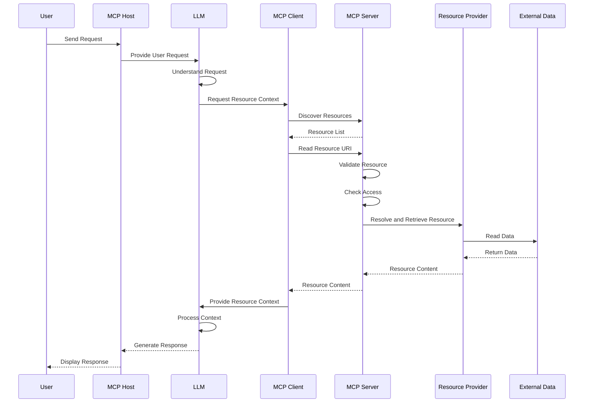
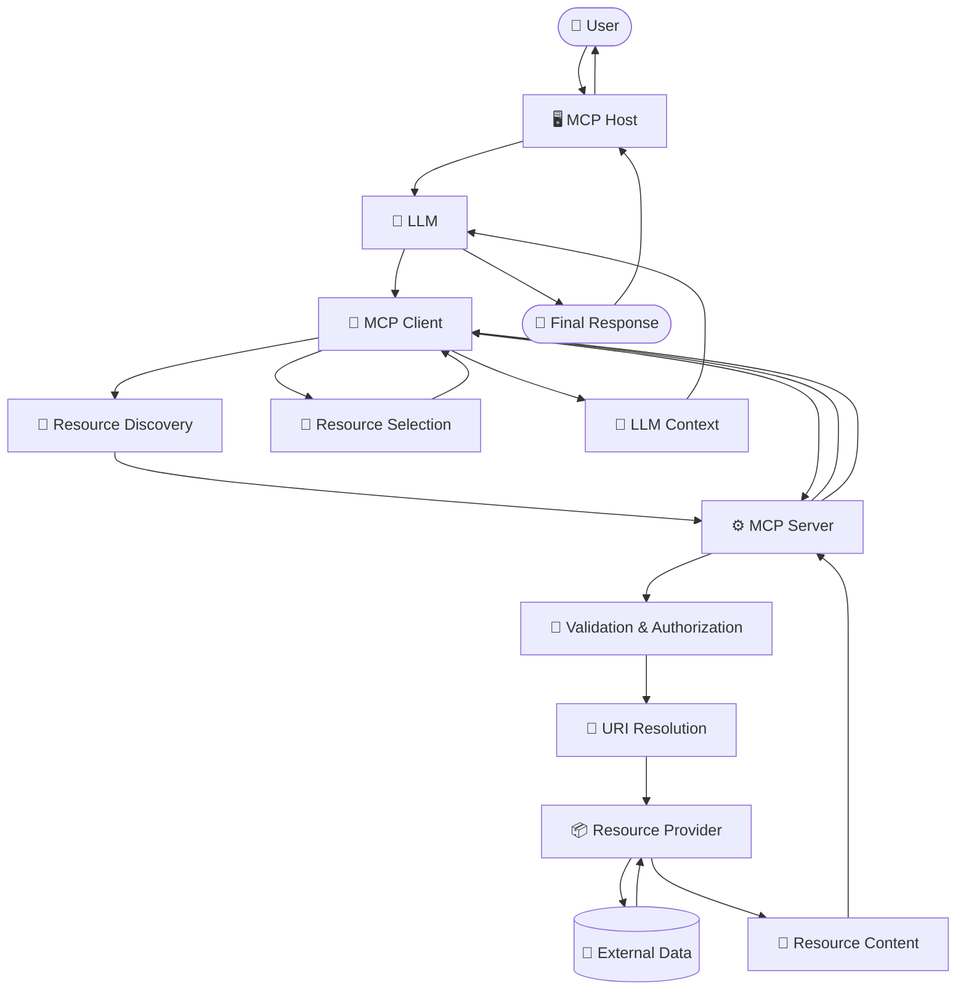

# MCP Resources - Flow

> A detailed guide to the complete flow of MCP Resources, from the user's request to resource discovery, resource retrieval, context delivery, and the final response.

---

# Table of Contents

1. Introduction
2. What is the MCP Resource Flow?
3. High-Level Resource Flow
4. Complete Resource Flow
5. Step 1 - User Sends Request
6. Step 2 - MCP Host Receives Request
7. Step 3 - LLM Understands the Request
8. Step 4 - Determine Whether Context is Required
9. Step 5 - MCP Client Handles Resource Communication
10. Step 6 - Resource Discovery
11. Step 7 - Resource Selection
12. Step 8 - Resource URI Identification
13. Step 9 - Resource Read Request
14. Step 10 - MCP Server Receives Request
15. Step 11 - Resource Validation
16. Step 12 - Access Control
17. Step 13 - URI Resolution
18. Step 14 - Resource Provider
19. Step 15 - External Data Source
20. Step 16 - Data Retrieval
21. Step 17 - Resource Content Creation
22. Step 18 - Server Returns Resource
23. Step 19 - MCP Client Receives Resource
24. Step 20 - Context is Provided to LLM
25. Step 21 - LLM Processes Context
26. Step 22 - Generate Final Response
27. Step 23 - MCP Host Displays Response
28. Complete Sequence Diagram
29. Resource Discovery Flow
30. Resource Read Flow
31. Static Resource Flow
32. Dynamic Resource Flow
33. Resource Template Flow
34. File Resource Flow
35. Database Resource Flow
36. API Resource Flow
37. Documentation Resource Flow
38. Resource Update Flow
39. Resource Subscription Flow
40. Resource Error Flow
41. Resource Security Flow
42. Resource Caching Flow
43. Resource + Tool Flow
44. Resource + Prompt Flow
45. Multi-Resource Flow
46. Complete End-to-End Example
47. Common Flow Mistakes
48. Best Practices
49. Quick Flow Reference
50. Key Takeaways
51. Summary

---

# Introduction

The **Model Context Protocol (MCP)** defines a standardized way for AI applications to communicate with external systems.

One of the major MCP primitives is the **Resource**.

Resources provide information that an AI application can use as context.

Examples include:

- Files
- Documents
- Database records
- API responses
- Documentation
- Logs
- Application state
- Configuration
- Knowledge-base information

The Resource flow explains how information moves between:

```text
User
  ↓
MCP Host
  ↓
LLM
  ↓
MCP Client
  ↓
MCP Server
  ↓
Resource Provider
  ↓
External Data
  ↓
Resource Content
  ↓
MCP Client
  ↓
LLM
  ↓
MCP Host
  ↓
User
```

The important idea is that the LLM does not directly access the underlying resource.

---

# What is the MCP Resource Flow?

The MCP Resource Flow is the sequence of operations through which an AI application discovers, selects, requests, retrieves, and uses a resource.

A simplified flow is:

```text
User Request
     ↓
MCP Host
     ↓
LLM
     ↓
MCP Client
     ↓
Resource Discovery
     ↓
Resource Selection
     ↓
Resource Read
     ↓
MCP Server
     ↓
Resource Provider
     ↓
External Data
     ↓
Resource Content
     ↓
MCP Client
     ↓
LLM Context
     ↓
Final Answer
```

---

# High-Level Resource Flow

```text
                         USER
                           │
                           │ Request
                           ▼
                    MCP HOST APPLICATION
                           │
                           ▼
                          LLM
                           │
                           │ Needs Context
                           ▼
                       MCP CLIENT
                           │
                           │ Discover / Read
                           ▼
                      MCP SERVER
                           │
                           ▼
                   RESOURCE MANAGER
                           │
                           ▼
                   RESOURCE PROVIDER
                           │
                           ▼
                    EXTERNAL DATA
                           │
                           ▼
                  RESOURCE CONTENT
                           │
                           ▼
                       MCP CLIENT
                           │
                           ▼
                          LLM
                           │
                           ▼
                    MCP HOST APPLICATION
                           │
                           ▼
                          USER
```

---

# Complete Resource Flow

The complete flow can be divided into four major phases.

```text
PHASE 1
Request Understanding

User
 ↓
MCP Host
 ↓
LLM


PHASE 2
Resource Discovery

LLM
 ↓
MCP Client
 ↓
MCP Server
 ↓
Resource List


PHASE 3
Resource Retrieval

MCP Client
 ↓
MCP Server
 ↓
Resource Provider
 ↓
External Data
 ↓
Resource Content


PHASE 4
Context Processing

Resource Content
 ↓
MCP Client
 ↓
LLM
 ↓
MCP Host
 ↓
User
```

---

# Step 1 - User Sends Request

The flow starts when the user sends a request.

Example:

```text
User:

"Read the project README and explain what this project does."
```

At this point, the system has:

```text
User Request
     ↓
"Read the project README..."
```

The request is passed to the MCP Host.

---

# Step 2 - MCP Host Receives Request

The MCP Host is responsible for managing the AI interaction.

```text
User
 │
 │ Request
 ▼
MCP Host
```

The host may manage:

- User interface
- Conversation
- LLM connection
- MCP Clients
- Context
- Permissions
- Application state

The host sends the request to the LLM.

---

# Step 3 - LLM Understands the Request

The LLM analyzes the user's request.

Example:

```text
User Request:

"Explain the project using the README."
```

The LLM identifies:

```text
Required information:
Project README
```

The LLM may determine that external context is needed.

```text
User Request
     ↓
LLM
     ↓
Need project README
```

---

# Step 4 - Determine Whether Context is Required

The LLM or host workflow determines whether an MCP Resource is needed.

```text
                  User Request
                       │
                       ▼
                      LLM
                       │
                       ▼
              Need external context?
                 /            \
               NO              YES
               │                │
               ▼                ▼
        Generate Answer    Use Resource
```

If no external information is required:

```text
LLM
 ↓
Answer
```

If external information is required:

```text
LLM
 ↓
MCP Client
 ↓
Resource Flow
```

---

# Step 5 - MCP Client Handles Resource Communication

The MCP Client is responsible for communicating with the MCP Server.

```text
LLM / Host
    │
    ▼
MCP Client
    │
    ▼
MCP Server
```

The client may perform operations such as:

```text
Discover Resources
Read Resource
Subscribe to Resource Updates
```

---

# Step 6 - Resource Discovery

Before reading a resource, the client may need to know which resources are available.

```text
MCP Client
     │
     │ Resource Discovery
     ▼
MCP Server
     │
     ▼
Resource Registry
     │
     ▼
Available Resources
     │
     ▼
MCP Client
```

Example:

```text
Available Resources:

repo://README.md
repo://src/main.py
repo://docs/architecture.md
```

The client now knows which resources can be requested.

---

# Step 7 - Resource Selection

The relevant resource is selected.

Example:

```text
Available Resources:

repo://README.md
repo://src/main.py
repo://docs/architecture.md
```

Required resource:

```text
repo://README.md
```

Flow:

```text
Resource List
     ↓
Select Relevant Resource
     ↓
repo://README.md
```

---

# Step 8 - Resource URI Identification

Every resource is identified by a URI.

Example:

```text
repo://README.md
```

Other examples:

```text
file:///project/README.md
database://users/123
docs://mcp/resources
api://system/status
```

Flow:

```text
Resource Selection
       ↓
Resource URI
       ↓
MCP Client
```

---

# Step 9 - Resource Read Request

The MCP Client sends a request to read the selected resource.

Conceptually:

```text
MCP Client
     │
     │ Read Resource
     │ URI: repo://README.md
     ▼
MCP Server
```

The server now needs to resolve and retrieve the resource.

---

# Step 10 - MCP Server Receives Request

The MCP Server receives the resource request.

```text
MCP Client
     │
     │ Resource Read Request
     ▼
MCP Server
```

The server processes:

```text
Resource URI
     ↓
Validation
     ↓
Authorization
     ↓
URI Resolution
     ↓
Resource Provider
```

---

# Step 11 - Resource Validation

The server validates the requested resource.

```text
Resource Request
      │
      ▼
Validate URI
      │
      ▼
Validate Parameters
      │
      ▼
Validate Resource
```

Possible failures include:

```text
Invalid URI
Invalid Resource
Invalid Template Parameter
Malformed Request
```

If validation fails:

```text
Request
 ↓
Validation
 ↓
❌ Error
```

If validation succeeds:

```text
Request
 ↓
Validation
 ↓
✅ Continue
```

---

# Step 12 - Access Control

After validation, the server can check whether access is allowed.

```text
Resource Request
      │
      ▼
Authentication
      │
      ▼
Authorization
      │
      ▼
Access Decision
```

Decision:

```text
                 Access?
                /       \
              NO         YES
              │           │
              ▼           ▼
            Error      Continue
```

This prevents unauthorized resource access.

---

# Step 13 - URI Resolution

The MCP Server resolves the resource URI.

Example:

```text
repo://README.md
```

may be mapped internally to:

```text
/project/README.md
```

Flow:

```text
Resource URI
     ↓
URI Resolver
     ↓
Internal Resource Location
```

For a dynamic resource:

```text
customer://101
```

the resolver may extract:

```text
customer_id = 101
```

---

# Step 14 - Resource Provider

The Resource Provider retrieves the actual information.

```text
MCP Server
     │
     ▼
Resource Provider
```

The provider can communicate with:

```text
File System
Database
External API
Documentation Store
Application State
```

---

# Step 15 - External Data Source

The Resource Provider accesses the underlying data source.

Example:

```text
MCP Server
     ↓
File Provider
     ↓
File System
     ↓
README.md
```

Database example:

```text
MCP Server
     ↓
Database Provider
     ↓
Database
     ↓
Users Table
```

API example:

```text
MCP Server
     ↓
API Provider
     ↓
External API
     ↓
JSON Response
```

---

# Step 16 - Data Retrieval

The actual data is retrieved.

Example:

```text
Resource URI:

repo://README.md
```

Data source:

```text
README.md
```

Content:

```markdown
# My Project

This project demonstrates MCP Resources.
```

Flow:

```text
External Data
     ↓
Resource Provider
     ↓
Retrieved Data
```

---

# Step 17 - Resource Content Creation

The retrieved information is converted into the resource content representation expected by the MCP protocol.

```text
External Data
     ↓
Resource Provider
     ↓
Resource Content
```

Conceptually:

```text
URI
Metadata
Content
```

Example:

```text
URI:
repo://README.md

MIME Type:
text/markdown

Content:
# My Project
...
```

---

# Step 18 - Server Returns Resource

The MCP Server sends the resource content back to the MCP Client.

```text
External Data
     ↓
Resource Provider
     ↓
MCP Server
     ↓
MCP Client
```

The server does not need to expose the internal implementation details of the data source.

---

# Step 19 - MCP Client Receives Resource

The MCP Client receives the resource.

```text
MCP Server
     │
     │ Resource Content
     ▼
MCP Client
```

The client can now make the resource available to the host/LLM workflow.

---

# Step 20 - Context is Provided to LLM

The resource content becomes context for the LLM.

```text
Resource Content
       ↓
MCP Client
       ↓
LLM Context
```

Example:

```text
User:
"Explain the project."

Resource:
"# My Project
This project demonstrates MCP Resources."

LLM:
Uses README as context.
```

---

# Step 21 - LLM Processes Context

The LLM combines:

```text
User Request
+
Resource Context
+
Conversation Context
```

Conceptually:

```text
              ┌─────────────────┐
              │  User Request   │
              └────────┬────────┘
                       │
                       ▼
              ┌─────────────────┐
              │      LLM        │
              └────────┬────────┘
                       ▲
                       │
              ┌────────┴────────┐
              │ Resource Context│
              └─────────────────┘
```

The LLM uses the retrieved information to formulate the answer.

---

# Step 22 - Generate Final Response

The LLM generates the response.

Example:

```text
"The project demonstrates how MCP Resources
can provide contextual information to an AI
application."
```

Flow:

```text
User Request
     +
Resource Context
     ↓
LLM
     ↓
Final Response
```

---

# Step 23 - MCP Host Displays Response

The response returns to the MCP Host.

```text
LLM
 ↓
MCP Host
 ↓
User Interface
```

The host displays the final answer.

---

# Complete Sequence Diagram



---

# Resource Discovery Flow

The discovery flow can be represented as:

```text
MCP Client
     │
     │ List Resources
     ▼
MCP Server
     │
     ▼
Resource Registry
     │
     ▼
Resource Metadata
     │
     ▼
MCP Server
     │
     ▼
MCP Client
```

Example:

```text
Client asks:

"What resources are available?"

Server returns:

repo://README.md
repo://src/main.py
docs://architecture
```

---

# Resource Read Flow

The read flow is:

```text
MCP Client
     │
     │ Read URI
     ▼
MCP Server
     │
     ▼
Validate
     │
     ▼
Authorize
     │
     ▼
Resolve URI
     │
     ▼
Resource Provider
     │
     ▼
External Data
     │
     ▼
Resource Content
     │
     ▼
MCP Server
     │
     ▼
MCP Client
```

---

# Static Resource Flow

Static resources have known resource locations.

Example:

```text
docs://mcp/resources
```

Flow:

```text
Client
  ↓
Read Static URI
  ↓
MCP Server
  ↓
Static Resource Provider
  ↓
Documentation
  ↓
Resource Content
  ↓
Client
```

---

# Dynamic Resource Flow

Dynamic resources retrieve information based on runtime parameters.

Example:

```text
customer://101
```

Flow:

```text
Client
  ↓
customer://101
  ↓
MCP Server
  ↓
URI Resolver
  ↓
customer_id = 101
  ↓
Database Provider
  ↓
Database
  ↓
Customer Record
  ↓
Resource Content
  ↓
Client
```

---

# Resource Template Flow

A Resource Template defines a URI pattern.

Example:

```text
customer://{customer_id}
```

Request:

```text
customer://101
```

Flow:

```text
URI Template
     ↓
Extract Parameter
     ↓
customer_id = 101
     ↓
Resolve Resource
     ↓
Retrieve Data
     ↓
Return Content
```

Another example:

```text
order://{order_id}
```

Request:

```text
order://5001
```

The same template can support many orders.

---

# File Resource Flow

Example:

```text
file:///project/README.md
```

Flow:

```text
User
 ↓
LLM
 ↓
MCP Client
 ↓
MCP Server
 ↓
File Provider
 ↓
File System
 ↓
README.md
 ↓
Resource Content
 ↓
MCP Client
 ↓
LLM
 ↓
Response
```

---

# Database Resource Flow

Example:

```text
database://users/123
```

Flow:

```text
User
 ↓
LLM
 ↓
MCP Client
 ↓
MCP Server
 ↓
Database Provider
 ↓
Database
 ↓
Users Table
 ↓
User Record
 ↓
Resource Content
 ↓
MCP Client
 ↓
LLM
 ↓
Response
```

---

# API Resource Flow

Example:

```text
api://weather/current
```

Flow:

```text
User
 ↓
LLM
 ↓
MCP Client
 ↓
MCP Server
 ↓
API Provider
 ↓
External API
 ↓
JSON Response
 ↓
Resource Content
 ↓
MCP Client
 ↓
LLM
 ↓
Response
```

---

# Documentation Resource Flow

Example:

```text
docs://mcp/resources
```

Flow:

```text
User Question
     ↓
LLM
     ↓
MCP Client
     ↓
MCP Server
     ↓
Documentation Provider
     ↓
Documentation Store
     ↓
Relevant Documentation
     ↓
Resource Content
     ↓
LLM
     ↓
Answer
```

---

# Resource Update Flow

When a resource changes, the flow may involve an update notification.

```text
Resource
    │
    │ Data Changes
    ▼
MCP Server
    │
    │ Resource Update
    ▼
MCP Client
    │
    ▼
Updated Resource
    │
    ▼
LLM Context
```

Example:

```text
Database Record
     ↓
Record Updated
     ↓
Resource Changes
     ↓
Client Receives Update
     ↓
New Context
```

---

# Resource Subscription Flow

When subscriptions are supported:

```text
MCP Client
     │
     │ Subscribe
     ▼
MCP Server
     │
     ▼
Resource
     │
     │ Changes
     ▼
MCP Server
     │
     │ Notification
     ▼
MCP Client
```

The client can then retrieve or process the updated resource.

---

# Resource Error Flow

Errors can occur at different stages.

```text
Client
  ↓
MCP Server
  ↓
Validation
  ↓
Authorization
  ↓
Provider
  ↓
Data Source
```

Possible errors:

```text
Invalid URI
Resource Not Found
Permission Denied
Database Error
API Error
Network Error
Provider Error
```

Error flow:

```text
Error
 ↓
Resource Provider / Server
 ↓
Error Handling
 ↓
Structured Error
 ↓
MCP Client
 ↓
Host / LLM
 ↓
User
```

---

# Resource Security Flow

A secure resource flow should include access checks.

```text
MCP Client
     ↓
Resource Request
     ↓
MCP Server
     ↓
Authentication
     ↓
Authorization
     ↓
URI Validation
     ↓
Resource Provider
     ↓
Filtered Resource
     ↓
MCP Client
```

The server should avoid exposing data that the requester is not allowed to access.

---

# Resource Caching Flow

Caching can reduce repeated access to slow data sources.

```text
MCP Client
     ↓
MCP Server
     ↓
Cache
    / \
   /   \
 HIT   MISS
 │       │
 ▼       ▼
Data   Provider
         │
         ▼
      Data Source
```

On a cache hit:

```text
Cache
 ↓
Resource Content
 ↓
Client
```

On a cache miss:

```text
Cache
 ↓
Resource Provider
 ↓
External Data
 ↓
Cache
 ↓
Client
```

Caching strategy should consider how frequently the resource changes.

---

# Resource + Tool Flow

Resources and Tools can work together in a single workflow.

Example:

```text
User
 ↓
LLM
 ↓
Read Customer Resource
 ↓
Analyze Customer Data
 ↓
Call Tool
 ↓
Update Database
 ↓
Read Updated Resource
 ↓
LLM
 ↓
Final Response
```

Detailed flow:

```text
customer://101
     ↓
Read Customer
     ↓
LLM analyzes customer
     ↓
update_customer()
     ↓
Database Updated
     ↓
customer://101
     ↓
Read Updated Customer
     ↓
LLM
```

Resources provide information.

Tools perform actions.

---

# Resource + Prompt Flow

Prompts can provide instructions for how the LLM should use resource information.

```text
Prompt
  ↓
LLM
  ↓
Resource
  ↓
Context
  ↓
LLM
  ↓
Response
```

Example:

```text
Prompt:

"Summarize the project documentation."

Resource:

docs://project/README

LLM:

Uses the documentation to create the summary.
```

---

# Multi-Resource Flow

A request may require multiple resources.

Example:

```text
User:

"Compare customer 101's order with the refund policy."
```

Required resources:

```text
customer://101
order://5001
docs://refund-policy
```

Flow:

```text
                    User
                      ↓
                     LLM
                      ↓
                 MCP Client
                      ↓
              ┌───────┼───────┐
              ↓       ↓       ↓
         Customer    Order   Policy
              ↓       ↓       ↓
              └───────┼───────┘
                      ↓
                 Resource Context
                      ↓
                     LLM
                      ↓
                  Response
```

---

# Complete End-to-End Example

Consider an AI coding assistant.

User request:

```text
"Explain what the authentication module does."
```

The project contains:

```text
project/
├── README.md
├── src/
│   ├── auth.py
│   └── main.py
└── docs/
    └── architecture.md
```

The MCP Server exposes:

```text
repo://README.md
repo://src/auth.py
repo://src/main.py
docs://architecture
```

## Step 1

User sends:

```text
"Explain what the authentication module does."
```

## Step 2

MCP Host sends the request to the LLM.

## Step 3

LLM identifies that source code is required.

```text
Required Resource:

repo://src/auth.py
```

## Step 4

MCP Client communicates with MCP Server.

```text
MCP Client
    ↓
MCP Server
```

## Step 5

Server validates:

```text
repo://src/auth.py
```

## Step 6

Server resolves the URI:

```text
repo://src/auth.py
        ↓
project/src/auth.py
```

## Step 7

File Provider reads the file.

```text
File Provider
     ↓
auth.py
```

## Step 8

Resource content is returned.

```text
auth.py contents
```

## Step 9

MCP Client provides the content to the LLM.

## Step 10

LLM analyzes the code.

## Step 11

LLM generates the response.

```text
"The authentication module handles user
login, credential validation, and session
management."
```

## Step 12

MCP Host displays the response.

```text
User
 ↓
Answer
```

---

# Complete Example Flow Diagram



---

# Common Flow Mistakes

## 1. Thinking the LLM Directly Reads Resources

Incorrect:

```text
LLM
 ↓
File
```

Correct:

```text
LLM
 ↓
MCP Client
 ↓
MCP Server
 ↓
Resource Provider
 ↓
File
```

---

## 2. Skipping Resource Validation

Incorrect:

```text
Client
 ↓
Provider
 ↓
Data
```

Better:

```text
Client
 ↓
Server
 ↓
Validation
 ↓
Authorization
 ↓
Provider
 ↓
Data
```

---

## 3. Treating Resources as Actions

A Resource primarily provides information.

Example:

```text
customer://101
```

A Tool performs an action.

Example:

```text
update_customer()
```

Conceptually:

```text
Resource → Read Information

Tool → Perform Action
```

---

## 4. Returning Unnecessary Data

Avoid retrieving an entire database or project when only one resource is required.

Bad:

```text
Entire Project
     ↓
LLM
```

Better:

```text
Relevant Resource
     ↓
LLM
```

---

## 5. Ignoring Resource Freshness

Some resources change frequently.

Examples:

```text
Live Logs
Database State
System Status
Application State
```

The flow should consider whether cached information is still valid.

---

# Best Practices

✔ Understand the user request before selecting resources.

✔ Discover resources when the available resource set is not already known.

✔ Select only relevant resources.

✔ Use meaningful resource URIs.

✔ Validate resource requests.

✔ Apply access control before retrieving protected data.

✔ Keep resource providers separate from protocol logic.

✔ Return only useful context.

✔ Handle resource errors gracefully.

✔ Consider resource freshness.

✔ Use caching where appropriate.

✔ Use Resource Templates for dynamic resources.

✔ Use Resources for information.

✔ Use Tools for actions.

✔ Keep the flow modular and observable.

---

# Quick Flow Reference

## Basic Flow

```text
User
 ↓
Host
 ↓
LLM
 ↓
MCP Client
 ↓
MCP Server
 ↓
Resource Provider
 ↓
External Data
 ↓
Resource Content
 ↓
MCP Client
 ↓
LLM
 ↓
Host
 ↓
User
```

## Discovery Flow

```text
Client
 ↓
Server
 ↓
Resource Registry
 ↓
Resource List
 ↓
Client
```

## Read Flow

```text
Client
 ↓
Server
 ↓
Validate
 ↓
Authorize
 ↓
Resolve URI
 ↓
Provider
 ↓
Data Source
 ↓
Content
 ↓
Client
```

## Dynamic Resource Flow

```text
URI Template
 ↓
Parameter
 ↓
Resolver
 ↓
Provider
 ↓
Data
 ↓
Content
```

## Error Flow

```text
Request
 ↓
Server
 ↓
Error
 ↓
Error Handler
 ↓
Client
 ↓
User
```

---

# Key Takeaways

- The MCP Resource flow starts with a user request.
- The MCP Host manages the AI application.
- The LLM understands what information is required.
- The MCP Client communicates with the MCP Server.
- Resources can be discovered before they are read.
- A Resource is identified using a URI.
- The MCP Server validates resource requests.
- Access control can be applied before retrieving data.
- The Resource Provider communicates with the actual data source.
- The external data source provides the underlying information.
- The server returns the resource content to the MCP Client.
- The resource content becomes context for the LLM.
- The LLM uses the context to generate the final response.
- Static resources use known resource identifiers.
- Dynamic resources can resolve runtime parameters.
- Resource Templates support reusable URI patterns.
- Resources can be backed by files, databases, APIs, and documentation.
- Resources and Tools can be combined in a single workflow.
- Resource updates and subscriptions can support changing information.
- Error handling and security are important parts of the flow.

---

# Summary

The complete MCP Resource flow can be remembered as:

```text
USER
  ↓
MCP HOST
  ↓
LLM
  ↓
MCP CLIENT
  ↓
RESOURCE DISCOVERY
  ↓
RESOURCE SELECTION
  ↓
MCP SERVER
  ↓
VALIDATION
  ↓
AUTHORIZATION
  ↓
URI RESOLUTION
  ↓
RESOURCE PROVIDER
  ↓
EXTERNAL DATA
  ↓
RESOURCE CONTENT
  ↓
MCP CLIENT
  ↓
LLM CONTEXT
  ↓
LLM
  ↓
MCP HOST
  ↓
USER
```

The most important flow principle is:

> **The user provides the request, the LLM determines what context is needed, the MCP Client communicates with the MCP Server, the server controls resource access, the Resource Provider retrieves the data, and the retrieved resource becomes context for the LLM.**

Understanding this flow provides the foundation for implementing MCP Resources in Python and Node.js.
