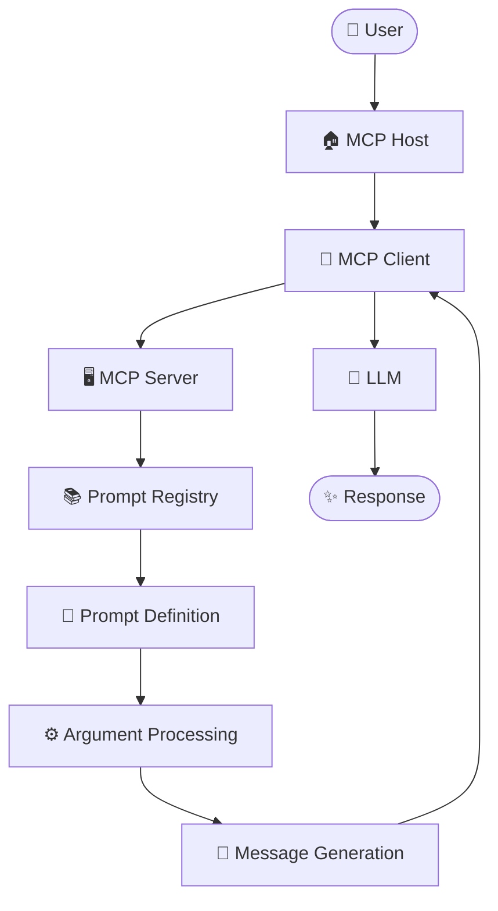
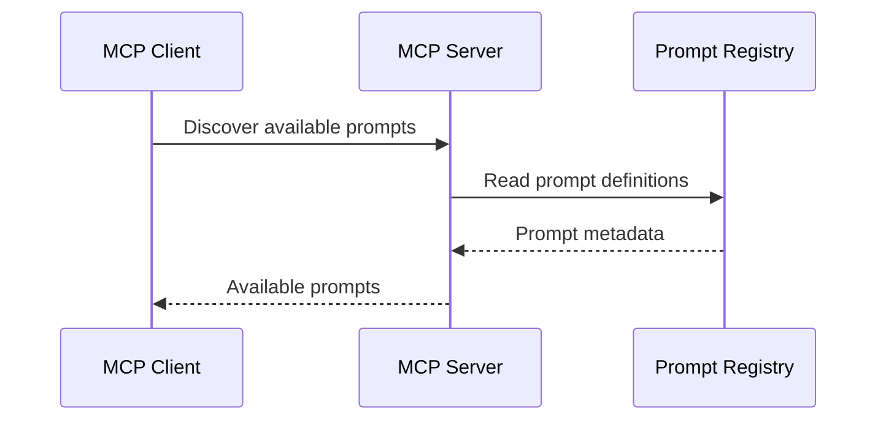
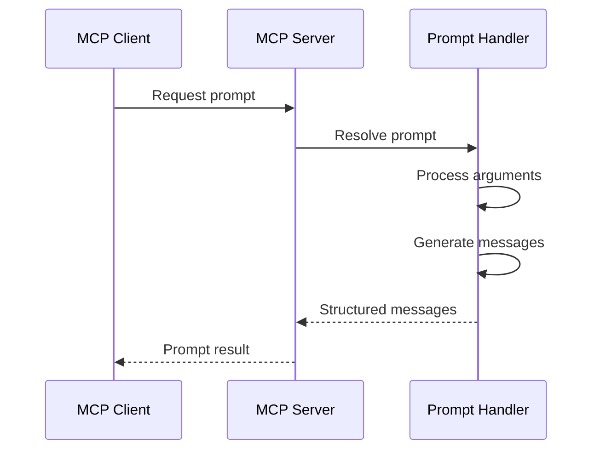
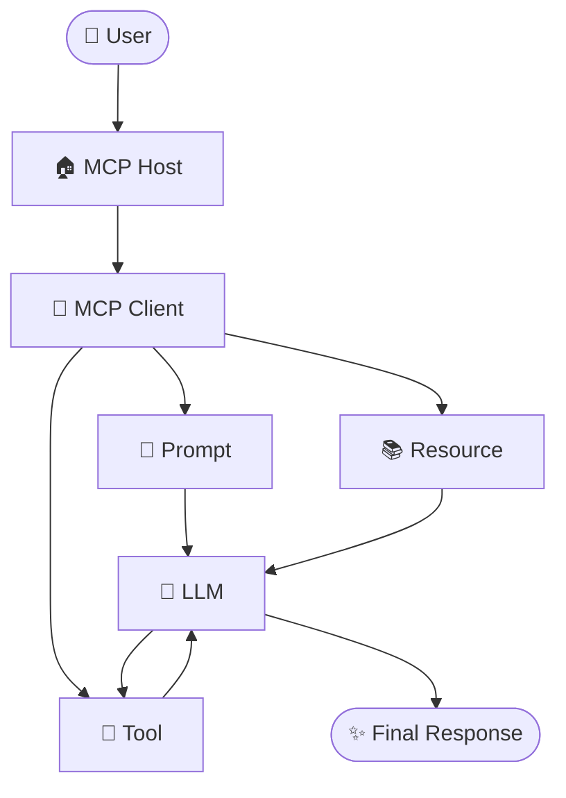

# MCP Prompts - Architecture

> A complete architectural guide to understanding how **Prompts** are exposed, discovered, retrieved, parameterized, and used within the **Model Context Protocol (MCP)**.

---

# Table of Contents

1. Introduction
2. What is MCP Prompt Architecture?
3. High-Level Architecture
4. Core Components
5. MCP Host
6. MCP Client
7. MCP Server
8. Prompt Registry
9. Prompt Definition
10. Prompt Metadata
11. Prompt Arguments
12. Prompt Message Generation
13. Prompt Discovery Architecture
14. Prompt Retrieval Architecture
15. Prompt Communication Architecture
16. JSON-RPC Communication
17. Prompt Request Flow
18. Prompt Response Flow
19. Complete Prompt Architecture
20. Static Prompt Architecture
21. Dynamic Prompt Architecture
22. Prompt Template Architecture
23. Prompt Validation Layer
24. Security Architecture
25. Prompt Injection Boundary
26. Resource + Prompt Architecture
27. Tool + Prompt Architecture
28. Resources + Prompts + Tools Architecture
29. Multi-Prompt Server Architecture
30. Enterprise Prompt Architecture
31. Prompt Versioning Architecture
32. Prompt Testing Architecture
33. Prompt Evaluation Architecture
34. Prompt Observability
35. Prompt Error Handling
36. Prompt Scalability
37. Prompt Governance
38. Deployment Architecture
39. End-to-End Architecture
40. Best Practices
41. Common Architectural Mistakes
42. Key Takeaways
43. Summary

---

# Introduction

MCP Prompts are designed to provide reusable and discoverable instructions for AI applications.

To understand how Prompts work in MCP, it is important to understand the architecture around them.

The architecture normally contains:

```text
User
  |
  v
MCP Host
  |
  v
MCP Client
  |
  v
MCP Server
  |
  v
Prompt System
```

The Prompt System is responsible for exposing prompt definitions and generating the appropriate prompt messages when requested.

The exact internal implementation can differ between MCP servers and SDKs, but the conceptual architecture remains similar.

---

# What is MCP Prompt Architecture?

MCP Prompt Architecture describes how the different components cooperate to provide reusable prompt capabilities.

The architecture includes:

```text
MCP Host
    |
    v
MCP Client
    |
    v
MCP Server
    |
    +---- Prompt Registry
    |
    +---- Prompt Definitions
    |
    +---- Argument Handling
    |
    +---- Message Generation
```

The overall purpose is to separate:

```text
User Interface
      |
      v
Protocol Communication
      |
      v
Prompt Definition
      |
      v
Prompt Generation
      |
      v
Model Interaction
```

This separation improves modularity and maintainability.

---

# High-Level Architecture

The high-level architecture can be represented as:

```text
                         USER
                           |
                           | Request
                           v
                     MCP HOST
                           |
                           v
                     MCP CLIENT
                           |
                  JSON-RPC / MCP
                           |
                           v
                     MCP SERVER
                           |
              +------------+------------+
              |                         |
              v                         v
        PROMPT REGISTRY          PROMPT HANDLER
              |                         |
              +------------+------------+
                           |
                           v
                    PROMPT TEMPLATE
                           |
                           v
                   ARGUMENT PROCESSING
                           |
                           v
                  STRUCTURED MESSAGES
                           |
                           v
                      MCP CLIENT
                           |
                           v
                          LLM
                           |
                           v
                       RESPONSE
```

---

# High-Level Mermaid Architecture



This diagram represents the conceptual flow of a prompt from the user request through the MCP architecture.

---

# Core Components

The main architectural components are:

| Component | Responsibility |
|----------|----------------|
| MCP Host | Manages the overall AI application |
| MCP Client | Communicates with MCP Servers |
| MCP Server | Exposes MCP capabilities |
| Prompt Registry | Organizes available prompts |
| Prompt Definition | Defines a reusable prompt |
| Prompt Arguments | Provides dynamic input |
| Prompt Handler | Processes prompt requests |
| Message Generator | Produces structured messages |
| LLM | Uses the resulting instructions |

---

# MCP Host

The **MCP Host** is the application that provides the overall AI experience.

Examples conceptually include:

```text
AI Desktop Application
IDE
AI Assistant
Enterprise AI Application
Custom Chat Application
```

The host is responsible for orchestrating the user interaction and MCP client connections.

Architecture:

```text
User
 |
 v
MCP Host
 |
 +---- User Interface
 |
 +---- LLM Integration
 |
 +---- MCP Client
 |
 +---- Session Management
```

The host should not need to hard-code every prompt provided by every MCP server.

---

# MCP Client

The MCP Client is the protocol-aware component inside the host.

Its responsibilities may include:

```text
Connect to MCP Server
        |
        v
Discover Capabilities
        |
        v
Discover Prompts
        |
        v
Select Prompt
        |
        v
Send Prompt Request
        |
        v
Receive Prompt Messages
```

Conceptually:

```text
MCP Host
   |
   v
MCP Client
   |
   +---- Protocol Communication
   |
   +---- Prompt Discovery
   |
   +---- Prompt Retrieval
   |
   +---- Session Handling
```

The client acts as the communication bridge between the host and MCP Server.

---

# MCP Server

The MCP Server exposes capabilities to an MCP Client.

For prompts, the server can contain:

```text
MCP Server

├── Prompt Registry
├── Prompt Definitions
├── Argument Validation
├── Prompt Handlers
└── Message Generation
```

Example:

```text
MCP Server
    |
    +-- code_review
    +-- debug_code
    +-- generate_tests
    +-- generate_docs
```

The server owns the implementation of the prompt definitions.

---

# Prompt Registry

The Prompt Registry is a conceptual collection of available prompts.

Example:

```text
Prompt Registry

├── code_review
├── debug_code
├── explain_code
├── generate_tests
├── generate_documentation
└── summarize_document
```

The registry may be implemented using:

```text
Dictionary
Map
Database
File System
Configuration
Application Code
```

The exact implementation is application-specific.

The important concept is that the server can identify and expose its available prompts.

---

# Prompt Definition

A Prompt Definition describes a reusable prompt.

Conceptually:

```text
Prompt Definition
│
├── Name
├── Description
├── Arguments
└── Message Generation Logic
```

Example:

```text
Name:

code_review
```

Description:

```text
Review source code for
quality and security issues.
```

Arguments:

```text
language
code
```

Message generation:

```text
Generate review instructions
using language and code.
```

---

# Prompt Metadata

Prompt metadata allows clients to understand what a prompt is designed to do.

Example:

```text
Prompt:

code_review

Description:

Review source code for
correctness and security.

Arguments:

language
code
```

Architecture:

```text
Prompt
 |
 +-- Name
 |
 +-- Description
 |
 +-- Arguments
 |
 +-- Generated Messages
```

Metadata improves prompt discovery and usability.

---

# Prompt Arguments

Arguments allow prompt definitions to be dynamic.

Example:

```text
Prompt:

code_review
```

Arguments:

```text
language
code
```

Architecture:

```text
Client
  |
  | Arguments
  v
Prompt Handler
  |
  +---- language
  |
  +---- code
  |
  v
Prompt Template
```

The server uses these arguments to generate the final prompt messages.

---

# Argument Processing

The prompt server may process arguments before generating messages.

Conceptually:

```text
Incoming Arguments
        |
        v
Validation
        |
        v
Normalization
        |
        v
Template Processing
        |
        v
Message Generation
```

For example:

```text
language = Python
code = "..."
```

The server inserts the values into the prompt's dynamic content.

---

# Prompt Message Generation

The Prompt Handler generates structured prompt messages.

Conceptual architecture:

```text
Prompt Request
      |
      v
Prompt Handler
      |
      v
Argument Processing
      |
      v
Prompt Template
      |
      v
Structured Messages
```

Example:

```text
Prompt:

code_review

Input:

language = Python

code = "def add(a,b): ..."
```

Generated message:

```text
Review the following Python code.

Identify bugs, security issues,
performance issues, and maintainability problems.

Code:

def add(a,b): ...
```

---

# Prompt Discovery Architecture

Before retrieving a specific prompt, the client needs to know which prompts are available.

Conceptually:

```text
MCP Client
     |
     | Discover Prompts
     v
MCP Server
     |
     v
Prompt Registry
     |
     v
Available Prompt Metadata
     |
     v
MCP Client
```

Example result:

```text
code_review
debug_code
generate_tests
generate_documentation
```

The client can then choose an appropriate prompt.

---

# Prompt Discovery Diagram



---

# Prompt Retrieval Architecture

After discovering prompts, the client can request one prompt.

```text
MCP Client
     |
     | Select Prompt
     |
     | Prompt Arguments
     v
MCP Server
     |
     v
Prompt Handler
     |
     v
Prompt Definition
     |
     v
Generated Messages
     |
     v
MCP Client
```

The retrieval stage transforms a prompt identifier and arguments into structured prompt messages.

---

# Prompt Retrieval Diagram



---

# Prompt Communication Architecture

MCP uses protocol communication between the client and server.

Conceptually:

```text
MCP Client
     |
     | JSON-RPC
     v
MCP Server
```

Prompt operations are communicated using MCP protocol messages.

The architecture separates:

```text
Application Logic

from

Protocol Communication
```

This allows different clients and servers to communicate using a common protocol.

---

# JSON-RPC Communication

MCP communication is based on JSON-RPC.

Conceptually:

```text
Client

↓

JSON-RPC Request

↓

Server

↓

JSON-RPC Response

↓

Client
```

A conceptual prompt request can be thought of as:

```json
{
  "jsonrpc": "2.0",
  "id": 1,
  "method": "prompt-operation",
  "params": {
    "name": "code_review",
    "arguments": {
      "language": "Python",
      "code": "..."
    }
  }
}
```

> This is a conceptual example. Use the exact MCP method names and schemas defined by the MCP specification version and SDK you are implementing.

---

# Prompt Request Flow

The request architecture is:

```text
User
 |
 v
MCP Host
 |
 v
MCP Client
 |
 | Prompt Request
 v
MCP Server
 |
 v
Prompt Handler
 |
 v
Prompt Registry
 |
 v
Prompt Definition
 |
 v
Argument Processing
 |
 v
Message Generation
```

---

# Prompt Response Flow

After the server processes the prompt:

```text
Message Generation
       |
       v
Structured Messages
       |
       v
MCP Server
       |
       v
MCP Client
       |
       v
MCP Host
       |
       v
LLM
       |
       v
Final Response
```

---

# Complete Prompt Architecture

The complete architecture can be represented as:

```text
                              USER
                                |
                                v
                           MCP HOST
                                |
                     +----------+----------+
                     |                     |
                     v                     v
                 User UI               LLM Layer
                     |
                     v
                 MCP CLIENT
                     |
                     |
              MCP / JSON-RPC
                     |
                     v
                 MCP SERVER
                     |
          +----------+----------+
          |                     |
          v                     v
   PROMPT REGISTRY        PROMPT HANDLER
          |                     |
          |                     v
          |              ARGUMENT PROCESSING
          |                     |
          +-----------> PROMPT DEFINITION
                                |
                                v
                         MESSAGE GENERATION
                                |
                                v
                       STRUCTURED MESSAGES
                                |
                                v
                            MCP CLIENT
                                |
                                v
                               LLM
                                |
                                v
                             RESPONSE
```

---

# Static Prompt Architecture

A static prompt does not require dynamic arguments.

Example:

```text
explain_clean_code
```

Architecture:

```text
MCP Client
    |
    v
MCP Server
    |
    v
Prompt Registry
    |
    v
Static Prompt
    |
    v
Messages
    |
    v
MCP Client
```

Example:

```text
Explain the principles of clean code
with beginner-friendly examples.
```

---

# Dynamic Prompt Architecture

A dynamic prompt uses arguments.

Example:

```text
code_review(
    language,
    code
)
```

Architecture:

```text
MCP Client
    |
    | language
    | code
    v
MCP Server
    |
    v
Argument Validation
    |
    v
Prompt Template
    |
    v
Generated Messages
    |
    v
MCP Client
```

Dynamic prompts are useful when the same instructions must work with different input values.

---

# Prompt Template Architecture

A prompt template can be divided into:

```text
Prompt Template

├── Fixed Instructions
├── Dynamic Arguments
├── Task Requirements
└── Output Expectations
```

Example:

```text
Fixed:

Review the following code.

Dynamic:

{language}
{code}

Requirements:

Check correctness,
security,
performance,
maintainability.
```

Architecture:

```text
Arguments
    |
    v
Template Engine / Handler
    |
    +---- Fixed Instructions
    |
    +---- Dynamic Values
    |
    +---- Requirements
    |
    v
Structured Messages
```

---

# Prompt Validation Layer

Validation should occur before untrusted arguments are used.

Architecture:

```text
Client
 |
 v
Prompt Request
 |
 v
Argument Validation
 |
 +---- Invalid ----> Error
 |
 v
Valid Arguments
 |
 v
Prompt Handler
 |
 v
Message Generation
```

Possible validation checks:

```text
Required Argument Exists
Correct Data Type
Allowed Values
Maximum Length
Input Format
Security Constraints
```

---

# Validation Example

Suppose:

```text
Prompt:

generate_documentation
```

Arguments:

```text
language
code
format
```

Validation:

```text
language
   |
   +-- Required?
   +-- Allowed?
   +-- Valid format?

code
   |
   +-- Required?
   +-- Maximum size?
   +-- Valid encoding?

format
   |
   +-- markdown?
   +-- json?
   +-- text?
```

Only validated values should be passed to the prompt generation layer.

---

# Security Architecture

Prompt security should be treated as part of the overall MCP security model.

A secure conceptual architecture is:

```text
USER INPUT
    |
    v
VALIDATION
    |
    v
MCP CLIENT
    |
    v
AUTHENTICATED CONNECTION
    |
    v
MCP SERVER
    |
    v
AUTHORIZATION
    |
    v
PROMPT HANDLER
    |
    v
CONTROLLED MESSAGE GENERATION
```

Important security controls include:

```text
Authentication
Authorization
Input Validation
Least Privilege
Data Protection
Tool Permissions
Resource Permissions
Monitoring
```

---

# Prompt Injection Boundary

Prompt injection can happen when untrusted content is included in an AI interaction.

Example:

```text
Untrusted Document
        |
        v
Prompt Argument
        |
        v
Prompt Template
        |
        v
LLM
```

The architectural risk is:

```text
Trusted Instructions
        +
Untrusted Content
        |
        v
LLM Interpretation
```

Therefore, untrusted data should be clearly treated as data rather than trusted instructions.

---

# Secure Prompt Boundary

A safer architecture is:

```text
                   TRUSTED
                     |
                     v
              Prompt Definition
                     |
                     v
              Trusted Instructions
                     |
                     |
                     v
                  +-----+
                  | LLM |
                  +-----+
                     ^
                     |
                     |
              Untrusted Input
                     |
                     v
                 Validation
```

The application should also enforce security independently of the model's interpretation.

---

# Resource + Prompt Architecture

Resources provide information.

Prompts provide instructions.

Together:

```text
                 MCP CLIENT
                     |
          +----------+----------+
          |                     |
          v                     v
      RESOURCE                PROMPT
          |                     |
          v                     v
       Context              Instructions
          \                     /
           \                   /
            +-------+---------+
                    |
                    v
                   LLM
```

Example:

```text
Resource:

company_security_policy

Prompt:

analyze_security_compliance
```

The resource supplies the information while the prompt defines how to analyze it.

---

# Tool + Prompt Architecture

Tools perform actions.

Prompts provide instructions.

Architecture:

```text
                    PROMPT
                       |
                       v
                      LLM
                       |
                       v
                     TOOL
                       |
                       v
                    RESULT
                       |
                       v
                      LLM
                       |
                       v
                   RESPONSE
```

Example:

```text
Prompt:

analyze_database

Tool:

query_database
```

The prompt can guide the analysis while the tool performs the actual database operation.

---

# Resources + Prompts + Tools Architecture

The three primitives can work together.



Conceptually:

```text
Prompt   → Instructions
Resource → Context
Tool     → Action
LLM      → Reasoning / Generation
```

---

# Complete Combined Architecture

```text
                           USER
                             |
                             v
                        MCP HOST
                             |
                             v
                        MCP CLIENT
                             |
              +--------------+--------------+
              |              |              |
              v              v              v
           PROMPTS       RESOURCES        TOOLS
              |              |              |
              v              v              v
        Instructions       Context         Actions
              \              |              /
               \             |             /
                \            |            /
                 +-----------+-----------+
                             |
                             v
                            LLM
                             |
                             v
                          RESPONSE
```

---

# Multi-Prompt Server Architecture

A server can expose multiple prompts.

```text
                         MCP SERVER
                              |
                     PROMPT REGISTRY
                              |
       +----------+-----------+-----------+----------+
       |          |           |           |          |
       v          v           v           v          v
 code_review  debug_code  explain_code  testing   docs
       |          |           |           |          |
       v          v           v           v          v
   Handler     Handler     Handler     Handler    Handler
```

Each prompt can have its own:

```text
Description
Arguments
Validation
Message Generation
```

---

# Prompt Categories

A large server can categorize prompts.

```text
MCP Prompt Server

├── Coding
│   ├── code_review
│   ├── debug_code
│   └── refactor_code
│
├── Testing
│   ├── generate_tests
│   └── analyze_test_failure
│
├── Documentation
│   ├── generate_readme
│   └── generate_api_docs
│
└── Data
    ├── analyze_data
    └── explain_sql
```

Categorization improves organization.

---

# Enterprise Prompt Architecture

A larger organization may have:

```text
                       ENTERPRISE AI PLATFORM
                                |
                                v
                         MCP PROMPT SERVER
                                |
       +------------------------+------------------------+
       |                        |                        |
       v                        v                        v
 Engineering                Support                   Data
 Prompts                    Prompts                  Prompts
       |                        |                        |
       v                        v                        v
 Code Review              Ticket Reply              Analysis
 Debugging                Classification             SQL
 Testing                  Summarization               Reports
       |                        |                        |
       +------------------------+------------------------+
                                |
                                v
                         Prompt Governance
                                |
       +------------------------+------------------------+
       |                        |                        |
       v                        v                        v
   Versioning               Security                Evaluation
       |                        |                        |
       +------------------------+------------------------+
                                |
                                v
                           MCP CLIENTS
```

---

# Enterprise Security Architecture

Enterprise environments should separate responsibilities.

```text
                        USER
                          |
                          v
                   AUTHENTICATION
                          |
                          v
                     MCP HOST
                          |
                          v
                    MCP CLIENT
                          |
                          v
                  AUTHORIZATION
                          |
                          v
                   MCP SERVER
                          |
             +------------+------------+
             |                         |
             v                         v
        PROMPT SYSTEM             SECURITY LAYER
             |                         |
             v                         v
      MESSAGE GENERATION       AUDIT / MONITORING
             |
             v
            LLM
```

Prompts should not be responsible for enforcing authorization.

---

# Prompt Versioning Architecture

Prompt versions can be managed separately.

Conceptually:

```text
Prompt Registry

├── code_review
│   ├── v1
│   ├── v2
│   └── v3
│
├── debug_code
│   ├── v1
│   └── v2
│
└── generate_docs
    ├── v1
    └── v2
```

Versioning helps teams understand behavioral changes.

---

# Prompt Change Flow

```text
Developer
    |
    v
Modify Prompt
    |
    v
Version Update
    |
    v
Automated Tests
    |
    v
Evaluation
    |
    v
Security Review
    |
    v
Deployment
    |
    v
Monitoring
```

---

# Prompt Testing Architecture

A testing architecture can be:

```text
                    PROMPT
                       |
                       v
                TEST DATASET
                       |
                       v
                PROMPT EXECUTION
                       |
                       v
                   OUTPUTS
                       |
             +---------+---------+
             |                   |
             v                   v
        Correctness          Safety
             |                   |
             +---------+---------+
                       |
                       v
                   Evaluation
                       |
                       v
                  PASS / FAIL
```

Test categories:

```text
Normal Inputs
Boundary Inputs
Invalid Inputs
Large Inputs
Adversarial Inputs
Prompt Injection Inputs
Sensitive Inputs
```

---

# Prompt Evaluation Architecture

Evaluation can compare multiple prompt versions.

```text
                 Prompt V1
                    |
                    v
               Test Dataset
                    |
                    v
                 Outputs
                    |
                    v
                Evaluation
                    ^
                    |
                 Outputs
                    ^
                    |
               Test Dataset
                    ^
                    |
                 Prompt V2
```

Comparison metrics may include:

```text
Accuracy
Relevance
Completeness
Consistency
Safety
Latency
Token Usage
Cost
```

---

# Prompt Observability

Production systems can collect operational metrics.

```text
                    PROMPT SYSTEM
                         |
                         v
                    EXECUTION
                         |
        +----------------+----------------+
        |                |                |
        v                v                v
      Usage           Errors           Latency
        |                |                |
        +----------------+----------------+
                         |
                         v
                    Monitoring
                         |
                         v
                      Alerts
```

Avoid logging secrets or sensitive information unnecessarily.

---

# Prompt Error Handling

Prompt errors should have a controlled path.

```text
Client
  |
  v
Prompt Request
  |
  v
Validation
  |
  +---- Invalid ----> Error Response
  |
  v
Prompt Resolution
  |
  +---- Not Found --> Error Response
  |
  v
Message Generation
  |
  +---- Failure ----> Error Response
  |
  v
Success
```

Possible failures:

```text
Prompt Not Found
Missing Argument
Invalid Argument
Invalid Request
Server Error
Connection Failure
Unsupported Capability
```

---

# Prompt Scalability

A prompt architecture should support growth.

Small system:

```text
MCP Server
 |
 +-- 5 Prompts
```

Medium system:

```text
MCP Server
 |
 +-- Development
 +-- Testing
 +-- Documentation
 +-- Data
```

Large system:

```text
Enterprise
 |
 +-- Multiple MCP Servers
 |
 +-- Multiple Prompt Domains
 |
 +-- Central Governance
 |
 +-- Versioning
 |
 +-- Monitoring
 |
 +-- Evaluation
```

---

# Horizontal Scaling

For high traffic, prompt servers can be deployed behind a load balancer.

```text
                    MCP CLIENTS
                         |
                         v
                   LOAD BALANCER
                         |
              +----------+----------+
              |          |          |
              v          v          v
          MCP Server  MCP Server  MCP Server
              |          |          |
              +----------+----------+
                         |
                         v
                  Prompt Definitions
```

The exact architecture depends on whether prompts are stored in application code, configuration, or external storage.

---

# Shared Prompt Storage

A larger architecture may store prompt definitions externally.

```text
MCP Server
     |
     v
Prompt Service
     |
     v
Prompt Storage
     |
     +---- Database
     +---- Version Store
     +---- Configuration
```

This can support centralized management.

---

# Prompt Governance

A mature prompt platform can contain:

```text
Prompt Governance

├── Naming Rules
├── Ownership
├── Versioning
├── Testing
├── Evaluation
├── Security Review
├── Documentation
└── Deployment Approval
```

Governance becomes increasingly important when prompts affect production systems.

---

# Deployment Architecture

A production deployment can look like:

```text
                      USERS
                        |
                        v
                   MCP HOSTS
                        |
                        v
                   MCP CLIENTS
                        |
                        v
                NETWORK / GATEWAY
                        |
                        v
                 MCP SERVER CLUSTER
                        |
          +-------------+-------------+
          |                           |
          v                           v
    PROMPT SERVICE               SECURITY LAYER
          |                           |
          v                           v
    PROMPT STORAGE               MONITORING
          |
          v
    PROMPT DEFINITIONS
```

The actual deployment depends on application requirements.

---

# Local Development Architecture

For learning and development, the architecture can be much simpler.

```text
Developer
    |
    v
MCP Host / Client
    |
    v
Local MCP Server
    |
    v
Prompt Definitions
```

Example project:

```text
03-Prompts/

├── README.md
├── Theory.md
├── Architecture.md
├── Flow.md
├── Examples.md
├── Python-Code.md
└── NodeJS-Code.md
```

This structure can be used to learn prompt concepts progressively.

---

# Production Architecture

Production systems may introduce:

```text
Authentication
Authorization
Logging
Monitoring
Versioning
Testing
Evaluation
Load Balancing
Prompt Storage
Security Controls
```

Architecture:

```text
                           CLIENTS
                              |
                              v
                        API / GATEWAY
                              |
                              v
                     AUTHENTICATION
                              |
                              v
                      MCP SERVER CLUSTER
                              |
             +----------------+----------------+
             |                                 |
             v                                 v
       PROMPT SERVICE                    SECURITY LAYER
             |                                 |
             v                                 v
       PROMPT STORAGE                    MONITORING
             |
             v
        VERSIONED PROMPTS
             |
             v
       MESSAGE GENERATION
             |
             v
             LLM
```

---

# End-to-End Architecture

The complete conceptual architecture is:

```text
                              USER
                                |
                                v
                           MCP HOST
                                |
                                v
                           MCP CLIENT
                                |
                         MCP / JSON-RPC
                                |
                                v
                           MCP SERVER
                                |
          +---------------------+---------------------+
          |                     |                     |
          v                     v                     v
   PROMPT DISCOVERY       PROMPT RETRIEVAL       SECURITY
          |                     |                     |
          v                     v                     v
   PROMPT REGISTRY       ARGUMENT VALIDATION    AUTHORIZATION
          |                     |                     |
          +----------+----------+---------------------+
                     |
                     v
               PROMPT DEFINITION
                     |
                     v
              MESSAGE GENERATION
                     |
                     v
              STRUCTURED MESSAGES
                     |
                     v
                  MCP CLIENT
                     |
                     v
                    LLM
                     |
          +----------+----------+
          |                     |
          v                     v
       RESOURCE               TOOL
       Context               Action
          |                     |
          +----------+----------+
                     |
                     v
                    LLM
                     |
                     v
                  RESPONSE
                     |
                     v
                    USER
```

---

# Architecture Summary Table

| Component | Main Responsibility |
|----------|----------------------|
| User | Requests an AI task |
| MCP Host | Manages the AI application |
| MCP Client | Communicates with MCP Server |
| MCP Server | Exposes MCP capabilities |
| Prompt Registry | Organizes available prompts |
| Prompt Definition | Defines prompt behavior |
| Prompt Arguments | Provides dynamic input |
| Validation Layer | Validates input |
| Prompt Handler | Processes requests |
| Message Generator | Creates structured messages |
| Resource | Provides contextual information |
| Tool | Performs operations |
| LLM | Generates/understands model responses |
| Monitoring | Observes system behavior |
| Governance | Controls prompt lifecycle |

---

# Architectural Principles

## 1. Separation of Responsibilities

Keep responsibilities separated:

```text
Host
 →
Client
 →
Server
 →
Prompt
 →
Messages
```

Do not put all logic into a single component.

---

## 2. Reusability

Design prompts so they can be reused with different arguments.

```text
One Prompt

+

Many Inputs

=

Reusable Capability
```

---

## 3. Discoverability

Provide clear names and descriptions.

```text
Prompt Name
+
Description
+
Arguments
```

---

## 4. Security by Design

Security should be enforced outside the prompt text.

```text
Prompt
≠
Authorization
```

Use application-level security controls.

---

## 5. Least Privilege

If a prompt workflow uses tools, only provide the permissions required for the task.

```text
Required Permission
        |
        v
Minimum Access
```

---

## 6. Testability

Prompts should be testable independently.

```text
Prompt
 |
 v
Test Cases
 |
 v
Evaluation
```

---

## 7. Versionability

Important prompts should be version controlled.

```text
Prompt v1
Prompt v2
Prompt v3
```

---

# Best Practices

✔ Keep prompt definitions modular.

✔ Use clear names.

✔ Use meaningful descriptions.

✔ Define arguments explicitly.

✔ Validate arguments.

✔ Separate trusted instructions from untrusted content.

✔ Keep sensitive information outside prompts where possible.

✔ Use Resources for context.

✔ Use Tools for actions.

✔ Keep authorization outside prompt text.

✔ Test prompts before production.

✔ Evaluate changes before deployment.

✔ Monitor production behavior.

✔ Document ownership and versions.

✔ Avoid unnecessary prompt complexity.

---

# Common Architectural Mistakes

❌ Hard-coding every prompt inside the host.

❌ Duplicating the same prompt across applications.

❌ Treating prompts as authorization mechanisms.

❌ Allowing unvalidated user content into sensitive workflows.

❌ Giving prompt-driven workflows excessive tool permissions.

❌ Ignoring prompt versioning.

❌ Mixing prompt logic with unrelated application logic.

❌ Not defining clear argument contracts.

❌ Failing to test prompt changes.

❌ Logging sensitive prompt arguments.

❌ Creating a large prompt registry without organization.

❌ Assuming the LLM will always follow instructions exactly.

---

# Key Takeaways

- MCP Prompt Architecture separates prompt definitions from the consuming application.
- The MCP Host manages the overall AI experience.
- The MCP Client communicates with the MCP Server.
- The MCP Server exposes prompt capabilities.
- A Prompt Registry organizes available prompts.
- Prompt metadata supports discovery.
- Prompt arguments make prompts dynamic.
- Prompt handlers process prompt requests.
- Structured messages are generated from prompt definitions.
- MCP communication uses the MCP protocol and JSON-RPC.
- Resources provide context.
- Tools perform actions.
- Prompts provide instructions.
- Validation should happen before untrusted arguments are processed.
- Prompt injection is an architectural security concern.
- Prompts should not be used as authorization boundaries.
- Large prompt systems benefit from versioning, testing, monitoring, and governance.
- Production architecture may include authentication, authorization, storage, load balancing, and observability.

---

# Summary

The architecture of MCP Prompts can be summarized as:

```text
                         USER
                           |
                           v
                      MCP HOST
                           |
                           v
                      MCP CLIENT
                           |
                           v
                      MCP SERVER
                           |
                           v
                   PROMPT REGISTRY
                           |
                           v
                  PROMPT DEFINITION
                           |
                           v
                  ARGUMENT PROCESSING
                           |
                           v
                 MESSAGE GENERATION
                           |
                           v
                  STRUCTURED MESSAGES
                           |
                           v
                         LLM
                           |
                           v
                       RESPONSE
```

The most important architectural relationship is:

```text
MCP Host
   ↓
MCP Client
   ↓
MCP Server
   ↓
Prompt System
   ↓
Structured Messages
   ↓
LLM
```

And the three core MCP concepts can be remembered as:

```text
PROMPTS
   ↓
Instructions

RESOURCES
   ↓
Context

TOOLS
   ↓
Actions
```

Together, these components provide a modular architecture for building AI applications that can discover capabilities, retrieve reusable instructions, access context, perform actions, and generate intelligent responses.

---

# Next Topic

Continue with:

```text
Flow.md
```

The Flow section should explain:

- Prompt Discovery Flow
- Prompt Retrieval Flow
- Prompt Argument Flow
- JSON-RPC Flow
- Static Prompt Flow
- Dynamic Prompt Flow
- Prompt + Resource Flow
- Prompt + Tool Flow
- Complete End-to-End Flow
- Error Flow
- Security Flow
- Production Flow
