# MCP Prompts - Flow

> A complete guide to the communication and execution flow of MCP Prompts, from prompt discovery to prompt retrieval, argument processing, message generation, and final LLM response.

---

# Table of Contents

1. Introduction
2. What is Prompt Flow?
3. High-Level Prompt Flow
4. Prompt Discovery Flow
5. Prompt Listing Flow
6. Prompt Selection Flow
7. Prompt Retrieval Flow
8. Prompt Argument Flow
9. Prompt Validation Flow
10. Prompt Message Generation Flow
11. JSON-RPC Communication Flow
12. Static Prompt Flow
13. Dynamic Prompt Flow
14. Prompt Template Flow
15. Prompt + Resource Flow
16. Prompt + Tool Flow
17. Complete Prompt Execution Flow
18. End-to-End Sequence
19. Error Flow
20. Security Flow
21. Prompt Injection Flow
22. Multi-Prompt Flow
23. Client-Side Flow
24. Server-Side Flow
25. LLM Integration Flow
26. Production Flow
27. Testing Flow
28. Evaluation Flow
29. Monitoring Flow
30. Versioning Flow
31. Complete Architecture Flow
32. Best Practices
33. Common Flow Mistakes
34. Key Takeaways
35. Summary

---

# Introduction

MCP Prompts provide reusable instructions that can be discovered and retrieved by MCP clients.

The flow explains how a Prompt moves through the MCP architecture.

The basic flow is:

```text
User
 |
 v
MCP Host
 |
 v
MCP Client
 |
 v
MCP Server
 |
 v
Prompt
 |
 v
Generated Messages
 |
 v
LLM
 |
 v
Response
```

A complete prompt workflow normally contains two major phases:

```text
1. Prompt Discovery
2. Prompt Retrieval
```

These phases allow the client to first understand what prompts are available and then request the prompt it needs.

---

# What is Prompt Flow?

Prompt Flow describes the sequence of operations involved when an MCP client discovers, selects, and retrieves a prompt.

Conceptually:

```text
Discover
   |
   v
Select
   |
   v
Request
   |
   v
Validate
   |
   v
Generate
   |
   v
Return
   |
   v
Use with LLM
```

The exact internal implementation can vary, but the conceptual sequence remains similar.

---

# High-Level Prompt Flow

```text
                         USER
                           |
                           | Request
                           v
                      MCP HOST
                           |
                           v
                      MCP CLIENT
                           |
                           | Discover Prompts
                           v
                      MCP SERVER
                           |
                           v
                   PROMPT REGISTRY
                           |
                           | Available Prompts
                           v
                      MCP CLIENT
                           |
                           | Select Prompt
                           v
                      MCP SERVER
                           |
                           v
                   PROMPT HANDLER
                           |
                           v
                  ARGUMENT VALIDATION
                           |
                           v
                  MESSAGE GENERATION
                           |
                           v
                      MCP CLIENT
                           |
                           v
                          LLM
                           |
                           v
                       RESPONSE
```

---

# High-Level Mermaid Flow

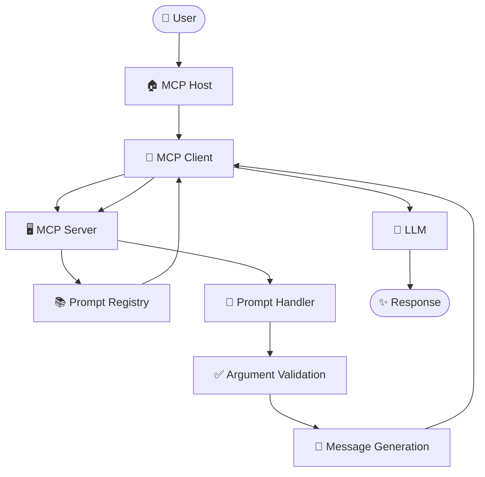

---

# Prompt Discovery Flow

Prompt discovery is the first important phase.

The client needs to determine which prompts the server provides.

```text
MCP Client
    |
    | Request available prompts
    v
MCP Server
    |
    v
Prompt Registry
    |
    v
Available Prompt Definitions
    |
    v
MCP Server
    |
    | Prompt Metadata
    v
MCP Client
```

---

# Prompt Discovery Step-by-Step

## Step 1 - Client Connects

```text
MCP Client
     |
     v
MCP Server
```

The client establishes communication with the MCP Server.

---

## Step 2 - Client Discovers Capabilities

```text
Client
  |
  v
Server
  |
  v
Capability Information
```

The client learns which MCP features are available.

---

## Step 3 - Client Requests Prompts

```text
Client
  |
  | Prompt Discovery
  v
Server
```

The client asks for available prompt definitions.

---

## Step 4 - Server Reads Prompt Registry

```text
Server
  |
  v
Prompt Registry
```

The server identifies the prompts it can expose.

---

## Step 5 - Server Returns Prompt Metadata

```text
Prompt Registry
       |
       v
Prompt Metadata
       |
       v
MCP Client
```

Example conceptual metadata:

```text
code_review
debug_code
generate_tests
generate_docs
```

---

# Prompt Discovery Sequence Diagram

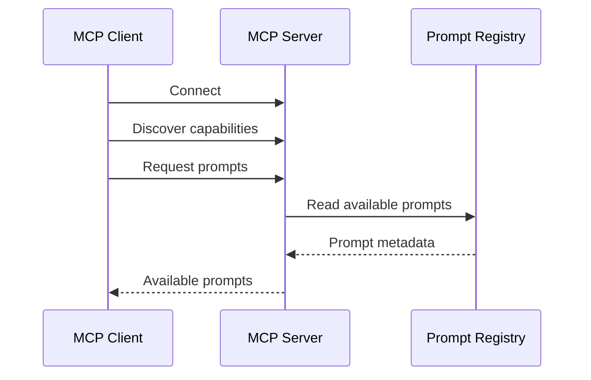

---

# Prompt Listing Flow

The listing flow can be represented as:

```text
Client
 |
 | Request Prompt List
 v
Server
 |
 v
Prompt Registry
 |
 +---- Prompt A
 |
 +---- Prompt B
 |
 +---- Prompt C
 |
 +---- Prompt D
 |
 v
Server
 |
 | Prompt List
 v
Client
```

Example:

```text
Available Prompts

1. code_review
2. debug_code
3. explain_code
4. generate_tests
5. generate_documentation
```

---

# Prompt Selection Flow

Once prompts are discovered, the host or user can select one.

```text
Available Prompts
       |
       v
User / Host
       |
       v
Prompt Selection
       |
       v
Selected Prompt
```

Example:

```text
Available:

code_review
debug_code
generate_tests

User chooses:

code_review
```

Flow:

```text
User
 |
 | Select code_review
 v
MCP Host
 |
 v
MCP Client
```

---

# Prompt Retrieval Flow

After selection, the client requests the selected prompt.

```text
MCP Client
    |
    | Prompt Name
    | Arguments
    v
MCP Server
    |
    v
Prompt Handler
    |
    v
Prompt Definition
    |
    v
Generated Messages
    |
    v
MCP Client
```

---

# Prompt Retrieval Step-by-Step

```text
1. Client selects prompt
2. Client prepares arguments
3. Client sends prompt request
4. Server receives request
5. Server resolves prompt
6. Server validates arguments
7. Server generates messages
8. Server returns result
9. Client receives messages
10. Host uses messages with LLM
```

---

# Prompt Argument Flow

Dynamic prompts can accept arguments.

Example:

```text
Prompt:

code_review
```

Arguments:

```text
language
code
```

Flow:

```text
User
 |
 | Python code
 v
MCP Host
 |
 v
MCP Client
 |
 | language = Python
 | code = ...
 v
MCP Server
 |
 v
Prompt Handler
 |
 v
Argument Validation
 |
 v
Prompt Template
 |
 v
Generated Messages
```

---

# Argument Flow Diagram

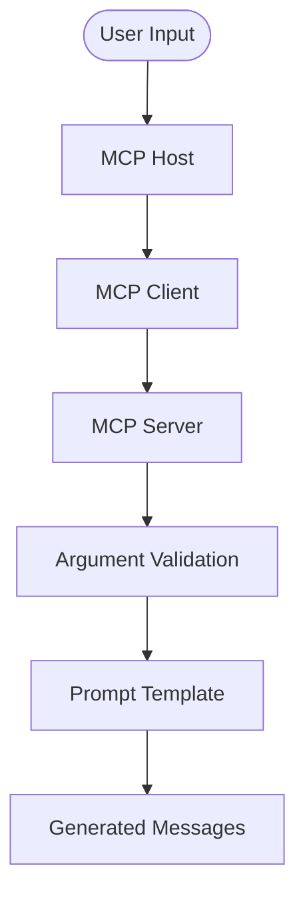

---

# Prompt Validation Flow

Before using arguments, the server should validate them.

```text
Prompt Request
      |
      v
Argument Validation
      |
      +------ Invalid ------> Error
      |
      v
Valid Arguments
      |
      v
Prompt Generation
```

Validation may include:

```text
Required Argument Check
Data Type Check
Format Check
Allowed Value Check
Length Check
Security Check
```

---

# Validation Example

Suppose the prompt requires:

```text
language
code
```

Flow:

```text
Request
 |
 v
Is language present?
 |
 +-- NO --> Error
 |
 YES
 |
 v
Is code present?
 |
 +-- NO --> Error
 |
 YES
 |
 v
Are values valid?
 |
 +-- NO --> Error
 |
 YES
 |
 v
Generate Prompt
```

---

# Prompt Message Generation Flow

After successful validation:

```text
Valid Arguments
      |
      v
Prompt Definition
      |
      v
Prompt Template
      |
      v
Fixed Instructions
      +
Dynamic Arguments
      +
Task Requirements
      |
      v
Structured Messages
```

Example:

```text
language = Python

code =

def add(a, b):
    return a+b
```

Generated instruction:

```text
Review the following Python code.

Check for:
- correctness
- security
- performance
- maintainability

Code:

def add(a, b):
    return a+b
```

---

# Message Generation Sequence

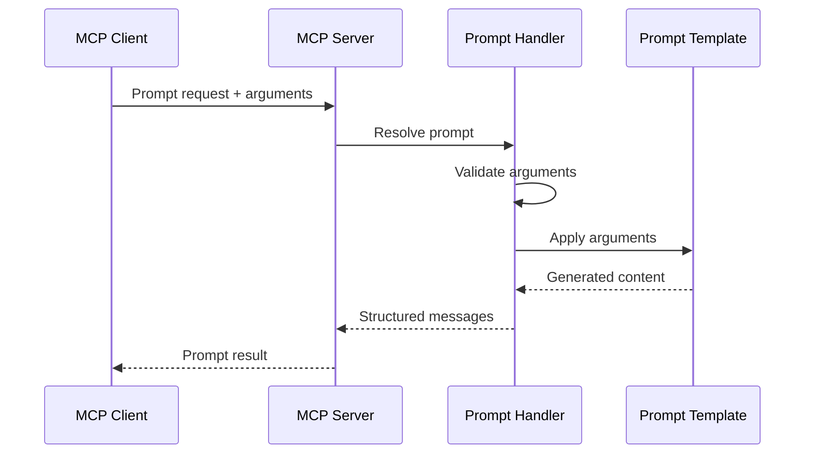

---

# JSON-RPC Communication Flow

MCP communication uses the protocol's message model, with JSON-RPC as the underlying RPC format.

Conceptually:

```text
MCP Client
     |
     | JSON-RPC Request
     v
MCP Server
     |
     | JSON-RPC Response
     v
MCP Client
```

Conceptual request:

```json
{
  "jsonrpc": "2.0",
  "id": 1,
  "method": "prompt-operation",
  "params": {
    "name": "code_review",
    "arguments": {
      "language": "Python",
      "code": "..."
    }
  }
}
```

> This is a conceptual example. Use the exact method names and schemas specified by the MCP specification and SDK version being used.

---

# JSON-RPC Request Flow

```text
Client
 |
 | Request
 v
JSON-RPC Message
 |
 v
Transport
 |
 v
MCP Server
 |
 v
Request Handler
 |
 v
Prompt Handler
```

---

# JSON-RPC Response Flow

```text
Prompt Handler
 |
 v
Generated Messages
 |
 v
MCP Server
 |
 v
JSON-RPC Response
 |
 v
Transport
 |
 v
MCP Client
```

---

# Static Prompt Flow

A static prompt does not require dynamic arguments.

Example:

```text
explain_clean_code
```

Flow:

```text
User
 |
 v
MCP Host
 |
 v
MCP Client
 |
 | Request prompt
 v
MCP Server
 |
 v
Prompt Definition
 |
 v
Static Messages
 |
 v
MCP Client
 |
 v
LLM
 |
 v
Response
```

---

# Static Prompt Sequence

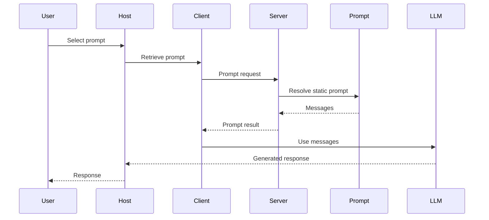

---

# Dynamic Prompt Flow

Dynamic prompts use arguments.

Example:

```text
code_review
```

Input:

```text
language = Python
code = ...
```

Flow:

```text
User
 |
 v
Host
 |
 v
Client
 |
 | Prompt + Arguments
 v
Server
 |
 v
Validate Arguments
 |
 v
Prompt Template
 |
 v
Generated Messages
 |
 v
Client
 |
 v
LLM
 |
 v
Response
```

---

# Dynamic Prompt Sequence

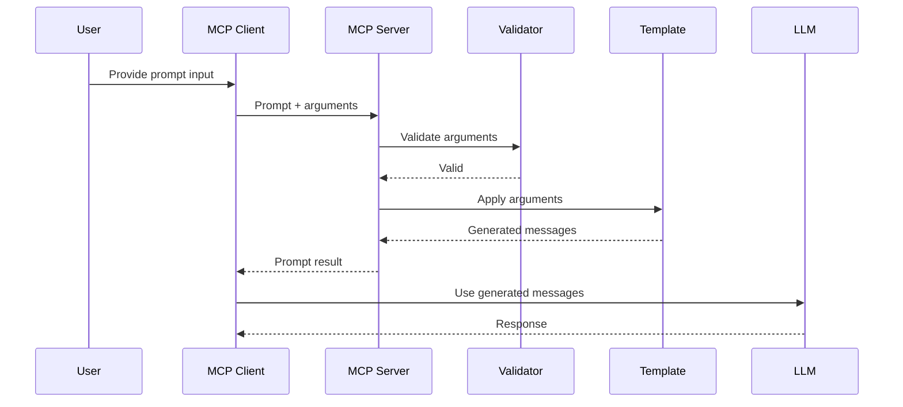

---

# Prompt Template Flow

A template combines fixed instructions and dynamic values.

```text
Prompt Template
       |
       +---- Fixed Instructions
       |
       +---- Arguments
       |
       +---- Output Requirements
       |
       v
Generated Prompt Messages
```

Example:

```text
Template:

Review this {language} code:

{code}

Focus on:
{focus}
```

Arguments:

```text
language = Python
code = ...
focus = Security
```

Result:

```text
Review this Python code:

...

Focus on:

Security
```

---

# Prompt + Resource Flow

Resources provide context while prompts provide instructions.

Example:

```text
Resource:

company_policy.md
```

Prompt:

```text
analyze_policy
```

Flow:

```text
User
 |
 v
MCP Host
 |
 v
MCP Client
 |
 +-------------------+
 |                   |
 v                   v
Resource           Prompt
 |                   |
 v                   v
Context          Instructions
 \                   /
  \                 /
   +-------+-------+
           |
           v
          LLM
           |
           v
       Response
```

---

# Prompt + Resource Sequence

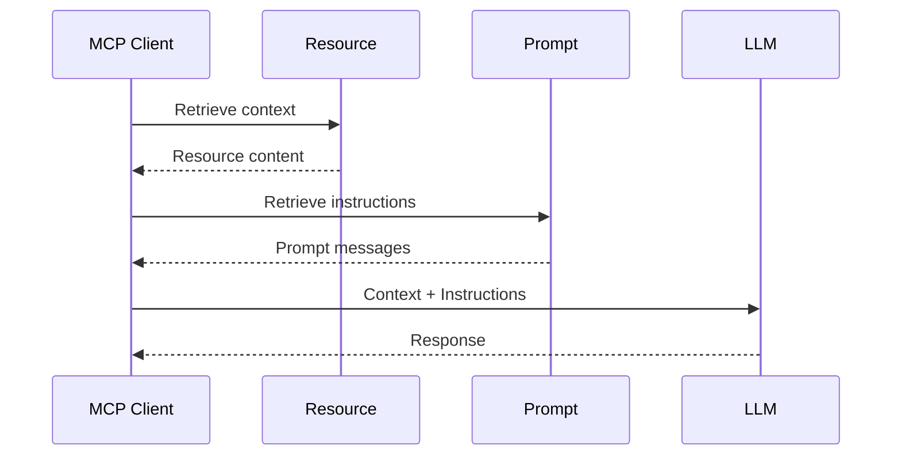

---

# Prompt + Tool Flow

A prompt can guide the model while a tool performs an operation.

Example:

```text
Prompt:

analyze_database

Tool:

query_database
```

Flow:

```text
User
 |
 v
MCP Host
 |
 v
MCP Client
 |
 v
Prompt
 |
 v
LLM
 |
 | Tool Request
 v
Tool
 |
 v
Tool Result
 |
 v
LLM
 |
 v
Response
```

---

# Prompt + Tool Sequence

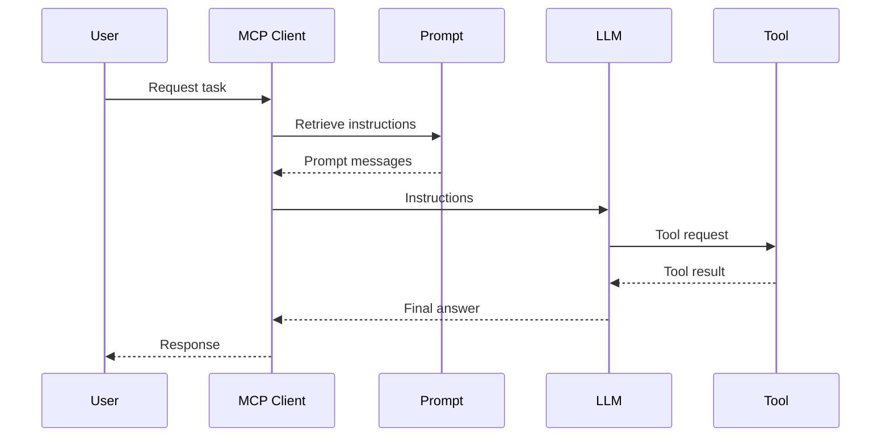

---

# Complete Prompt Execution Flow

The complete flow is:

```text
USER
 |
 v
MCP HOST
 |
 v
MCP CLIENT
 |
 v
CONNECT TO SERVER
 |
 v
DISCOVER CAPABILITIES
 |
 v
DISCOVER PROMPTS
 |
 v
DISPLAY AVAILABLE PROMPTS
 |
 v
USER / HOST SELECTS PROMPT
 |
 v
PREPARE ARGUMENTS
 |
 v
SEND PROMPT REQUEST
 |
 v
MCP SERVER
 |
 v
RESOLVE PROMPT
 |
 v
VALIDATE ARGUMENTS
 |
 v
GENERATE MESSAGES
 |
 v
RETURN PROMPT RESULT
 |
 v
MCP CLIENT
 |
 v
LLM
 |
 v
OPTIONAL TOOL / RESOURCE INTERACTION
 |
 v
FINAL RESPONSE
 |
 v
USER
```

---

# Complete End-to-End Flow

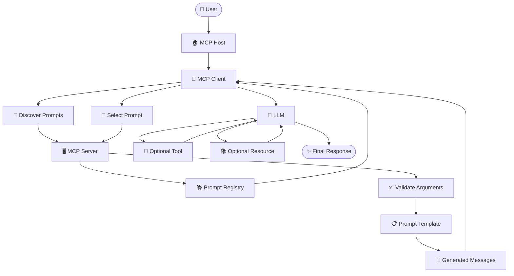

---

# End-to-End Sequence Diagram

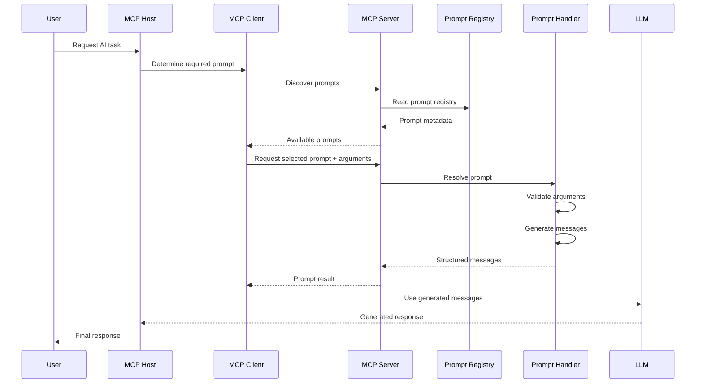

---

# Error Flow

Not every request succeeds.

The error flow is:

```text
Prompt Request
      |
      v
Validation
      |
      +---- Invalid ----> Error
      |
      v
Prompt Resolution
      |
      +---- Not Found --> Error
      |
      v
Message Generation
      |
      +---- Failure ----> Error
      |
      v
Success
```

---

# Error Flow Diagram

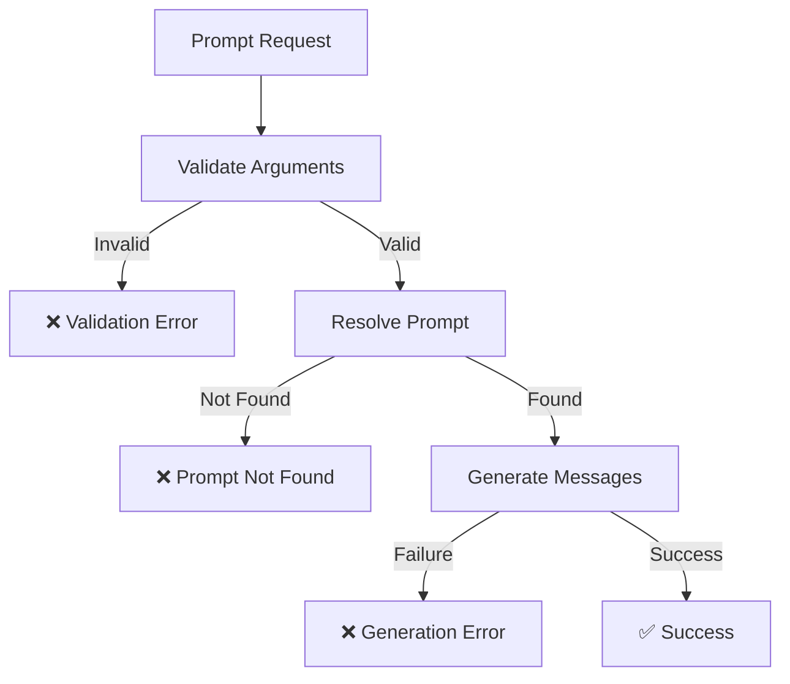

---

# Security Flow

Security should be considered throughout the request lifecycle.

```text
User
 |
 v
MCP Host
 |
 v
MCP Client
 |
 v
Authentication / Connection Security
 |
 v
MCP Server
 |
 v
Authorization
 |
 v
Prompt Request
 |
 v
Input Validation
 |
 v
Controlled Prompt Generation
 |
 v
LLM
```

---

# Security Flow Principles

Security controls can exist at multiple layers:

```text
Transport
   |
Authentication
   |
Authorization
   |
Input Validation
   |
Prompt Processing
   |
Tool Permissions
   |
Output Handling
   |
Monitoring
```

A prompt itself should not be considered a security boundary.

---

# Prompt Injection Flow

Prompt injection is a major consideration when prompts incorporate external or user-controlled content.

Example:

```text
Untrusted Input
       |
       v
Prompt Argument
       |
       v
Prompt Template
       |
       v
LLM
```

Potential problem:

```text
Trusted Instructions
+
Untrusted Content
```

The model may interpret malicious content as instructions.

---

# Safer Prompt Injection Flow

```text
Untrusted Input
       |
       v
Validation
       |
       v
Clearly Delimited Data
       |
       v
Prompt Generation
       |
       v
LLM
```

Security must also be enforced by application logic and permissions.

---

# Multi-Prompt Flow

A server can expose multiple prompts.

```text
                    MCP SERVER
                         |
                         v
                  PROMPT REGISTRY
                         |
       +-----------------+-----------------+
       |                 |                 |
       v                 v                 v
 code_review        debug_code       generate_tests
       |                 |                 |
       v                 v                 v
   Handler           Handler           Handler
       |                 |                 |
       +-----------------+-----------------+
                         |
                         v
                    MCP CLIENT
```

---

# Multi-Prompt Selection Flow

```text
User
 |
 v
Host
 |
 v
Client
 |
 v
Available Prompts
 |
 +---- code_review
 |
 +---- debug_code
 |
 +---- generate_tests
 |
 v
Selected Prompt
 |
 v
Prompt Request
```

---

# Client-Side Flow

The client-side flow is:

```text
Connect
  |
  v
Initialize
  |
  v
Discover Capabilities
  |
  v
Discover Prompts
  |
  v
Present Prompts
  |
  v
Select Prompt
  |
  v
Collect Arguments
  |
  v
Request Prompt
  |
  v
Receive Messages
  |
  v
Provide Context to LLM
```

---

# Server-Side Flow

The server-side flow is:

```text
Receive Request
      |
      v
Parse Request
      |
      v
Resolve Prompt
      |
      v
Validate Arguments
      |
      v
Execute Prompt Handler
      |
      v
Generate Messages
      |
      v
Return Result
```

---

# LLM Integration Flow

After the client retrieves prompt messages:

```text
Prompt Messages
       |
       v
MCP Client
       |
       v
Host LLM Integration
       |
       v
LLM
       |
       +---- Resource Context
       |
       +---- Tool Interaction
       |
       v
Generated Response
```

The MCP Prompt provides instructions; the host remains responsible for integrating the resulting messages into its model interaction.

---

# Prompt Flow with Tool Execution

```text
Prompt
  |
  v
LLM
  |
  | Need external action?
  v
Tool
  |
  v
Tool Result
  |
  v
LLM
  |
  v
Final Answer
```

Example:

```text
Prompt:

Analyze customer order status.

Tool:

get_order_status
```

---

# Prompt Flow with Resource Context

```text
Prompt
  |
  +---- Instructions
  |
  v
LLM
  ^
  |
Resource
  |
  +---- Context
```

Example:

```text
Prompt:

Summarize policy.

Resource:

company_policy.md
```

---

# Production Flow

A production workflow can contain additional stages.

```text
User
 |
 v
MCP Host
 |
 v
MCP Client
 |
 v
Gateway
 |
 v
Authentication
 |
 v
Authorization
 |
 v
MCP Server
 |
 v
Prompt Service
 |
 v
Prompt Registry
 |
 v
Validation
 |
 v
Message Generation
 |
 v
LLM
 |
 v
Monitoring
 |
 v
Response
```

---

# Production Flow Diagram

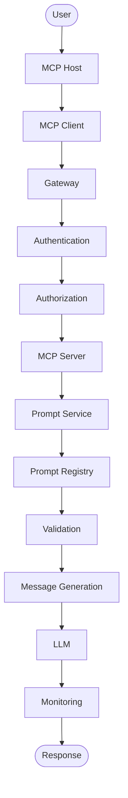

---

# Testing Flow

Prompt testing should happen before production deployment.

```text
Prompt Definition
       |
       v
Test Cases
       |
       v
Prompt Execution
       |
       v
Generated Output
       |
       v
Expected Result
       |
       v
Evaluation
       |
       +---- Fail ----> Fix Prompt
       |
       +---- Pass ----> Deployment
```

---

# Prompt Test Categories

A robust test suite may contain:

```text
Normal Input
Boundary Input
Empty Input
Invalid Input
Large Input
Special Characters
Adversarial Input
Prompt Injection
Sensitive Data
Tool-Related Input
```

---

# Evaluation Flow

Prompt evaluation can compare outputs against expected behavior.

```text
Prompt Version
      |
      v
Evaluation Dataset
      |
      v
Run Prompt
      |
      v
Collect Outputs
      |
      v
Evaluate
      |
      v
Metrics
      |
      v
Decision
```

Possible metrics:

```text
Accuracy
Relevance
Completeness
Consistency
Safety
Latency
Token Usage
Cost
```

---

# Versioning Flow

A prompt change should follow a controlled process.

```text
Existing Prompt
      |
      v
Modify Prompt
      |
      v
Create New Version
      |
      v
Run Tests
      |
      v
Evaluate
      |
      v
Security Review
      |
      v
Deploy
      |
      v
Monitor
```

Example:

```text
code_review v1
      |
      v
code_review v2
      |
      v
code_review v3
```

---

# Monitoring Flow

Production monitoring can observe:

```text
Prompt Usage
      |
      +---- Requests
      +---- Errors
      +---- Latency
      +---- Token Usage
      +---- Cost
      +---- Safety Events
      |
      v
Monitoring System
      |
      v
Alerts / Reports
```

Avoid unnecessarily storing sensitive prompt content or arguments.

---

# Complete Architecture Flow

The entire MCP Prompt flow can be summarized as:

```text
                              USER
                                |
                                v
                           MCP HOST
                                |
                                v
                           MCP CLIENT
                                |
                                v
                     CONNECT / INITIALIZE
                                |
                                v
                      DISCOVER CAPABILITIES
                                |
                                v
                       DISCOVER PROMPTS
                                |
                                v
                       PROMPT REGISTRY
                                |
                                v
                     AVAILABLE PROMPTS
                                |
                                v
                      SELECT A PROMPT
                                |
                                v
                     PREPARE ARGUMENTS
                                |
                                v
                     SEND PROMPT REQUEST
                                |
                                v
                           MCP SERVER
                                |
                                v
                       RESOLVE PROMPT
                                |
                                v
                     VALIDATE ARGUMENTS
                                |
                                v
                      PROMPT TEMPLATE
                                |
                                v
                     GENERATE MESSAGES
                                |
                                v
                      RETURN PROMPT RESULT
                                |
                                v
                           MCP CLIENT
                                |
                                v
                              LLM
                                |
                  +-------------+-------------+
                  |                           |
                  v                           v
              RESOURCE                     TOOL
              Context                     Action
                  |                           |
                  +-------------+-------------+
                                |
                                v
                               LLM
                                |
                                v
                          FINAL RESPONSE
                                |
                                v
                              USER
```

---

# Compact Flow

For quick revision:

```text
User
 ↓
Host
 ↓
Client
 ↓
Discover Prompts
 ↓
Select Prompt
 ↓
Send Arguments
 ↓
Server
 ↓
Validate
 ↓
Generate Messages
 ↓
Return Prompt
 ↓
LLM
 ↓
Response
```

---

# Prompt Flow in One Sentence

The complete conceptual flow is:

```text
The MCP Client discovers available prompts from an MCP Server,
selects a prompt, supplies its arguments, the server validates
those arguments and generates structured prompt messages, and
the host can then use those messages as part of an interaction
with the LLM.
```

---

# Best Practices

✔ Discover prompts before attempting to retrieve unknown prompts.

✔ Use clear prompt names.

✔ Provide useful descriptions.

✔ Validate dynamic arguments.

✔ Keep prompt generation deterministic where practical.

✔ Separate trusted instructions from untrusted content.

✔ Handle errors explicitly.

✔ Use Resources for contextual data.

✔ Use Tools for external actions.

✔ Keep authorization outside prompt text.

✔ Test prompt behavior.

✔ Evaluate prompt changes.

✔ Version important prompts.

✔ Monitor production behavior.

✔ Avoid unnecessary logging of sensitive prompt data.

---

# Common Flow Mistakes

❌ Assuming the client already knows every prompt.

❌ Skipping prompt discovery.

❌ Sending invalid arguments.

❌ Not handling missing arguments.

❌ Not handling unknown prompts.

❌ Treating prompt text as an authorization mechanism.

❌ Mixing untrusted content with trusted instructions without safeguards.

❌ Giving tools excessive permissions.

❌ Skipping testing after changing a prompt.

❌ Ignoring production monitoring.

❌ Treating the LLM as a deterministic security boundary.

---

# Key Takeaways

- Prompt flow begins with the MCP Host and Client.
- The client discovers available capabilities and prompts.
- The client selects the required prompt.
- Dynamic prompts receive arguments.
- The server validates prompt arguments.
- The prompt handler resolves the prompt definition.
- The server generates structured messages.
- The messages are returned to the client.
- The host can use the messages in an LLM interaction.
- Resources can provide additional context.
- Tools can perform external actions.
- Errors should be handled at every important stage.
- Security should be applied across the complete flow.
- Prompt injection should be treated as an application security concern.
- Testing and evaluation should happen before production deployment.
- Versioning and monitoring are important for production prompt systems.

---

# Summary

The most important MCP Prompt flow is:

```text
                 USER
                   |
                   v
              MCP HOST
                   |
                   v
              MCP CLIENT
                   |
                   v
          DISCOVER PROMPTS
                   |
                   v
           SELECT PROMPT
                   |
                   v
          SEND ARGUMENTS
                   |
                   v
             MCP SERVER
                   |
                   v
          VALIDATE INPUT
                   |
                   v
         RESOLVE PROMPT
                   |
                   v
       GENERATE MESSAGES
                   |
                   v
          RETURN RESULT
                   |
                   v
                 LLM
                   |
                   v
              RESPONSE
                   |
                   v
                 USER
```

Remember the core sequence:

```text
DISCOVER
   ↓
SELECT
   ↓
REQUEST
   ↓
VALIDATE
   ↓
GENERATE
   ↓
RETURN
   ↓
USE WITH LLM
   ↓
RESPOND
```

This flow forms the foundation for understanding how MCP Prompts operate inside an MCP-based AI application.

---

# Next Topic

Continue with:

```text
Examples.md
```

The Examples section can cover:

- Basic Prompt Examples
- Static Prompt Examples
- Dynamic Prompt Examples
- Coding Prompts
- Code Review Prompts
- Debugging Prompts
- Documentation Prompts
- Testing Prompts
- Prompt + Resource Examples
- Prompt + Tool Examples
- Real-World MCP Prompt Scenarios
