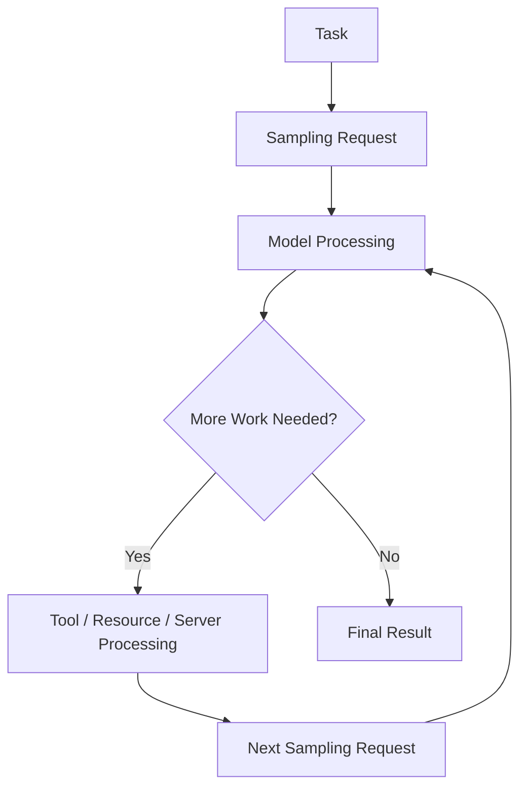
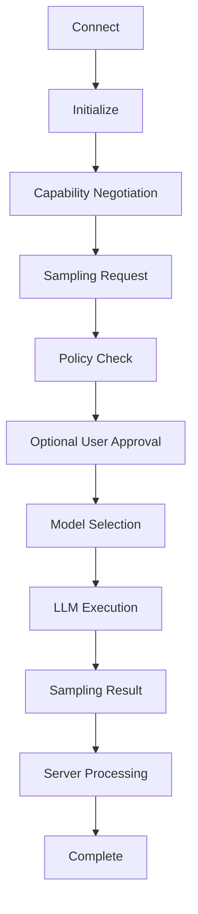

# MCP Sampling - Theory

> A complete theoretical guide to **Sampling in the Model Context Protocol (MCP)**, covering the concept, purpose, participants, message flow, model interaction, use cases, security, permissions, implementation concepts, and best practices.

---

# Table of Contents

1. Introduction
2. What is MCP Sampling?
3. Why Sampling Exists
4. The Core Idea of Sampling
5. Sampling vs Traditional LLM Calls
6. MCP Sampling Participants
7. MCP Sampling Architecture Concept
8. Sampling Request
9. Sampling Response
10. Sampling Messages
11. Model Preferences
12. Model Selection
13. System Prompt
14. Context Inclusion
15. Sampling Parameters
16. Maximum Tokens
17. Temperature
18. Stop Sequences
19. Model Hints
20. Model Preferences and Hints
21. Sampling Control
22. Human-in-the-Loop
23. User Consent
24. Security and Authorization
25. Privacy
26. Prompt Injection Risks
27. Sampling and Tools
28. Sampling and Resources
29. Sampling Use Cases
30. Agentic Workflows
31. Iterative Sampling
32. Multi-Step Sampling
33. Sampling Limitations
34. Error Handling
35. Sampling Capability Negotiation
36. Sampling Lifecycle
37. Conceptual Example
38. Pseudocode Example
39. Best Practices
40. Common Mistakes
41. Key Takeaways
42. Summary

---

# Introduction

**MCP Sampling** is an MCP capability that allows an MCP Server to request that the connected MCP Client ask an AI model to generate a completion.

The important architectural idea is:

```text
MCP Server
     |
     | Sampling Request
     v
MCP Client / Host
     |
     v
LLM
     |
     v
Generated Completion
     |
     v
MCP Client / Host
     |
     | Sampling Result
     v
MCP Server
```

This creates an important relationship between the MCP Server and the model.

Instead of the server directly connecting to a model provider, the server can ask the client to perform model sampling through the host's model access.

---

# What is MCP Sampling?

Sampling is a mechanism through which an MCP Server can request model-generated output from the MCP Client.

In simple terms:

```text
Server needs model reasoning
        |
        v
Server asks Client
        |
        v
Client uses available LLM
        |
        v
LLM generates response
        |
        v
Client returns result
        |
        v
Server continues its workflow
```

The server does not necessarily need to own or manage the model API credentials.

This allows model access to remain under the control of the host/client environment.

---

# Simple Definition

MCP Sampling can be remembered as:

```text
Sampling =
MCP Server requesting
LLM-generated content
through the MCP Client.
```

The server provides the request context and preferences.

The client decides how the request is handled according to its capabilities, policies, user permissions, and model access.

---

# Why Sampling Exists

Without Sampling, an MCP Server that needs model-generated reasoning might need to integrate directly with an LLM provider.

That could result in:

```text
MCP Server
    |
    v
LLM Provider API
    |
    v
Model
```

This introduces additional concerns:

```text
API Keys
Model Provider Integration
Billing
Authentication
Privacy
Model Selection
Provider-Specific Code
```

With Sampling:

```text
MCP Server
    |
    v
MCP Client
    |
    v
Host Model Access
    |
    v
LLM
```

The client/host can manage the model interaction.

---

# The Core Idea of Sampling

The central idea is:

```text
Server
  |
  | "Please generate something using
  |  this context and these instructions."
  v
Client
  |
  v
Model
  |
  v
Completion
  |
  v
Server
```

The server can therefore participate in model-driven workflows without necessarily embedding a specific model provider SDK.

---

# Sampling is a Client Capability

Sampling is not simply a normal server-side function.

The conceptual relationship is:

```text
MCP Client
      |
      | exposes model access
      |
      v
MCP Server
      |
      | requests sampling
      v
MCP Client
```

The client must support the Sampling capability before the server can rely on it.

---

# Sampling vs Traditional LLM Calls

Traditional architecture:

```text
Application
     |
     v
LLM SDK
     |
     v
LLM Provider
     |
     v
Model
```

Sampling architecture:

```text
MCP Server
     |
     v
MCP Client
     |
     v
Host Model Integration
     |
     v
Model
```

The major difference is where model access is controlled.

---

# MCP Sampling Participants

The main participants are:

| Component | Responsibility |
|----------|----------------|
| MCP Server | Requests model generation |
| MCP Client | Receives and manages sampling request |
| MCP Host | Controls overall AI application |
| LLM | Generates the completion |
| User | May approve or influence sampling |
| Resources | May provide context |
| Tools | May participate in a broader workflow |

Conceptual relationship:

```text
MCP Server
    |
    v
MCP Client
    |
    v
MCP Host
    |
    v
LLM
```

---

# MCP Sampling Architecture Concept

A simple conceptual architecture is:

```text
                         USER
                           |
                           v
                      MCP HOST
                           |
                           v
                      MCP CLIENT
                           |
              +------------+------------+
              |                         |
              v                         v
          MCP SERVER                LLM ACCESS
              |                         |
              | Sampling Request        |
              +------------------------>|
                                        |
                                        v
                                       LLM
                                        |
                                        v
                                 Generated Output
                                        |
              <-------------------------+
              |
              v
        Sampling Result
```

---

# Sampling Request

A Sampling request is sent from the MCP Server to the MCP Client.

Conceptually, the request can contain:

```text
Sampling Request
│
├── Messages
├── Model Preferences
├── System Prompt
├── Temperature
├── Maximum Tokens
├── Stop Sequences
└── Other Supported Parameters
```

The exact fields and schema depend on the MCP specification version.

---

# Sampling Response

The client returns the generated model result to the server.

Conceptually:

```text
Sampling Request
      |
      v
MCP Client
      |
      v
LLM
      |
      v
Generated Completion
      |
      v
Sampling Response
      |
      v
MCP Server
```

The response can contain the generated assistant message and model-related information supported by the protocol.

---

# Sampling Messages

Sampling works around messages supplied to the model.

Conceptually:

```text
Messages
   |
   +---- User Message
   |
   +---- Assistant Message
   |
   +---- Other Supported Context
   |
   v
LLM
```

The message structure gives the model the context needed to generate an answer.

---

# Message Role

A message generally has a role and content.

Conceptually:

```text
Message
 |
 +-- Role
 |
 +-- Content
```

Common conversational roles include:

```text
user
assistant
```

System-level instructions may be provided separately through the sampling request.

The exact supported message structure should follow the MCP specification and SDK version being used.

---

# System Prompt

A sampling request can include a system-level instruction.

Conceptually:

```text
System Prompt
      |
      v
LLM Behavior
```

Example:

```text
You are a software engineering assistant.
Analyze the provided code carefully.
```

The system prompt establishes high-level instructions for the model interaction.

---

# System Prompt vs User Message

A conceptual structure is:

```text
System Prompt
      |
      v
Model Behavior
      |
      v
User Message
      |
      v
Model Response
```

Example:

```text
System:

You are a code review assistant.

User:

Review this Python function.
```

The exact way the host/client combines these inputs depends on its model integration.

---

# Model Preferences

A server may provide model preferences when requesting sampling.

The purpose is to communicate what kind of model the server would prefer.

Conceptually:

```text
MCP Server
    |
    | Model Preferences
    v
MCP Client
    |
    v
Model Selection
```

Model preferences are not necessarily a guarantee that a specific model will be used.

---

# Model Selection

The client is responsible for deciding which available model should handle the request, subject to its policies and capabilities.

Conceptually:

```text
Server Preference
       |
       v
Client Policy
       |
       v
Available Models
       |
       v
Selected Model
```

The client may consider:

```text
Model Availability
Model Capabilities
User Preferences
Cost
Latency
Privacy
Application Policy
```

---

# Model Hints

Model hints can communicate preferred model characteristics.

Conceptually:

```text
Sampling Request
       |
       v
Model Preferences
       |
       v
Model Hints
       |
       v
Client Model Selection
```

For example, a server may prefer a model with capabilities suitable for:

```text
Reasoning
Coding
Long Context
Fast Response
```

The client determines how to interpret supported preferences.

---

# Model Preferences and Hints

The conceptual relationship is:

```text
                MODEL PREFERENCES
                       |
          +------------+------------+
          |                         |
          v                         v
     Model Hints              Other Preferences
          |                         |
          +------------+------------+
                       |
                       v
                  MCP Client
                       |
                       v
                 Model Selection
```

The server communicates preferences; the client controls actual model selection.

---

# Sampling Control

Sampling gives the MCP Server a way to request model generation, but the client remains an important control point.

Conceptually:

```text
MCP Server
     |
     | Request
     v
MCP Client
     |
     +---- Policy Check
     |
     +---- User Approval
     |
     +---- Model Selection
     |
     +---- Request Execution
     |
     v
LLM
```

This architecture supports host-level control.

---

# Human-in-the-Loop

Sampling can be integrated with human approval.

A host may choose to ask the user before allowing a sampling request.

```text
MCP Server
     |
     | Sampling Request
     v
MCP Client
     |
     v
User Approval?
    / \
  YES  NO
   |    |
   v    v
  LLM  Reject
   |
   v
Result
```

This is especially useful when sampling may involve sensitive information or expensive model usage.

---

# User Consent

A host may use user consent as part of its security model.

Example:

```text
Server requests sampling
          |
          v
Client evaluates request
          |
          v
Ask user for approval
          |
      +---+---+
      |       |
     YES      NO
      |       |
      v       v
  Continue   Reject
```

The exact consent experience is determined by the host/client application.

---

# Security and Authorization

Sampling should be controlled as a privileged capability.

Security flow:

```text
MCP Server
     |
     v
Sampling Request
     |
     v
MCP Client
     |
     v
Policy Check
     |
     v
Authorization
     |
     v
Optional User Consent
     |
     v
LLM
```

The model itself should not be treated as an authorization mechanism.

---

# Privacy

Sampling may expose server-provided context to the host's selected model.

Therefore, the architecture should consider:

```text
What data is sent?
       |
       v
Who can process it?
       |
       v
Which model receives it?
       |
       v
How is it stored?
```

Potentially sensitive information should be minimized or handled according to the host's privacy policies.

---

# Data Flow and Privacy

```text
MCP Server
    |
    | Context
    v
MCP Client
    |
    | Model Request
    v
LLM
    |
    v
Generated Output
    |
    v
MCP Client
    |
    v
MCP Server
```

Every arrow represents a potential data boundary that should be considered during system design.

---

# Prompt Injection Risks

Sampling can create prompt injection risks because server-controlled or external content may be sent to a model.

Example:

```text
External Data
      |
      v
MCP Server
      |
      v
Sampling Request
      |
      v
LLM
```

If external content contains malicious instructions, the model may interpret them as instructions rather than data.

---

# Safer Sampling Architecture

```text
External Data
      |
      v
Validation
      |
      v
Controlled Context
      |
      v
Sampling Request
      |
      v
MCP Client
      |
      v
LLM
```

Security controls should be implemented at the application and protocol layers rather than relying only on prompt wording.

---

# Sampling and Tools

Sampling can participate in workflows involving tools.

Conceptually:

```text
MCP Server
     |
     | Sampling Request
     v
MCP Client
     |
     v
LLM
     |
     | Tool Decision
     v
Tool
     |
     v
Tool Result
     |
     v
LLM
     |
     v
Sampling Result
     |
     v
MCP Server
```

The exact tool execution path depends on the host/client architecture.

---

# Sampling and Resources

Resources can provide context to a sampling request.

Conceptually:

```text
MCP Server
     |
     +---- Resource Content
     |
     +---- Sampling Instructions
     |
     v
MCP Client
     |
     v
LLM
```

Example:

```text
Resource:

project_documentation

Sampling request:

Summarize the project documentation.
```

---

# Sampling Use Cases

Sampling can be useful for many workflows.

Examples:

```text
Code Analysis
Text Summarization
Classification
Planning
Reasoning
Data Analysis
Documentation Generation
Content Transformation
Research Assistance
Error Analysis
Decision Support
```

The server can request model-generated content without embedding a provider-specific model integration.

---

# Code Analysis Use Case

Example workflow:

```text
MCP Server
     |
     | Code + Instructions
     v
Sampling Request
     |
     v
MCP Client
     |
     v
LLM
     |
     v
Code Analysis
     |
     v
MCP Server
```

The server can then use the generated analysis in its broader workflow.

---

# Summarization Use Case

```text
Document
   |
   v
MCP Server
   |
   | Sampling Request
   v
MCP Client
   |
   v
LLM
   |
   v
Summary
   |
   v
MCP Server
```

This can be useful when a server needs model-generated summaries of contextual information.

---

# Classification Use Case

```text
Input Data
    |
    v
MCP Server
    |
    v
Sampling Request
    |
    v
LLM
    |
    v
Classification
    |
    v
MCP Server
```

For example:

```text
Input:

Customer support message

Possible classifications:

Billing
Technical
Account
General
```

---

# Planning Use Case

Sampling can also support planning workflows.

```text
Task
 |
 v
MCP Server
 |
 v
Sampling Request
 |
 v
LLM
 |
 v
Plan
 |
 v
MCP Server
 |
 +---- Execute Tools
 |
 +---- Retrieve Resources
 |
 v
Result
```

The server can use the generated plan as an input to subsequent operations.

---

# Agentic Workflows

Sampling can participate in agent-like workflows.

Conceptually:

```text
Task
 |
 v
MCP Server
 |
 v
Sampling
 |
 v
Plan
 |
 v
Tool / Resource
 |
 v
Result
 |
 v
Sampling
 |
 v
Next Step
 |
 v
Completion
```

This creates an iterative reasoning loop.

---

# Iterative Sampling

A workflow can request sampling multiple times.

```text
Request 1
   |
   v
Model Result
   |
   v
Server Processing
   |
   v
Request 2
   |
   v
Model Result
   |
   v
Server Processing
   |
   v
Final Result
```

Conceptually:

```text
Sampling
   ↓
Process
   ↓
Sampling
   ↓
Process
   ↓
Sampling
   ↓
Complete
```

The number of iterations should be controlled to prevent excessive cost or runaway workflows.

---

# Multi-Step Sampling

A more detailed workflow:

```text
Step 1
  |
  v
Analyze Task
  |
  v
Step 2
  |
  v
Generate Plan
  |
  v
Step 3
  |
  v
Execute Required Action
  |
  v
Step 4
  |
  v
Evaluate Result
  |
  v
Step 5
  |
  v
Generate Final Response
```

Sampling may be used at multiple stages.

---

# Sampling Loop



---

# Sampling Limitations

Sampling is powerful, but it has limitations.

Important considerations include:

```text
Client Must Support Sampling
Model Availability
Latency
Token Limits
Cost
Privacy
User Permissions
Security
Model Quality
Provider Policies
```

A server should not assume that every MCP client supports every sampling feature.

---

# Capability Negotiation

The client and server should establish supported capabilities during MCP initialization.

Conceptually:

```text
MCP Client
    |
    | Initialize
    v
MCP Server
    |
    | Capability Information
    v
MCP Client
```

The client can indicate whether it supports sampling.

---

# Sampling Capability Check

Before relying on sampling:

```text
Server
 |
 v
Does Client Support Sampling?
 |
 +---- NO ----> Alternative / Error
 |
 YES
 |
 v
Send Sampling Request
```

This prevents unsupported operations.

---

# Sampling Lifecycle

A complete lifecycle can be summarized as:

```text
1. Connection
2. Initialization
3. Capability Negotiation
4. Sampling Request
5. Client Policy Check
6. Optional User Approval
7. Model Selection
8. LLM Execution
9. Sampling Result
10. Server Processing
11. Completion
```

---

# Sampling Lifecycle Diagram



---

# Conceptual Example

Imagine an MCP Server that analyzes customer feedback.

The server receives:

```text
Customer Feedback:

"The application crashes whenever I upload a large file."
```

The server wants the model to classify the issue.

It sends a sampling request containing:

```text
System:

You are a customer support classification assistant.

User:

Classify this issue:

The application crashes whenever I upload a large file.
```

Flow:

```text
Customer Feedback
       |
       v
MCP Server
       |
       v
Sampling Request
       |
       v
MCP Client
       |
       v
LLM
       |
       v
Classification
       |
       v
MCP Client
       |
       v
MCP Server
```

Possible model output:

```text
Technical Issue
```

---

# Conceptual Pseudocode

The following pseudocode illustrates the idea:

```python
result = await session.create_message(
    messages=[
        {
            "role": "user",
            "content": {
                "type": "text",
                "text": "Classify this customer issue..."
            }
        }
    ],
    system_prompt="You are a support classification assistant.",
    max_tokens=500
)

print(result)
```

> This is conceptual pseudocode. Use the exact method names, parameter names, and message types provided by the MCP SDK and specification version you are using.

---

# Sampling Request Concept

Conceptually:

```text
Sampling Request
│
├── Messages
│   └── Conversation Context
│
├── System Prompt
│   └── Model Instructions
│
├── Model Preferences
│   └── Desired Model Characteristics
│
├── maxTokens
│   └── Output Limit
│
├── temperature
│   └── Generation Variability
│
└── stopSequences
    └── Optional Stop Conditions
```

The exact request schema should always be checked against the MCP specification and SDK documentation for the version being used.

---

# Maximum Tokens

A sampling request can specify a maximum output size.

Conceptually:

```text
maxTokens
    |
    v
Maximum Generated Output
```

For example:

```text
maxTokens = 500
```

means the client/model should limit the generated completion according to the supported token semantics.

The actual model may have additional limits.

---

# Temperature

Temperature controls how deterministic or varied model generation may be.

Conceptually:

```text
Low Temperature
      |
      v
More Deterministic

High Temperature
      |
      v
More Variable
```

Example conceptual values:

```text
0.0 → More deterministic
0.7 → More varied
1.0 → Higher variability
```

The supported range and behavior depend on the model/provider.

---

# Stop Sequences

Stop sequences can tell the model/client to stop generation when a specified sequence is encountered.

Conceptually:

```text
Generated Text
      |
      v
Stop Sequence Found?
    /       \
  YES        NO
   |          |
   v          v
 STOP      Continue
```

Example:

```text
stopSequences:

["END"]
```

---

# Sampling Output

The result may include:

```text
Generated Message
Model Information
Stop Reason
Other Supported Metadata
```

Conceptually:

```text
Sampling Result
 |
 +-- Role
 |
 +-- Content
 |
 +-- Model
 |
 +-- Stop Reason
```

The exact response fields depend on the MCP specification version and SDK.

---

# Server Processing After Sampling

The server may process the result.

```text
Sampling Result
      |
      v
Parse Result
      |
      v
Validate Output
      |
      v
Business Logic
      |
      v
Next Action
```

Example:

```text
Model Output:

"Technical Issue"

        |
        v

Server Logic:

Create technical support workflow
```

---

# Sampling Output Validation

Model output should not automatically be considered correct.

A safer flow is:

```text
Model Output
     |
     v
Output Validation
     |
     +---- Invalid ----> Retry / Error
     |
     v
Valid Output
     |
     v
Business Logic
```

For structured outputs, validate:

```text
Required Fields
Expected Format
Allowed Values
Length
Type
Business Rules
```

---

# Sampling and Structured Results

A model may be asked to produce structured information.

Conceptually:

```text
LLM
 |
 v
Structured Output
 |
 v
Validation
 |
 v
Application Logic
```

Example:

```json
{
  "category": "technical",
  "priority": "high"
}
```

The application should validate such output before using it for important decisions.

---

# Error Handling

Sampling can fail.

Possible causes include:

```text
Sampling Unsupported
Request Rejected
User Denied
Model Unavailable
Model Timeout
Token Limit
Invalid Request
Policy Restriction
Network Failure
Provider Error
```

Flow:

```text
Sampling Request
      |
      v
Client
      |
      +---- Failure ----> Error Result
      |
      v
LLM
      |
      +---- Failure ----> Error Result
      |
      v
Sampling Result
```

---

# Error Recovery

A robust application can use controlled recovery:

```text
Sampling Error
      |
      v
Identify Error
      |
      +---- Temporary --> Retry
      |
      +---- Unsupported --> Alternative
      |
      +---- Permission --> Ask User
      |
      +---- Invalid --> Fix Request
      |
      +---- Permanent --> Return Error
```

Retries should be bounded.

---

# Sampling Cost Control

Repeated sampling can increase model usage.

Example:

```text
Sampling 1
    |
    v
Sampling 2
    |
    v
Sampling 3
    |
    v
Sampling 4
```

Without limits, an agentic workflow can become expensive.

Recommended controls:

```text
Maximum Iterations
Maximum Tokens
Timeout
Budget
Rate Limit
Early Stop Conditions
```

---

# Sampling Latency

Sampling introduces model execution latency.

Flow:

```text
Server Request
      |
      v
Client
      |
      v
Model Selection
      |
      v
LLM
      |
      v
Generation
      |
      v
Response
```

For performance-sensitive applications, consider:

```text
Model Speed
Context Size
Maximum Tokens
Number of Sampling Calls
Network Latency
```

---

# Sampling and Context Size

Large context can increase cost and latency.

```text
Small Context
     |
     v
Lower Processing Cost

Large Context
     |
     v
Higher Processing Cost
```

Servers should provide only the context needed for the task.

---

# Sampling Governance

In enterprise environments, sampling can be governed by:

```text
Model Policies
Data Policies
Privacy Policies
Cost Limits
User Permissions
Security Rules
Audit Requirements
```

Architecture:

```text
MCP Server
     |
     v
Sampling Request
     |
     v
Governance Layer
     |
     +---- Security
     +---- Privacy
     +---- Cost
     +---- Permissions
     |
     v
MCP Client
     |
     v
LLM
```

---

# Sampling Audit Flow

For important systems:

```text
Sampling Request
      |
      v
Audit Event
      |
      v
Policy Check
      |
      v
Model Execution
      |
      v
Result
      |
      v
Audit Result
```

Audit logs should avoid unnecessary sensitive content.

---

# Sampling vs Tools

Sampling and Tools solve different problems.

```text
SAMPLING
   ↓
Ask the model to generate content

TOOLS
   ↓
Perform an external operation
```

Example:

```text
Sampling:

"Determine the likely category."

Tool:

"Create a support ticket."
```

---

# Sampling vs Resources

Resources and Sampling also have different roles.

```text
RESOURCE
   ↓
Provides information

SAMPLING
   ↓
Uses model generation
```

Example:

```text
Resource:

Product Documentation

Sampling:

Explain the documentation to the user.
```

---

# Prompts vs Sampling

Prompts and Sampling are related but different.

```text
PROMPT
   ↓
Reusable instructions

SAMPLING
   ↓
Request model-generated completion
```

Conceptually:

```text
Prompt
   |
   v
Instructions
   |
   v
Sampling
   |
   v
LLM
```

A server can use reusable prompt logic as part of a broader workflow and use Sampling when it needs model generation.

---

# Tools + Resources + Prompts + Sampling

The capabilities can work together.

```text
                  MCP SERVER
                      |
        +-------------+-------------+
        |             |             |
        v             v             v
      TOOLS       RESOURCES      PROMPTS
        |             |             |
        |             |             |
        +-------------+-------------+
                      |
                      v
                   SAMPLING
                      |
                      v
                 MCP CLIENT
                      |
                      v
                     LLM
                      |
                      v
                   RESULT
```

Remember:

```text
Tools    = Actions
Resources = Context
Prompts  = Instructions
Sampling = Model Generation Request
```

---

# Best Practices

## 1. Check Sampling Support

Do not assume every client supports Sampling.

```text
Capability Check
       |
       v
Sampling Supported?
```

---

## 2. Minimize Context

Send only the information needed.

```text
Required Context
       |
       v
Sampling Request
```

Avoid unnecessary data.

---

## 3. Validate Inputs

Validate server-controlled and user-controlled content where appropriate.

---

## 4. Validate Outputs

Do not blindly trust model-generated output.

---

## 5. Control Cost

Use:

```text
Token Limits
Iteration Limits
Timeouts
Rate Limits
Budgets
```

---

## 6. Protect Sensitive Data

Consider what data will reach the selected model.

---

## 7. Use Human Approval When Appropriate

For sensitive or expensive operations:

```text
Sampling Request
      |
      v
User Approval
      |
      v
Execute
```

---

## 8. Keep Authorization Outside the Prompt

Never rely on model instructions to enforce permissions.

---

## 9. Handle Errors

Always define behavior for:

```text
Timeout
Rejection
Unsupported Capability
Model Failure
Invalid Request
```

---

## 10. Keep Sampling Purpose Focused

A sampling request should have a clear purpose.

Good:

```text
Classify this support issue.
```

Less effective:

```text
Do everything necessary.
```

---

# Common Mistakes

❌ Assuming every MCP Client supports Sampling.

❌ Assuming the server directly controls the selected model.

❌ Treating model preferences as guaranteed model selection.

❌ Sending unnecessary sensitive data.

❌ Trusting model output without validation.

❌ Creating unlimited sampling loops.

❌ Ignoring token limits.

❌ Ignoring latency.

❌ Using prompts as authorization controls.

❌ Giving the model uncontrolled access to sensitive tools.

❌ Failing to handle user rejection.

❌ Treating LLM output as deterministic.

❌ Hard-coding provider-specific assumptions into every MCP Server.

---

# Key Takeaways

- MCP Sampling allows an MCP Server to request model-generated content through an MCP Client.
- The client/host controls access to the model.
- Sampling separates server logic from direct model-provider integration.
- Sampling requires client support.
- The server can provide messages and model preferences.
- Model preferences communicate desired characteristics but do not necessarily guarantee a particular model.
- The client can apply policies, permissions, and user-consent rules.
- Sampling can be combined with Resources, Tools, and Prompts.
- Sampling is useful for reasoning, classification, summarization, planning, and other model-driven workflows.
- Sampling can be iterative, but iteration limits are important.
- Input and output validation are important.
- Sensitive data should be handled carefully.
- Prompt injection is a relevant security concern.
- Cost and latency should be controlled.
- Errors and unsupported capabilities should be handled gracefully.

---

# Quick Revision

Remember Sampling with this simple flow:

```text
MCP SERVER
    |
    | Request model generation
    v
MCP CLIENT
    |
    | Apply policies
    v
LLM
    |
    | Generate completion
    v
MCP CLIENT
    |
    | Return result
    v
MCP SERVER
```

And remember the difference:

```text
PROMPTS
    ↓
Reusable Instructions

RESOURCES
    ↓
Context / Information

TOOLS
    ↓
Actions

SAMPLING
    ↓
Request Model Generation
```

---

# One-Line Definition

> **MCP Sampling is a mechanism that allows an MCP Server to request an LLM-generated completion through an MCP Client that controls access to the model.**

---

# Final Summary

MCP Sampling provides an important bridge between MCP Servers and AI model capabilities.

The conceptual architecture is:

```text
                         MCP SERVER
                              |
                              | Sampling Request
                              v
                         MCP CLIENT
                              |
                    +---------+---------+
                    |                   |
                    v                   v
                Policy             User Consent
                    |                   |
                    +---------+---------+
                              |
                              v
                         Model Selection
                              |
                              v
                             LLM
                              |
                              v
                      Generated Completion
                              |
                              v
                         MCP CLIENT
                              |
                              | Sampling Result
                              v
                         MCP SERVER
```

The most important idea is that the MCP Server can request model generation without necessarily owning direct model-provider integration.

The client remains the important control point for:

```text
Model Access
Permissions
Policies
User Consent
Model Selection
Privacy
Execution
```

This makes Sampling useful for building modular MCP-based AI systems where servers can participate in model-driven workflows while the host/client retains control over model access and user-facing policies.

---

# Next Topic

Continue with:

```text
Architecture.md
```

The Architecture section can cover:

- MCP Sampling Architecture
- Client and Server Responsibilities
- Sampling Request Architecture
- Sampling Response Architecture
- Model Selection Architecture
- Human-in-the-Loop Architecture
- Security Architecture
- Privacy Architecture
- Prompt + Sampling Architecture
- Resource + Sampling Architecture
- Tool + Sampling Architecture
- Agentic Sampling Architecture
- Production Sampling Architecture
