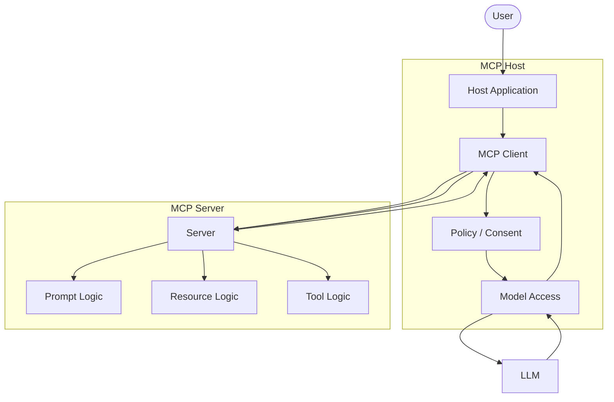
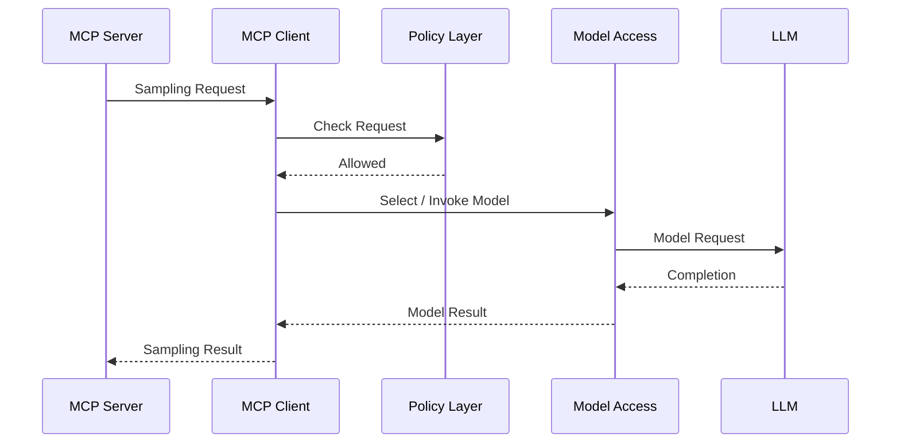
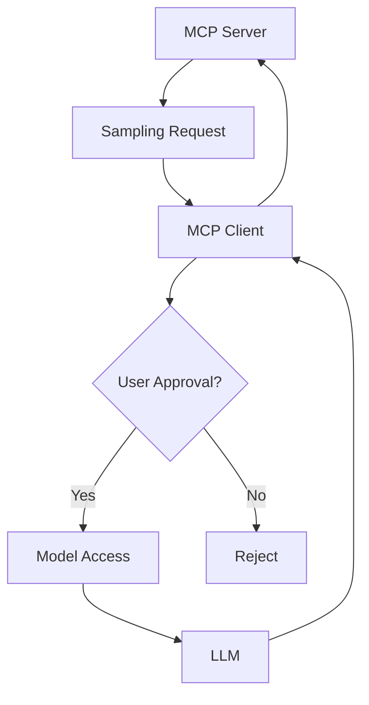
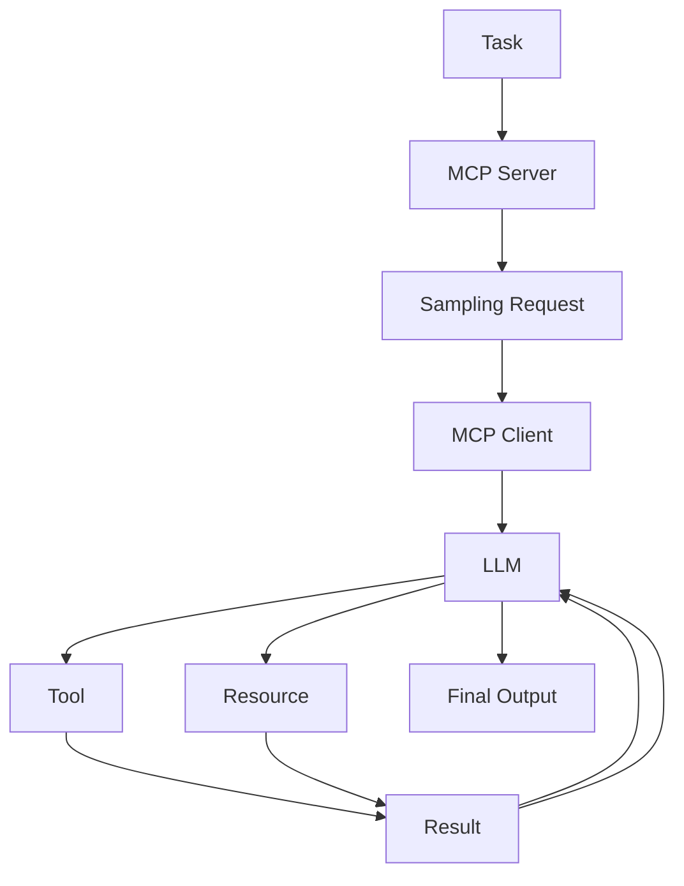
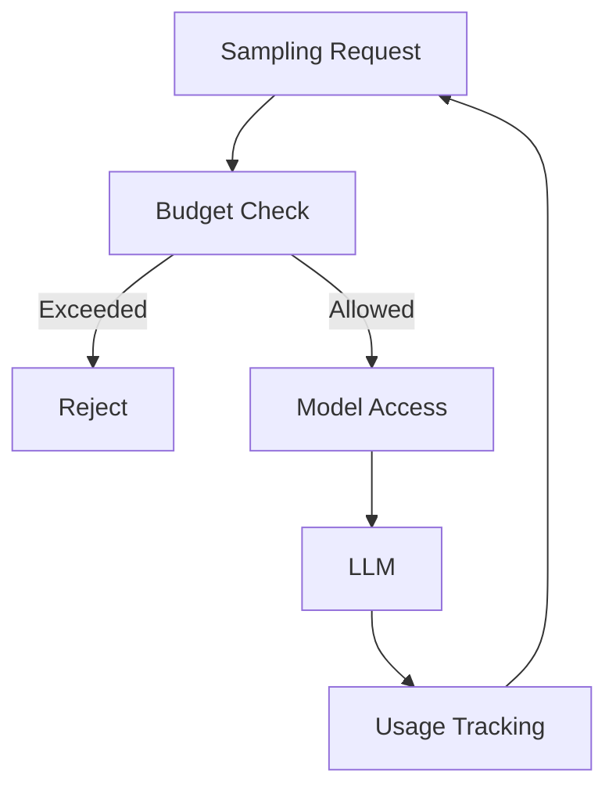
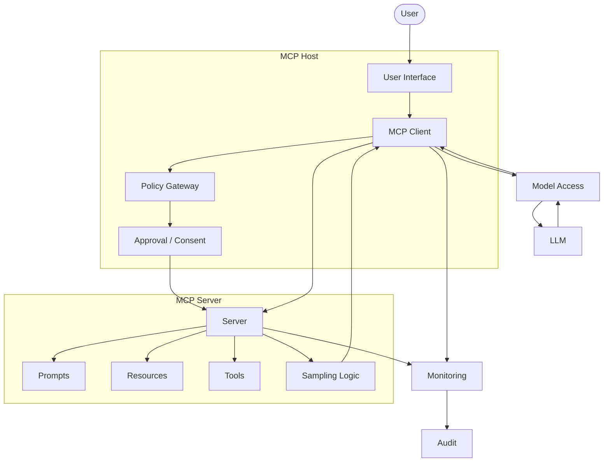
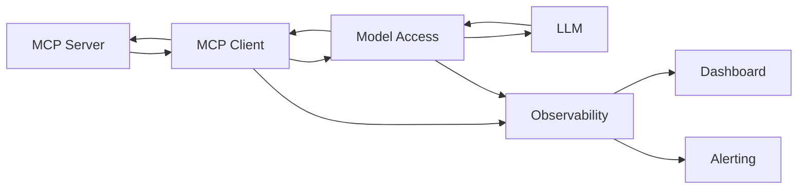
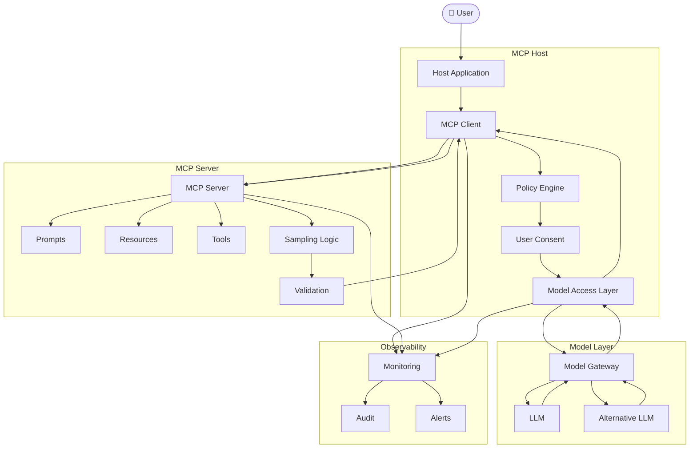

# MCP Sampling - Architecture

> A detailed architecture guide for MCP Sampling, explaining the roles of the MCP Host, MCP Client, MCP Server, model access layer, LLM, resources, tools, policies, and user consent.

---

# Table of Contents

1. Introduction
2. What is Sampling Architecture?
3. Core Architecture
4. High-Level Architecture
5. Component Overview
6. MCP Host
7. MCP Client
8. MCP Server
9. Sampling Capability
10. Model Access Layer
11. LLM
12. User Layer
13. Policy Layer
14. Resource Layer
15. Tool Layer
16. Prompt Layer
17. Sampling Request Architecture
18. Sampling Response Architecture
19. Capability Negotiation Architecture
20. Model Selection Architecture
21. Human-in-the-Loop Architecture
22. Security Architecture
23. Privacy Architecture
24. Prompt Injection Defense Architecture
25. Resource + Sampling Architecture
26. Tool + Sampling Architecture
27. Prompt + Sampling Architecture
28. Agentic Sampling Architecture
29. Iterative Sampling Architecture
30. Multi-Step Sampling Architecture
31. Error Handling Architecture
32. Cost Control Architecture
33. Production Architecture
34. Enterprise Architecture
35. Monitoring Architecture
36. Testing Architecture
37. Deployment Architecture
38. Complete Architecture Diagram
39. Architecture Principles
40. Best Practices
41. Common Mistakes
42. Key Takeaways
43. Summary

---

# Introduction

MCP Sampling provides a way for an MCP Server to request model-generated content through the MCP Client.

The architectural relationship is:

```text
MCP SERVER
    |
    | Sampling Request
    v
MCP CLIENT
    |
    v
MCP HOST / MODEL ACCESS
    |
    v
LLM
    |
    v
Generated Result
    |
    v
MCP CLIENT
    |
    | Sampling Result
    v
MCP SERVER
```

The key architectural principle is that the MCP Server does not have to directly own the model-provider connection.

The client/host can control model access.

---

# What is Sampling Architecture?

Sampling Architecture describes how model-generation requests move through the MCP system.

It defines:

```text
Who requests model generation?
Who receives the request?
Who selects the model?
Who applies policy?
Who obtains user consent?
Who communicates with the model?
Who receives the generated result?
```

A conceptual architecture is:

```text
Server
  |
  v
Client
  |
  v
Policy
  |
  v
Model Access
  |
  v
LLM
  |
  v
Result
  |
  v
Client
  |
  v
Server
```

---

# Core Architecture

The minimal architecture is:

```text
                 MCP HOST
                     |
                     v
                MCP CLIENT
                     |
          Sampling Request
                     |
                     v
                MCP SERVER
                     |
                     |
                     +----------------+
                                      |
                                      v
                                MCP CLIENT
                                      |
                                      v
                                  MODEL / LLM
                                      |
                                      v
                                Sampling Result
                                      |
                                      v
                                MCP SERVER
```

A more useful conceptual view is:

```text
                         USER
                           |
                           v
                       MCP HOST
                           |
                           v
                      MCP CLIENT
                           |
             +-------------+-------------+
             |                           |
             v                           v
        MCP SERVER                 POLICY / CONSENT
             |                           |
             | Sampling Request          |
             +-------------------------->|
                                         |
                                         v
                                  MODEL ACCESS
                                         |
                                         v
                                        LLM
                                         |
                                         v
                                  MODEL RESULT
                                         |
             <---------------------------+
             |
             v
        SERVER LOGIC
```

---

# High-Level Architecture



---

# Component Overview

The architecture can be divided into several layers.

| Layer | Main Responsibility |
|---|---|
| User | Provides intent and consent |
| MCP Host | Runs the AI application |
| MCP Client | Communicates with MCP Server |
| Policy Layer | Applies security and usage rules |
| MCP Server | Requests model generation |
| Prompt Layer | Defines instructions |
| Resource Layer | Provides context |
| Tool Layer | Performs actions |
| Model Access | Connects to the selected model |
| LLM | Generates output |
| Monitoring | Observes system behavior |

---

# MCP Host

The MCP Host is the application controlling the overall AI experience.

Examples conceptually include:

```text
AI Assistant
Developer Tool
Desktop AI Application
IDE Integration
Enterprise Agent
```

The host can manage:

```text
User Interface
MCP Clients
Model Access
Permissions
User Consent
Conversation State
Security Policies
```

Architecture:

```text
USER
 |
 v
MCP HOST
 |
 +---- MCP Client
 |
 +---- Model Access
 |
 +---- Policy
 |
 +---- User Consent
 |
 +---- Application Logic
```

---

# MCP Client

The MCP Client is the communication component between the host and MCP Server.

It can:

```text
Connect to Server
Initialize Session
Negotiate Capabilities
Discover Server Capabilities
Request Server Features
Receive Sampling Requests
Interact with Model Access
Return Sampling Results
```

Conceptually:

```text
MCP Host
    |
    v
MCP Client
    |
    +---- MCP Server
    |
    +---- Sampling / Model Access
```

---

# MCP Server

The MCP Server exposes capabilities and can request sampling when supported.

A server may contain:

```text
Prompt Handlers
Resource Handlers
Tool Handlers
Sampling Logic
Business Logic
Validation
```

Conceptual architecture:

```text
                    MCP SERVER
                         |
          +--------------+--------------+
          |              |              |
          v              v              v
       Prompts        Resources       Tools
          |              |              |
          +--------------+--------------+
                         |
                         v
                    Server Logic
                         |
                         v
                  Sampling Request
```

---

# Sampling Capability

Sampling is a capability that allows model-generation requests to be sent through the client.

Conceptually:

```text
Server
  |
  | "I need model generation"
  v
Client
  |
  | Check Sampling Support
  v
Policy
  |
  v
Model Access
```

The client must support the relevant sampling capability.

---

# Model Access Layer

The model access layer is conceptually responsible for:

```text
Model Selection
Authentication
Provider Integration
Request Translation
Model Invocation
Response Handling
```

Architecture:

```text
MCP Client
    |
    v
Model Access Layer
    |
    +---- Provider A
    |
    +---- Provider B
    |
    +---- Local Model
    |
    +---- Enterprise Model Gateway
```

This abstraction allows the MCP application to avoid coupling every server directly to one model provider.

---

# LLM

The LLM is responsible for generating the requested completion.

Conceptually:

```text
Input Messages
      |
      v
LLM
      |
      v
Generated Completion
```

The model may consider:

```text
System Instructions
Conversation Messages
Context
Model Parameters
Model Policies
```

---

# User Layer

The user provides the original task and may participate in approval decisions.

```text
User
 |
 +---- Task
 |
 +---- Data
 |
 +---- Consent
 |
 +---- Feedback
```

The host can place a human approval step before sampling.

---

# Policy Layer

The policy layer can control:

```text
Whether Sampling is Allowed
Which Models Can Be Used
What Data Can Be Sent
Maximum Token Budget
Maximum Sampling Calls
Allowed Server
User Permissions
Privacy Requirements
```

Architecture:

```text
Sampling Request
      |
      v
Policy Engine
      |
      +---- Allowed
      |
      +---- Rejected
```

---

# Resource Layer

Resources provide contextual information.

```text
MCP Server
    |
    v
Resource
    |
    v
Context
    |
    v
Sampling Request
```

Example:

```text
Resource:
project_documentation.md

Sampling:
Summarize this project.
```

---

# Tool Layer

Tools perform actions.

```text
LLM
 |
 | Tool Request
 v
Tool
 |
 v
External System
 |
 v
Tool Result
 |
 v
LLM
```

Sampling and tools can therefore participate in the same agentic architecture.

---

# Prompt Layer

Prompts provide reusable instructions.

```text
Prompt
  |
  v
Instructions
  |
  v
Sampling
  |
  v
LLM
```

Conceptual relationship:

```text
PROMPT
  ↓
Instructions

RESOURCE
  ↓
Context

SAMPLING
  ↓
Model Generation

TOOL
  ↓
Action
```

---

# Sampling Request Architecture

The request path is:

```text
MCP Server
     |
     v
Sampling Request
     |
     v
MCP Client
     |
     v
Policy Check
     |
     v
Model Selection
     |
     v
LLM
```

A request can conceptually contain:

```text
Messages
System Prompt
Model Preferences
Maximum Tokens
Temperature
Stop Sequences
Other Supported Parameters
```

The exact schema must follow the MCP specification and SDK version being used.

---

# Sampling Request Diagram



---

# Sampling Response Architecture

The response path is:

```text
LLM
 |
 v
Model Result
 |
 v
Model Access
 |
 v
MCP Client
 |
 v
Sampling Result
 |
 v
MCP Server
```

Conceptual response:

```text
Generated Message
      +
Metadata
      +
Stop Information
      |
      v
Sampling Result
```

The exact fields depend on the MCP specification version.

---

# Capability Negotiation Architecture

Before sampling is used, capabilities should be established during initialization.

```text
MCP Client
    |
    | Initialize
    v
MCP Server
    |
    | Capability Information
    v
MCP Client
```

Conceptual decision:

```text
Sampling Supported?
       |
   +---+---+
   |       |
  YES      NO
   |       |
   v       v
Sampling  Alternative
```

---

# Model Selection Architecture

The server can express preferences, while the client controls the actual model selection.

```text
MCP Server
    |
    | Model Preferences
    v
MCP Client
    |
    v
Policy
    |
    v
Available Models
    |
    v
Model Selection
    |
    v
LLM
```

Selection factors may include:

```text
Capability
Availability
Cost
Latency
Privacy
User Preference
Application Policy
```

---

# Human-in-the-Loop Architecture

A host can require user approval.

```text
MCP Server
     |
     v
Sampling Request
     |
     v
MCP Client
     |
     v
User Approval
     |
    / \
  YES  NO
   |    |
   v    v
Model  Reject
   |
   v
Result
```

This is useful for:

```text
Sensitive Data
Expensive Requests
High-Risk Operations
Enterprise Environments
User-Controlled AI Systems
```

---

# Human-in-the-Loop Diagram



---

# Security Architecture

Security should exist at multiple layers.

```text
                    SECURITY
                        |
        +---------------+---------------+
        |               |               |
        v               v               v
   Transport       Authorization      Validation
        |               |               |
        +---------------+---------------+
                        |
                        v
                 Sampling Policy
                        |
                        v
                    Model Access
                        |
                        v
                       LLM
```

Important controls include:

```text
Authentication
Authorization
Input Validation
Output Validation
User Consent
Data Minimization
Rate Limits
Token Limits
Audit Logging
```

---

# Security Boundary Architecture

A useful mental model is:

```text
+------------------------------------------------+
|                  MCP HOST                      |
|                                                |
|  +-------------+       +-------------------+   |
|  | MCP Client  |       | Policy / Consent  |   |
|  +------+------+       +---------+---------+   |
|         |                        |             |
+---------|------------------------|-------------+
          |                        |
          v                        v
     MCP SERVER               MODEL ACCESS
                                   |
                                   v
                                  LLM
```

The client/host environment can act as a control boundary between the server and the model.

---

# Privacy Architecture

Sampling may transmit server-provided information to the model.

Therefore:

```text
Server Data
    |
    v
Data Filtering
    |
    v
Policy Check
    |
    v
MCP Client
    |
    v
Model
```

Data handling should consider:

```text
Personal Data
Credentials
Business Data
Source Code
Confidential Documents
Customer Data
Internal Information
```

---

# Data Minimization Architecture

Instead of:

```text
Entire Database
       |
       v
Sampling
```

Prefer:

```text
Required Records
       |
       v
Filtered Context
       |
       v
Sampling
```

The server should provide only what is required for the task.

---

# Prompt Injection Defense Architecture

Potentially untrusted content should be isolated from trusted instructions.

```text
UNTRUSTED DATA
      |
      v
Validation / Filtering
      |
      v
Clearly Delimited Context
      |
      v
Sampling Request
      |
      v
LLM
```

Do not assume that a system prompt alone can prevent every prompt-injection attack.

---

# Resource + Sampling Architecture

Resources can provide information used by sampling.

```text
                    MCP SERVER
                         |
              +----------+----------+
              |                     |
              v                     v
          RESOURCE              SAMPLING
              |                     |
              v                     |
           CONTEXT                  |
              |                     |
              +----------+----------+
                         |
                         v
                    MCP CLIENT
                         |
                         v
                        LLM
```

Example:

```text
Resource:
API documentation

Sampling:
Explain how to use the API.
```

---

# Tool + Sampling Architecture

Tools can provide external data or perform operations around sampling.

```text
                       LLM
                        |
                        | Tool Request
                        v
                      TOOL
                        |
                        v
                 External System
                        |
                        v
                   Tool Result
                        |
                        v
                       LLM
                        |
                        v
                 Sampling Result
```

A broader architecture:

```text
MCP Server
    |
    +---- Sampling
    |
    +---- Tools
    |
    +---- Resources
    |
    v
MCP Client
    |
    v
LLM
```

---

# Prompt + Sampling Architecture

Prompts provide reusable instructions.

```text
MCP Server
     |
     v
Prompt Definition
     |
     v
Instructions
     |
     v
Sampling Request
     |
     v
MCP Client
     |
     v
LLM
```

Conceptual architecture:

```text
Prompt
  +
Context
  +
User Input
  |
  v
Sampling
  |
  v
LLM
```

---

# Agentic Sampling Architecture

Sampling can participate in an agentic loop.

```text
                  TASK
                   |
                   v
              MCP SERVER
                   |
                   v
               SAMPLING
                   |
                   v
                  LLM
                   |
            +------+------+
            |             |
            v             v
          TOOL         RESOURCE
            |             |
            +------+------+
                   |
                   v
                RESULT
                   |
                   v
               SAMPLING
                   |
                   v
                  LLM
                   |
                   v
              FINAL RESULT
```

---

# Agentic Architecture Diagram



---

# Iterative Sampling Architecture

An iterative workflow can look like:

```text
Server
 |
 v
Sampling #1
 |
 v
Model Result
 |
 v
Server Analysis
 |
 v
Sampling #2
 |
 v
Model Result
 |
 v
Server Analysis
 |
 v
Sampling #3
 |
 v
Final Result
```

Architecture:

```text
                 +--------------------+
                 |                    |
                 v                    |
             Sampling 1              |
                 |                    |
                 v                    |
             Processing              |
                 |                    |
                 v                    |
             Sampling 2              |
                 |                    |
                 v                    |
             Processing              |
                 |                    |
                 +--------------------+
```

---

# Multi-Step Sampling Architecture

A more controlled workflow:

```text
Step 1: Understand
       |
       v
Sampling
       |
       v
Step 2: Plan
       |
       v
Sampling
       |
       v
Step 3: Execute
       |
       v
Tool / Resource
       |
       v
Step 4: Evaluate
       |
       v
Sampling
       |
       v
Step 5: Finalize
```

---

# Error Handling Architecture

Errors can occur at different layers.

```text
                     Sampling Request
                            |
              +-------------+-------------+
              |             |             |
              v             v             v
          Validation     Policy        Capability
              |             |             |
              v             v             v
           Error         Error         Error
              \             |             /
               +------------+------------+
                            |
                            v
                         Response
```

Possible failures:

```text
Unsupported Sampling
Invalid Request
Invalid Arguments
Permission Denied
User Rejection
Model Unavailable
Timeout
Rate Limit
Token Limit
Provider Failure
```

---

# Error Recovery Architecture

```text
Error
 |
 v
Classify Error
 |
 +---- Temporary ------> Controlled Retry
 |
 +---- Unsupported ----> Alternative
 |
 +---- Permission ------> User Action
 |
 +---- Invalid ---------> Correct Request
 |
 +---- Permanent -------> Return Error
```

Retries should always have limits.

---

# Cost Control Architecture

Sampling can consume model tokens.

A production architecture can enforce:

```text
Request
   |
   v
Budget Check
   |
   +---- Exceeded ----> Reject
   |
   v
Sampling
   |
   v
Usage Tracking
```

Controls may include:

```text
Maximum Tokens
Maximum Requests
Maximum Iterations
Time Budget
Rate Limit
Per-User Budget
Per-Server Budget
```

---

# Cost Control Diagram



---

# Production Architecture

A production-ready architecture may include:

```text
                         USER
                           |
                           v
                      MCP HOST
                           |
              +------------+------------+
              |                         |
              v                         v
         MCP CLIENT                UI / Consent
              |
              v
        Policy Gateway
              |
              v
         MCP SERVER
              |
       +------+------+------+
       |      |      |      |
       v      v      v      v
    Prompt Resource Tool Sampling
                          |
                          v
                    Model Access
                          |
                          v
                         LLM
                          |
                          v
                     Monitoring
```

---

# Production Architecture Diagram



---

# Enterprise Architecture

Enterprise environments may introduce additional layers.

```text
                           USER
                             |
                             v
                         MCP HOST
                             |
                             v
                        MCP CLIENT
                             |
                             v
                       API GATEWAY
                             |
                             v
                    AUTHENTICATION
                             |
                             v
                    AUTHORIZATION
                             |
                             v
                     POLICY ENGINE
                             |
                             v
                       MCP SERVER
                             |
                    +--------+--------+
                    |        |        |
                    v        v        v
                 PROMPTS  RESOURCES TOOLS
                             |
                             v
                         SAMPLING
                             |
                             v
                      MODEL GATEWAY
                             |
                             v
                         LLM / AI
                             |
                             v
                       MONITORING
```

---

# Enterprise Security Architecture

```text
+--------------------------------------------------+
|                 ENTERPRISE HOST                  |
|                                                  |
|  User                                            |
|   |                                              |
|   v                                              |
|  MCP Client                                      |
|   |                                              |
|   v                                              |
|  Authentication                                  |
|   |                                              |
|   v                                              |
|  Authorization                                   |
|   |                                              |
|   v                                              |
|  Data Loss Prevention / Policy                   |
|   |                                              |
+---|----------------------------------------------+
    |
    v
MCP Server
    |
    v
Sampling
    |
    v
Model Gateway
    |
    v
Approved Model
```

---

# Monitoring Architecture

Sampling should be observable in production.

```text
MCP Server
     |
     v
Sampling Request
     |
     +------------------+
     |                  |
     v                  v
 Model Access       Monitoring
     |                  |
     v                  v
    LLM              Metrics
     |                  |
     v                  v
 Result              Logs / Alerts
```

Possible metrics:

```text
Sampling Requests
Successful Requests
Failed Requests
Latency
Token Usage
Model Usage
Estimated Cost
Timeouts
User Rejections
Policy Rejections
```

---

# Monitoring Data Flow



Sensitive prompt content should not be logged unnecessarily.

---

# Testing Architecture

Sampling systems should be tested at multiple levels.

```text
Unit Tests
    |
    v
Prompt / Request Tests
    |
    v
Integration Tests
    |
    v
Security Tests
    |
    v
Model Evaluation
    |
    v
Load Tests
    |
    v
Production Monitoring
```

---

# Testing Layers

## Unit Testing

Test:

```text
Request Construction
Argument Validation
Output Parsing
Error Handling
Budget Logic
```

## Integration Testing

Test:

```text
Client ↔ Server
Client ↔ Model Access
Server ↔ Resources
Server ↔ Tools
```

## Security Testing

Test:

```text
Unauthorized Requests
Prompt Injection
Sensitive Data Leakage
Permission Bypass
Resource Abuse
```

---

# Deployment Architecture

A simple deployment:

```text
              USER
                |
                v
            MCP HOST
                |
                v
           MCP CLIENT
                |
                v
           MCP SERVER
                |
                v
          MODEL ACCESS
                |
                v
               LLM
```

A scalable deployment:

```text
                    Load Balancer
                         |
             +-----------+-----------+
             |           |           |
             v           v           v
          MCP Server  MCP Server  MCP Server
             |           |           |
             +-----------+-----------+
                         |
                         v
                    Model Gateway
                         |
              +----------+----------+
              |                     |
              v                     v
           Model A                Model B
```

---

# Scalable Architecture

For high-volume systems:

```text
Users
  |
  v
MCP Hosts
  |
  v
MCP Clients
  |
  v
Gateway
  |
  v
MCP Server Cluster
  |
  v
Sampling Service
  |
  v
Model Gateway
  |
  +---- Model A
  |
  +---- Model B
  |
  +---- Model C
```

Scaling concerns include:

```text
Concurrency
Rate Limits
Model Capacity
Token Budgets
Connection Management
Caching
Timeouts
Queueing
```

---

# Complete Architecture Diagram



---

# Architecture Principles

## 1. Client-Controlled Model Access

The client/host controls how model access is performed.

```text
Server
  ↓
Client
  ↓
Model
```

---

## 2. Capability-Based Design

Sampling should only be used when the required capability is available.

```text
Capability
    ↓
Supported?
    ↓
Sampling
```

---

## 3. Separation of Responsibilities

Keep responsibilities separated:

```text
Server
    ↓
Application Logic

Client
    ↓
Protocol + Model Access

Policy
    ↓
Security + Permissions

LLM
    ↓
Generation
```

---

## 4. Explicit Data Flow

Know what data travels from:

```text
Server → Client → Model
```

and back:

```text
Model → Client → Server
```

---

## 5. Least Privilege

Only provide the minimum access required.

```text
Minimum Context
Minimum Permissions
Minimum Tools
Minimum Tokens
Minimum Iterations
```

---

# Best Practices

### Use capability negotiation

Always determine whether Sampling is supported.

### Validate requests

Check request structure and application-specific constraints.

### Validate model output

Do not blindly trust generated results.

### Protect sensitive data

Minimize confidential information sent to models.

### Add user consent when needed

Especially for sensitive or expensive operations.

### Control model usage

Apply token, request, and iteration limits.

### Separate instructions from data

Clearly distinguish trusted instructions from untrusted content.

### Monitor usage

Track errors, latency, cost, and sampling frequency.

### Keep authorization outside prompts

Security decisions should be enforced by software controls.

### Handle failures

Build bounded retries and meaningful error responses.

---

# Common Architecture Mistakes

❌ Connecting every MCP Server directly to an LLM provider when Sampling can provide the required model interaction.

❌ Assuming every client supports Sampling.

❌ Treating model preferences as guaranteed model selection.

❌ Putting authorization rules only inside prompts.

❌ Sending unnecessary sensitive data.

❌ Creating unlimited sampling loops.

❌ Ignoring token and cost limits.

❌ Failing to validate model-generated output.

❌ Ignoring user consent for sensitive workflows.

❌ Logging sensitive prompt content unnecessarily.

❌ Designing without capability negotiation.

❌ Coupling server logic tightly to one model provider.

---

# Key Takeaways

- MCP Sampling allows an MCP Server to request model-generated content through an MCP Client.
- The MCP Client is an important control point for model access.
- The MCP Host controls the overall AI application experience.
- The MCP Server owns its application logic and can request sampling.
- The model access layer can abstract different model providers.
- Policies can control sampling permissions, data, models, and budgets.
- Resources provide context.
- Prompts provide instructions.
- Tools perform actions.
- Sampling requests model-generated content.
- Human approval can be added when appropriate.
- Capability negotiation prevents unsupported operations.
- Security and privacy must be considered across the entire data path.
- Iterative sampling should have strict limits.
- Production systems benefit from monitoring, auditing, testing, and cost controls.

---

# Quick Architecture Revision

Remember the core architecture:

```text
                         USER
                           |
                           v
                       MCP HOST
                           |
                           v
                      MCP CLIENT
                           |
                           v
                     MCP SERVER
                           |
                           | Sampling Request
                           v
                     POLICY CHECK
                           |
                           v
                     MODEL ACCESS
                           |
                           v
                          LLM
                           |
                           v
                   GENERATED RESULT
                           |
                           v
                      MCP CLIENT
                           |
                           v
                     MCP SERVER
                           |
                           v
                      FINAL LOGIC
```

Remember the four major MCP concepts:

```text
PROMPTS
    ↓
Instructions

RESOURCES
    ↓
Context

TOOLS
    ↓
Actions

SAMPLING
    ↓
Model Generation
```

---

# Final Summary

The MCP Sampling architecture is built around a simple but powerful principle:

```text
MCP Server
     |
     | Requests model generation
     v
MCP Client
     |
     | Applies host policies
     v
Model Access
     |
     v
LLM
     |
     | Generates completion
     v
MCP Client
     |
     | Returns sampling result
     v
MCP Server
```

A production architecture expands this with:

```text
Capability Negotiation
Authentication
Authorization
User Consent
Data Filtering
Prompt Injection Defense
Cost Controls
Error Handling
Monitoring
Auditing
Testing
```

The overall goal is to keep model access controlled by the host/client while allowing MCP Servers to participate in powerful model-driven workflows.

The architecture can therefore be remembered as:

```text
SERVER
  ↓
REQUEST SAMPLING
  ↓
CLIENT
  ↓
POLICY
  ↓
MODEL ACCESS
  ↓
LLM
  ↓
RESULT
  ↓
CLIENT
  ↓
SERVER
```

This architecture provides a clean separation between server capabilities and model-provider access while enabling MCP applications to build advanced AI workflows.
