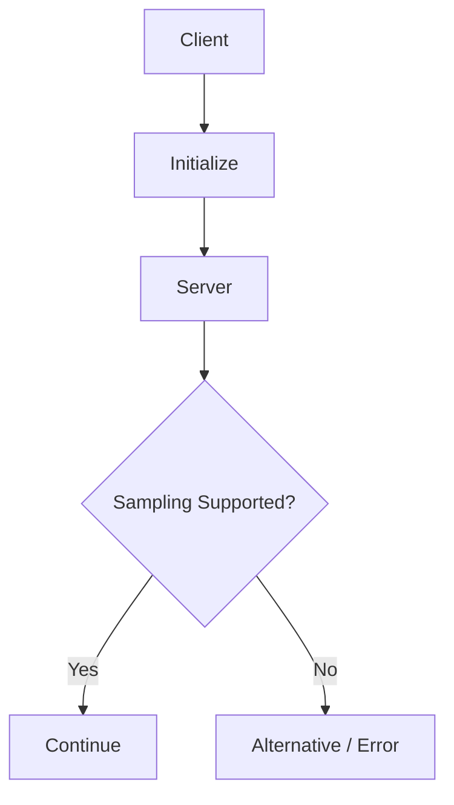
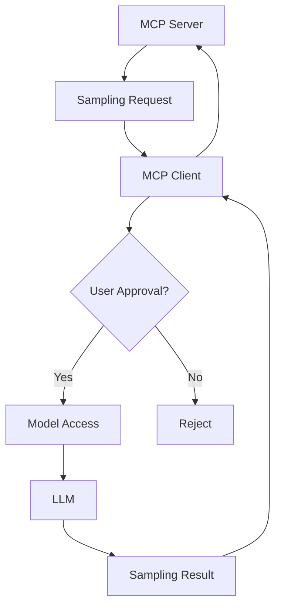
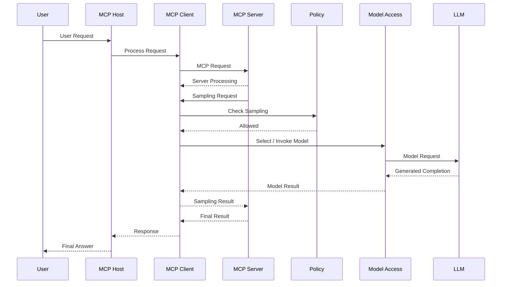
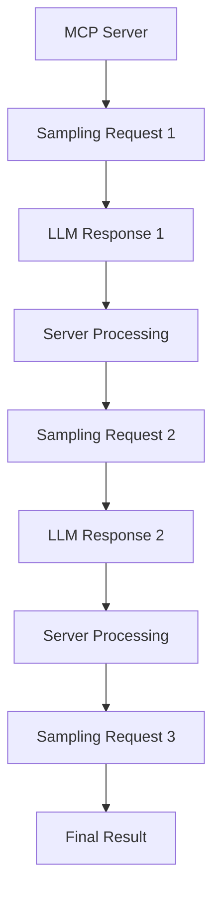
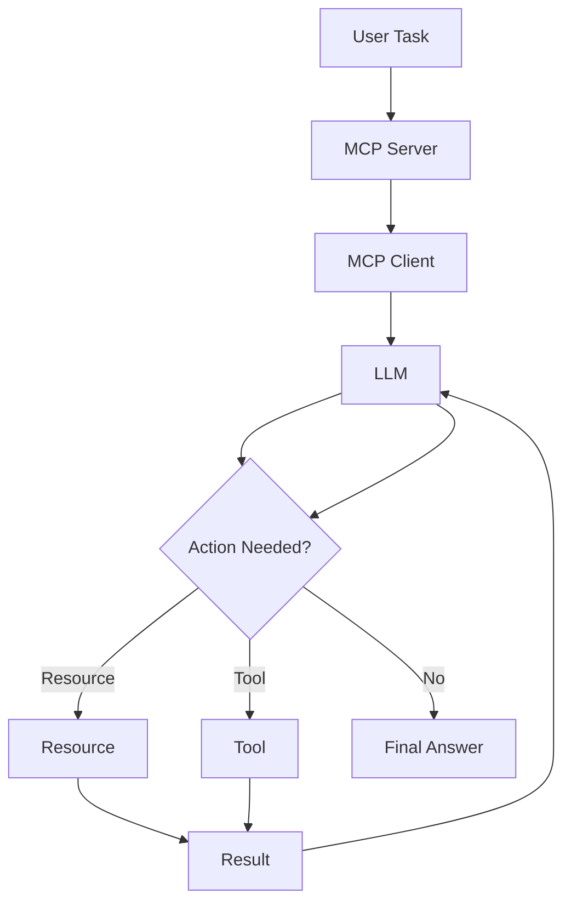
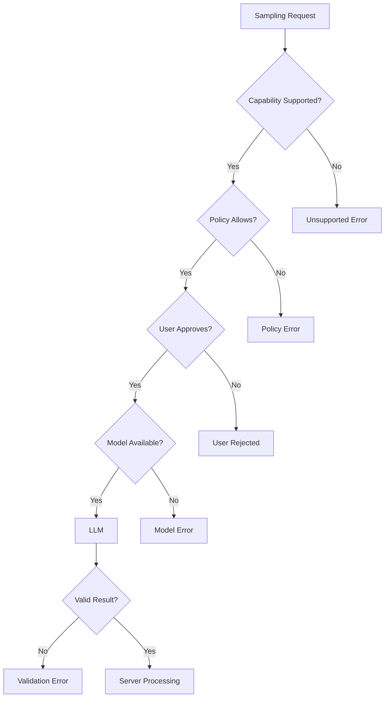
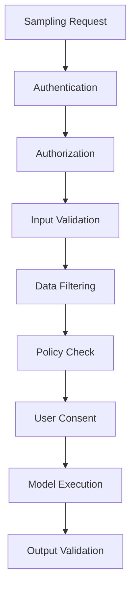

# MCP Sampling - Flow

> A complete step-by-step guide to the flow of MCP Sampling, from initialization and capability negotiation to sampling requests, client-side policy checks, model execution, results, validation, errors, and iterative workflows.

---

# Table of Contents

1. Introduction
2. What is the Sampling Flow?
3. Basic Sampling Flow
4. Complete Sampling Flow
5. Step 1 - User Request
6. Step 2 - MCP Host
7. Step 3 - MCP Client
8. Step 4 - MCP Server
9. Step 5 - Capability Negotiation
10. Step 6 - Sampling Request
11. Step 7 - Client Policy Check
12. Step 8 - User Consent
13. Step 9 - Model Selection
14. Step 10 - Model Request
15. Step 11 - LLM Processing
16. Step 12 - Model Result
17. Step 13 - Sampling Result
18. Step 14 - Server Processing
19. Step 15 - Final Response
20. Complete Sequence
21. Sampling Flow Diagram
22. Capability Flow
23. Request Flow
24. Response Flow
25. Human-in-the-Loop Flow
26. Resource + Sampling Flow
27. Tool + Sampling Flow
28. Prompt + Sampling Flow
29. Iterative Sampling Flow
30. Agentic Sampling Flow
31. Error Flow
32. Retry Flow
33. Validation Flow
34. Security Flow
35. Privacy Flow
36. Cost Control Flow
37. Production Flow
38. Complete End-to-End Example
39. Pseudocode Flow
40. Best Practices
41. Common Mistakes
42. Quick Revision
43. Final Summary

---

# Introduction

MCP Sampling allows an MCP Server to request model-generated content through an MCP Client.

The fundamental flow is:

```text
MCP Server
     |
     | Sampling Request
     v
MCP Client
     |
     v
Model Access
     |
     v
LLM
     |
     v
Generated Result
     |
     v
MCP Client
     |
     | Sampling Result
     v
MCP Server
```

The important point is that the MCP Server requests sampling through the client instead of necessarily connecting directly to a model provider.

---

# What is the Sampling Flow?

The Sampling Flow describes the sequence of operations involved when an MCP Server needs an LLM-generated completion.

The high-level process is:

```text
User
  |
  v
MCP Host
  |
  v
MCP Client
  |
  v
MCP Server
  |
  | Sampling Request
  v
MCP Client
  |
  v
Policy / Consent
  |
  v
Model Access
  |
  v
LLM
  |
  v
Generated Result
  |
  v
MCP Client
  |
  v
MCP Server
  |
  v
Final Result
```

---

# Basic Sampling Flow

The simplest flow is:

```text
Server
  |
  | Request Sampling
  v
Client
  |
  | Invoke Model
  v
LLM
  |
  | Generate
  v
Client
  |
  | Return Result
  v
Server
```

This can be remembered as:

```text
REQUEST
   ↓
CLIENT
   ↓
MODEL
   ↓
RESULT
   ↓
SERVER
```

---

# Complete Sampling Flow

A complete workflow contains several stages:

```text
1. User sends request
2. Host receives request
3. Client communicates with server
4. Client and server initialize
5. Capabilities are negotiated
6. Server determines sampling is required
7. Server creates sampling request
8. Client receives sampling request
9. Client checks policy
10. Optional user consent
11. Client selects model
12. Model request is prepared
13. LLM processes request
14. LLM generates completion
15. Client receives model result
16. Client returns sampling result
17. Server validates result
18. Server continues business logic
19. Final response is produced
20. Host returns response to user
```

---

# Step 1 - User Request

Everything begins with the user.

Example:

```text
User:

Analyze this customer complaint and classify the issue.
```

Flow:

```text
USER
  |
  | Request
  v
MCP HOST
```

---

# Step 2 - MCP Host

The MCP Host receives the user request.

The host coordinates:

```text
User Interface
Conversation
MCP Client
Model Access
Permissions
Application State
```

Flow:

```text
User
  |
  v
MCP Host
  |
  v
MCP Client
```

---

# Step 3 - MCP Client

The MCP Client manages communication with the MCP Server.

Conceptually:

```text
MCP Host
    |
    v
MCP Client
    |
    v
MCP Server
```

The client may:

```text
Connect
Initialize
Negotiate Capabilities
Send Requests
Receive Responses
Handle Notifications
Support Sampling
```

---

# Step 4 - MCP Server

The MCP Server processes the application request.

The server determines what action is required.

Example:

```text
User Request
     |
     v
MCP Server
     |
     v
Need Model Generation?
     |
   YES
     |
     v
Sampling
```

---

# Step 5 - Capability Negotiation

Before using Sampling, the system should establish whether the required capability is supported.

Conceptually:

```text
Client
  |
  | Initialize
  v
Server
  |
  | Capabilities
  v
Client
```

Decision:

```text
Sampling Supported?
      |
   +--+--+
   |     |
  YES    NO
   |     |
   v     v
Continue Alternative
```

---

# Capability Flow



---

# Step 6 - Sampling Request

The MCP Server creates a sampling request.

Conceptually, the request can include:

```text
Messages
System Prompt
Model Preferences
Maximum Tokens
Temperature
Stop Sequences
Other Supported Parameters
```

Example:

```text
System:

You are a customer support classification assistant.

User:

Classify this issue:
The application crashes when uploading large files.
```

---

# Sampling Request Flow

```text
MCP Server
     |
     | Sampling Request
     v
MCP Client
```

The request is then processed by the client.

---

# Step 7 - Client Policy Check

The client can evaluate the request before sending it to a model.

Possible checks:

```text
Is Sampling Allowed?
Is the Server Trusted?
Is the Data Allowed?
Is the Request Within Budget?
Is the Model Allowed?
Is User Approval Required?
```

Flow:

```text
Sampling Request
      |
      v
Policy Check
      |
   +--+--+
   |     |
 Allowed Rejected
   |       |
   v       v
Continue  Error
```

---

# Step 8 - User Consent

Depending on the host, the client may request user approval.

```text
Sampling Request
      |
      v
User Approval?
     / \
   YES  NO
    |    |
    v    v
Continue Reject
```

Example:

```text
The MCP Server wants to send
project information to the selected AI model.

Allow?
[Yes] [No]
```

If the user rejects:

```text
User
 |
 | Reject
 v
MCP Client
 |
 v
Sampling Error / Rejection
 |
 v
MCP Server
```

---

# Human-in-the-Loop Flow



---

# Step 9 - Model Selection

After the request is allowed, the client selects an appropriate model.

Conceptually:

```text
Sampling Request
       |
       v
Model Preferences
       |
       v
Client Policy
       |
       v
Available Models
       |
       v
Selected Model
```

The server may provide preferences, but actual model selection is controlled by the client/host environment.

---

# Model Selection Flow

```text
Server
  |
  | Preferred Model Characteristics
  v
Client
  |
  | Evaluate
  v
Available Models
  |
  v
Policy
  |
  v
Selected Model
```

Possible factors:

```text
Capability
Latency
Cost
Privacy
Availability
User Preference
Application Policy
```

---

# Step 10 - Model Request

The client prepares the request for the selected model.

Conceptually:

```text
Sampling Request
      |
      v
Model Adapter / Gateway
      |
      v
Model API
```

The model access layer may translate MCP-oriented information into the format expected by the selected model provider.

---

# Step 11 - LLM Processing

The selected LLM processes the request.

Input may include:

```text
System Instructions
Messages
Context
Model Parameters
```

Flow:

```text
Model Request
     |
     v
LLM
     |
     v
Model Processing
```

---

# Step 12 - LLM Result

The model generates a completion.

```text
LLM
 |
 v
Generated Completion
```

Example:

```text
Technical Issue
```

The result is passed back through the model access layer.

---

# Step 13 - Sampling Result

The client receives the model result.

```text
LLM
 |
 v
Model Access
 |
 v
MCP Client
 |
 v
Sampling Result
```

Conceptually:

```text
Sampling Result
 |
 +-- Generated Message
 |
 +-- Model Information
 |
 +-- Stop Information
 |
 +-- Other Supported Metadata
```

The exact result structure depends on the MCP specification and SDK version.

---

# Step 14 - Server Processing

The MCP Server receives the sampling result.

```text
Sampling Result
      |
      v
MCP Server
      |
      v
Validate
      |
      v
Process
```

The server can use the generated content for its business logic.

---

# Step 15 - Final Response

After processing:

```text
MCP Server
    |
    v
Final Result
    |
    v
MCP Client
    |
    v
MCP Host
    |
    v
User
```

Complete direction:

```text
USER
  ↓
HOST
  ↓
CLIENT
  ↓
SERVER
  ↓
SAMPLING
  ↓
CLIENT
  ↓
LLM
  ↓
CLIENT
  ↓
SERVER
  ↓
HOST
  ↓
USER
```

---

# Complete Sequence



---

# Sampling Flow Diagram

```text
                         USER
                           |
                           | Request
                           v
                      MCP HOST
                           |
                           v
                      MCP CLIENT
                           |
                           v
                      MCP SERVER
                           |
                           | Need LLM?
                           v
                    SAMPLING REQUEST
                           |
                           v
                      MCP CLIENT
                           |
                           v
                    POLICY CHECK
                           |
                    +------+------+
                    |             |
                  DENY           ALLOW
                    |             |
                    v             v
                 ERROR       USER CONSENT
                                  |
                             +----+----+
                             |         |
                            NO        YES
                             |         |
                             v         v
                           ERROR   MODEL SELECTION
                                       |
                                       v
                                  MODEL ACCESS
                                       |
                                       v
                                      LLM
                                       |
                                       v
                                MODEL COMPLETION
                                       |
                                       v
                                  MCP CLIENT
                                       |
                                       v
                                SAMPLING RESULT
                                       |
                                       v
                                  MCP SERVER
                                       |
                                       v
                                VALIDATE RESULT
                                       |
                                       v
                                 BUSINESS LOGIC
                                       |
                                       v
                                  FINAL RESULT
                                       |
                                       v
                                   MCP HOST
                                       |
                                       v
                                     USER
```

---

# Request Flow

The request-side flow can be remembered as:

```text
User
 ↓
Host
 ↓
Client
 ↓
Server
 ↓
Sampling Request
 ↓
Client
 ↓
Policy
 ↓
Consent
 ↓
Model Selection
 ↓
Model Access
 ↓
LLM
```

---

# Response Flow

The response-side flow is:

```text
LLM
 ↓
Model Access
 ↓
Client
 ↓
Sampling Result
 ↓
Server
 ↓
Validation
 ↓
Business Logic
 ↓
Host
 ↓
User
```

---

# Resource + Sampling Flow

A Resource can provide context for Sampling.

Example:

```text
Resource:
project_documentation.md

Task:
Summarize the documentation.
```

Flow:

```text
MCP Server
    |
    +---- Resource
    |       |
    |       v
    |    Context
    |
    +---- Sampling Request
            |
            v
        MCP Client
            |
            v
           LLM
            |
            v
         Summary
            |
            v
        MCP Server
```

---

# Resource + Sampling Detailed Flow

```text
1. Server retrieves resource
2. Server extracts relevant context
3. Server prepares sampling request
4. Server sends request through client
5. Client checks policy
6. Client selects model
7. Model receives context
8. Model generates response
9. Client returns sampling result
10. Server processes result
```

---

# Tool + Sampling Flow

Sampling can participate in a tool-based workflow.

Example:

```text
User asks:
"Analyze server health and explain the issue."
```

Flow:

```text
User
 |
 v
MCP Server
 |
 v
Sampling
 |
 v
LLM decides information is needed
 |
 v
Tool
 |
 v
Server Health Data
 |
 v
LLM
 |
 v
Explanation
 |
 v
MCP Server
 |
 v
User
```

---

# Tool + Sampling Detailed Flow

```text
Task
  |
  v
Sampling
  |
  v
Model Decision
  |
  v
Tool Request
  |
  v
Tool Execution
  |
  v
Tool Result
  |
  v
Sampling
  |
  v
Model Interpretation
  |
  v
Final Result
```

---

# Prompt + Sampling Flow

A reusable Prompt can provide instructions.

```text
Prompt
  |
  v
Instructions
  |
  +---- User Input
  |
  +---- Context
  |
  v
Sampling Request
  |
  v
MCP Client
  |
  v
LLM
  |
  v
Completion
```

---

# Prompt + Sampling Example

```text
Prompt:

You are a technical documentation assistant.

User:

Explain this API endpoint.

Resource:

API documentation.

        |
        v

Sampling Request

        |
        v

LLM

        |
        v

Technical Explanation
```

---

# Iterative Sampling Flow

Sampling can happen multiple times.

```text
Sampling #1
    |
    v
Initial Analysis
    |
    v
Server Processing
    |
    v
Sampling #2
    |
    v
Refinement
    |
    v
Server Processing
    |
    v
Sampling #3
    |
    v
Final Answer
```

---

# Iterative Sampling Diagram



---

# Iterative Sampling Control

An iterative workflow should have boundaries.

```text
Sampling
   |
   v
Iteration Counter
   |
   +---- Limit Reached ----> Stop
   |
   v
Continue
```

Example:

```text
Maximum iterations = 3

Iteration 1 → Continue
Iteration 2 → Continue
Iteration 3 → Stop
```

This prevents runaway model usage.

---

# Agentic Sampling Flow

A more advanced flow:

```text
User Task
    |
    v
MCP Server
    |
    v
Sampling
    |
    v
LLM
    |
    +---- Need Resource?
    |          |
    |         YES
    |          |
    |          v
    |       Resource
    |          |
    |          v
    |        Result
    |
    +---- Need Tool?
               |
              YES
               |
               v
             Tool
               |
               v
             Result
               |
               v
              LLM
               |
               v
         Final Completion
```

---

# Agentic Loop



---

# Error Flow

Sampling can fail at different stages.

```text
Sampling Request
      |
      v
Capability Check
      |
      +---- Unsupported
      |
      v
Policy Check
      |
      +---- Rejected
      |
      v
User Consent
      |
      +---- Denied
      |
      v
Model Selection
      |
      +---- Model Unavailable
      |
      v
LLM
      |
      +---- Timeout / Failure
      |
      v
Result
      |
      +---- Invalid Output
      |
      v
Server Processing
```

---

# Error Flow Diagram



---

# Retry Flow

Retries should be controlled.

```text
Sampling Error
      |
      v
Classify Error
      |
      v
Retryable?
    /     \
  YES      NO
   |        |
   v        v
Retry    Return Error
   |
   v
Retry Count
   |
   +---- Limit Reached ----> Stop
   |
   v
Sampling Again
```

---

# Retry Example

```text
Attempt 1
   ↓
Timeout
   ↓
Retry
   ↓
Attempt 2
   ↓
Success
```

But:

```text
Attempt 1
   ↓
Permission Denied
   ↓
Do Not Retry Automatically
```

Not every error should be retried.

---

# Validation Flow

Model output should be validated.

```text
Sampling Result
      |
      v
Parse Output
      |
      v
Schema Validation
      |
      v
Business Validation
      |
   +--+--+
   |     |
 Valid Invalid
   |       |
   v       v
Continue Retry / Error
```

---

# Validation Example

Suppose the model should return:

```json
{
  "category": "technical",
  "priority": "high"
}
```

Validation flow:

```text
Model Output
     |
     v
Valid JSON?
     |
     v
Required Fields?
     |
     v
Allowed Category?
     |
     v
Allowed Priority?
     |
     v
Accept
```

---

# Security Flow

Security should be applied before model execution.

```text
Sampling Request
      |
      v
Authentication
      |
      v
Authorization
      |
      v
Input Validation
      |
      v
Data Filtering
      |
      v
Policy Check
      |
      v
User Consent
      |
      v
Model Execution
```

---

# Security Flow Diagram



---

# Privacy Flow

A privacy-aware flow is:

```text
Server Data
    |
    v
Identify Sensitive Data
    |
    v
Remove / Minimize
    |
    v
Create Context
    |
    v
Sampling Request
    |
    v
Client Policy
    |
    v
Approved Model
    |
    v
LLM
```

---

# Privacy Example

Instead of sending:

```text
Customer Name
Email
Phone
Address
Full Account Data
Complaint
```

Send only:

```text
Complaint:
"The application crashes during file upload."

Task:
Classify the technical issue.
```

The exact data-minimization approach depends on the application.

---

# Cost Control Flow

Sampling usage should be controlled.

```text
Sampling Request
      |
      v
Token Budget Check
      |
      v
Iteration Limit Check
      |
      v
Rate Limit Check
      |
      v
Model Execution
      |
      v
Usage Tracking
```

---

# Cost Control Example

```text
Maximum Tokens = 1000
Maximum Iterations = 3

Request
  ↓
Budget Check
  ↓
Allowed
  ↓
Sampling
  ↓
Track Usage
  ↓
Continue or Stop
```

---

# Production Sampling Flow

A production flow may look like:

```text
USER
  |
  v
MCP HOST
  |
  v
MCP CLIENT
  |
  v
MCP SERVER
  |
  v
CAPABILITY CHECK
  |
  v
SAMPLING REQUEST
  |
  v
AUTHORIZATION
  |
  v
DATA FILTERING
  |
  v
USER CONSENT
  |
  v
MODEL SELECTION
  |
  v
MODEL GATEWAY
  |
  v
LLM
  |
  v
OUTPUT VALIDATION
  |
  v
MCP CLIENT
  |
  v
MCP SERVER
  |
  v
BUSINESS LOGIC
  |
  v
MCP HOST
  |
  v
USER
```

---

# Complete End-to-End Example

Consider an MCP Server that classifies customer support requests.

## User Request

```text
Classify this support issue:

"The application crashes when I upload a large PDF."
```

---

## Step 1 - Host

```text
User
 ↓
MCP Host
```

---

## Step 2 - Client

```text
MCP Host
 ↓
MCP Client
```

---

## Step 3 - Server

```text
MCP Client
 ↓
MCP Server
```

The server determines that model reasoning is needed.

---

## Step 4 - Sampling Request

The server creates:

```text
System:

You are a customer support classifier.

User:

Classify this issue:
The application crashes when I upload a large PDF.
```

---

## Step 5 - Client

```text
MCP Server
 ↓
Sampling Request
 ↓
MCP Client
```

---

## Step 6 - Policy

```text
MCP Client
 ↓
Policy Check
 ↓
Allowed
```

---

## Step 7 - Model Selection

```text
Policy
 ↓
Available Models
 ↓
Selected Model
```

---

## Step 8 - LLM

```text
Model Request
 ↓
LLM
 ↓
"Technical Issue"
```

---

## Step 9 - Sampling Result

```text
LLM
 ↓
MCP Client
 ↓
Sampling Result
 ↓
MCP Server
```

---

## Step 10 - Server Processing

The server validates:

```text
Category = Technical
```

Then performs application logic.

---

## Step 11 - Final Response

```text
MCP Server
 ↓
MCP Client
 ↓
MCP Host
 ↓
User
```

Final result:

```text
Category: Technical Issue
```

---

# Complete Example Flow

```text
                          USER
                            |
                            | Support Issue
                            v
                       MCP HOST
                            |
                            v
                       MCP CLIENT
                            |
                            v
                       MCP SERVER
                            |
                            | Need Model?
                            v
                    SAMPLING REQUEST
                            |
                            v
                       MCP CLIENT
                            |
                            v
                      POLICY CHECK
                            |
                            v
                     USER CONSENT
                            |
                            v
                    MODEL SELECTION
                            |
                            v
                      MODEL ACCESS
                            |
                            v
                           LLM
                            |
                            | "Technical Issue"
                            v
                      MODEL ACCESS
                            |
                            v
                       MCP CLIENT
                            |
                            v
                    SAMPLING RESULT
                            |
                            v
                       MCP SERVER
                            |
                            v
                       VALIDATION
                            |
                            v
                    BUSINESS LOGIC
                            |
                            v
                       MCP CLIENT
                            |
                            v
                        MCP HOST
                            |
                            v
                           USER
```

---

# Pseudocode Flow

The following pseudocode illustrates the conceptual flow:

```python
async def process_request(user_request):

    # Server receives application request
    request = user_request

    # Determine whether model generation is needed
    if needs_sampling(request):

        # Create a sampling request
        sampling_request = {
            "system_prompt": "You are a helpful assistant.",
            "messages": [
                {
                    "role": "user",
                    "content": {
                        "type": "text",
                        "text": request
                    }
                }
            ],
            "max_tokens": 500
        }

        # Ask the MCP client for model sampling
        result = await client.create_message(
            **sampling_request
        )

        # Validate model output
        validate_result(result)

        # Continue server-side logic
        return process_result(result)

    return process_without_sampling(request)
```

> This is conceptual pseudocode. Use the exact API and SDK method names provided by the MCP implementation you are using.

---

# Sampling Flow with Multiple Components

A complete MCP application can combine:

```text
                    USER
                      |
                      v
                  MCP HOST
                      |
                      v
                 MCP CLIENT
                      |
                      v
                 MCP SERVER
                      |
          +-----------+-----------+
          |           |           |
          v           v           v
       PROMPT      RESOURCE      TOOL
          |           |           |
          +-----------+-----------+
                      |
                      v
                  SAMPLING
                      |
                      v
                 MCP CLIENT
                      |
                      v
                 POLICY LAYER
                      |
                      v
                MODEL ACCESS
                      |
                      v
                     LLM
                      |
                      v
                 RESULT
                      |
                      v
                 MCP CLIENT
                      |
                      v
                 MCP SERVER
```

---

# Sampling Flow vs Tool Flow

It is important to distinguish the direction of these operations.

## Sampling

```text
MCP Server
    |
    v
MCP Client
    |
    v
LLM
```

## Tool

```text
LLM / Client
    |
    v
MCP Server Tool
    |
    v
External System
```

Conceptually:

```text
SAMPLING
Server → Client → Model

TOOL
Model/Client → Server → External System
```

The exact orchestration depends on the host implementation.

---

# Sampling Flow vs Resource Flow

```text
RESOURCE

Client
  |
  v
Server
  |
  v
Resource
  |
  v
Context
```

Sampling:

```text
Server
  |
  v
Client
  |
  v
LLM
```

Combined:

```text
Resource
   |
   v
Context
   |
   v
Sampling
   |
   v
LLM
```

---

# Sampling Flow vs Prompt Flow

```text
PROMPT

Prompt Definition
      |
      v
Instructions
```

Sampling:

```text
Instructions
      |
      v
Sampling Request
      |
      v
LLM
```

Combined:

```text
Prompt
  +
User Input
  +
Context
  |
  v
Sampling
  |
  v
LLM
```

---

# Decision Flow

A server can use the following conceptual decision process:

```text
Request
  |
  v
Does server need model generation?
  |
 +---- NO ----> Continue normal processing
 |
 YES
 |
 v
Does client support Sampling?
 |
 +---- NO ----> Use alternative / return error
 |
 YES
 |
 v
Create Sampling Request
 |
 v
Client Policy Check
 |
 +---- DENY ----> Return error
 |
 ALLOW
 |
 v
User Consent Required?
 |
 +---- YES ----> Ask User
 |                  |
 |                  +---- NO ----> Stop
 |
 v
Select Model
 |
 v
Execute Sampling
 |
 v
Validate Result
 |
 v
Continue Workflow
```

---

# Flow State Machine

A conceptual Sampling state machine:

```text
[START]
   |
   v
[INITIALIZED]
   |
   v
[CAPABILITY CHECK]
   |
   v
[REQUEST CREATED]
   |
   v
[POLICY CHECK]
   |
   v
[CONSENT]
   |
   v
[MODEL SELECTED]
   |
   v
[MODEL EXECUTION]
   |
   v
[RESULT RECEIVED]
   |
   v
[VALIDATION]
   |
   v
[SERVER PROCESSING]
   |
   v
[COMPLETE]
```

Error states can occur from several stages:

```text
[CAPABILITY ERROR]
[POLICY ERROR]
[CONSENT ERROR]
[MODEL ERROR]
[VALIDATION ERROR]
[TIMEOUT]
```

---

# Flow Timing

A typical conceptual timeline:

```text
Time ─────────────────────────────────────────────>

User
 | Request
 v
Host
 |
 v
Client
 |
 v
Server
 |
 | Sampling Request
 v
Client
 |
 | Policy
 v
Consent
 |
 v
Model Selection
 |
 v
LLM
 |
 | Generation
 v
Client
 |
 v
Server
 |
 v
Host
 |
 v
User
```

The largest latency may occur during:

```text
Model Selection
+
LLM Generation
```

---

# Flow Optimization

To improve flow performance:

```text
Reduce unnecessary context
       |
       v
Reduce token count
       |
       v
Reduce sampling iterations
       |
       v
Use appropriate model
       |
       v
Set reasonable timeouts
       |
       v
Validate efficiently
```

---

# Best Practices

## 1. Check Capability First

```text
Capability
   ↓
Supported?
   ↓
Sampling
```

---

## 2. Keep Requests Focused

Provide clear instructions and only necessary context.

---

## 3. Apply Policy Before Execution

```text
Request
 ↓
Policy
 ↓
Model
```

---

## 4. Use Consent When Needed

For sensitive workflows:

```text
Request
 ↓
Consent
 ↓
Model
```

---

## 5. Validate Model Results

```text
Model
 ↓
Validation
 ↓
Business Logic
```

---

## 6. Limit Iterations

```text
Maximum Iterations
Maximum Tokens
Timeout
```

---

## 7. Handle Errors

Every important stage should have a failure path.

---

## 8. Monitor Usage

Track:

```text
Latency
Tokens
Errors
Sampling Count
Cost
```

---

## 9. Protect Sensitive Information

Only send required information to the model.

---

## 10. Keep Security Outside the Prompt

Use application-level controls for authorization.

---

# Common Mistakes

❌ Assuming Sampling is always available.

❌ Skipping capability negotiation.

❌ Sending the sampling request without policy checks.

❌ Ignoring user consent where required.

❌ Assuming model selection is controlled by the server.

❌ Sending excessive context.

❌ Trusting model output without validation.

❌ Retrying every error.

❌ Creating unlimited sampling loops.

❌ Ignoring token budgets.

❌ Ignoring timeout handling.

❌ Logging sensitive prompts.

❌ Treating model output as guaranteed truth.

---

# Quick Revision

Remember the complete flow:

```text
USER
  ↓
MCP HOST
  ↓
MCP CLIENT
  ↓
MCP SERVER
  ↓
CAPABILITY CHECK
  ↓
SAMPLING REQUEST
  ↓
MCP CLIENT
  ↓
POLICY CHECK
  ↓
USER CONSENT
  ↓
MODEL SELECTION
  ↓
MODEL ACCESS
  ↓
LLM
  ↓
MODEL RESULT
  ↓
MCP CLIENT
  ↓
SAMPLING RESULT
  ↓
MCP SERVER
  ↓
VALIDATION
  ↓
BUSINESS LOGIC
  ↓
MCP HOST
  ↓
USER
```

---

# One-Line Flow

> **MCP Server requests sampling → MCP Client validates and controls the request → Model generates a completion → Client returns the sampling result → Server continues its workflow.**

---

# Final Summary

The MCP Sampling flow is a controlled sequence between the MCP Server, MCP Client, host policies, model access layer, and LLM.

The most important flow is:

```text
                 MCP SERVER
                      |
                      | Sampling Request
                      v
                 MCP CLIENT
                      |
                      v
                POLICY CHECK
                      |
                      v
                USER CONSENT
                      |
                      v
               MODEL SELECTION
                      |
                      v
                MODEL ACCESS
                      |
                      v
                     LLM
                      |
                      v
              GENERATED RESULT
                      |
                      v
                 MCP CLIENT
                      |
                      | Sampling Result
                      v
                 MCP SERVER
                      |
                      v
                  VALIDATE
                      |
                      v
               BUSINESS LOGIC
                      |
                      v
                 FINAL RESULT
```

The broader MCP workflow can be remembered as:

```text
PROMPTS
   ↓
Instructions

RESOURCES
   ↓
Context

TOOLS
   ↓
Actions

SAMPLING
   ↓
Model Generation
```

And the end-to-end Sampling sequence is:

```text
REQUEST
   ↓
CAPABILITY CHECK
   ↓
SAMPLING REQUEST
   ↓
POLICY
   ↓
CONSENT
   ↓
MODEL SELECTION
   ↓
LLM
   ↓
RESULT
   ↓
VALIDATION
   ↓
SERVER PROCESSING
   ↓
FINAL RESPONSE
```

This flow provides a clear and controlled way for MCP Servers to participate in LLM-powered workflows while allowing the MCP Client and host environment to control model access, permissions, privacy, and execution policies.
