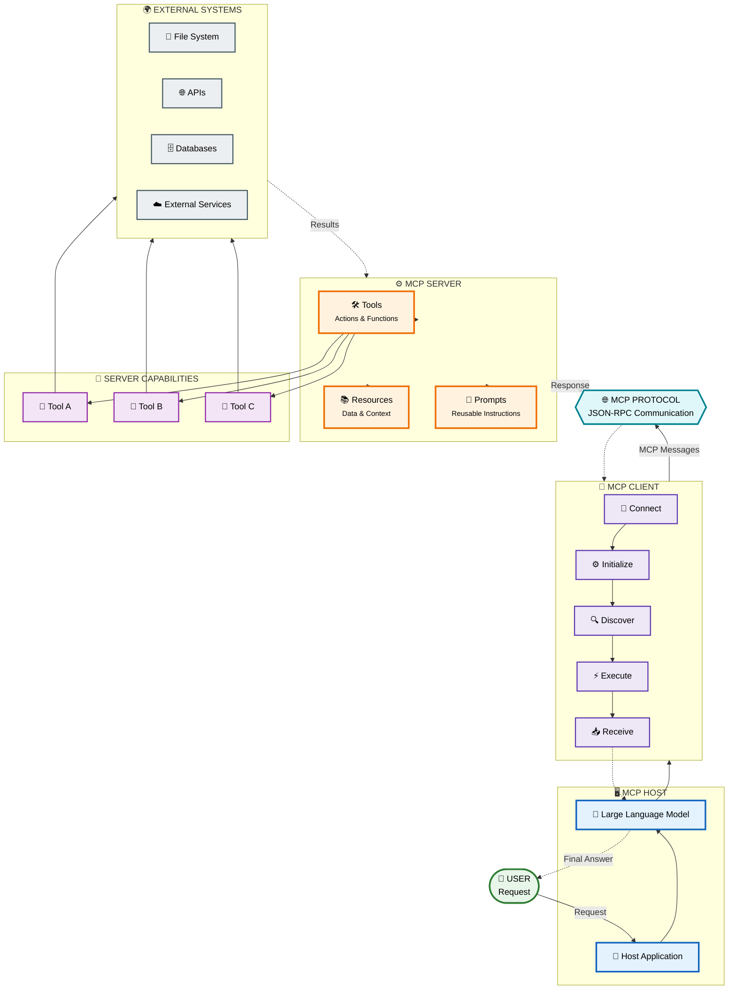
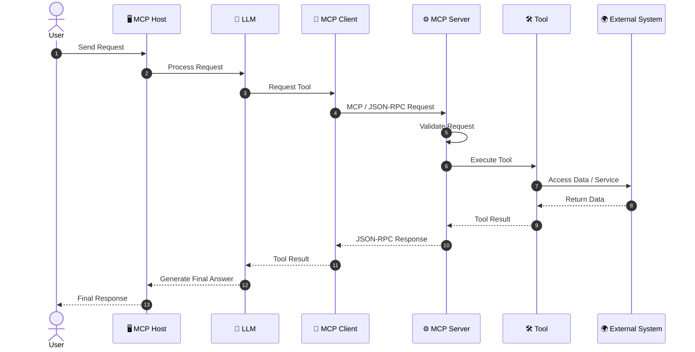

# MCP Client — Architecture

## 1. Introduction

The **MCP Client Architecture** defines how an MCP Host communicates with an MCP Server through the Model Context Protocol.

The MCP Client acts as the communication layer between the host application and the server.
# High-Level MCP Architecture

The high-level architecture of the **Model Context Protocol (MCP)** can be represented as follows:



## 🧩 Architecture Layers

### 1. 👤 User Layer

The user starts the interaction by sending a request to the host application.

```text
User
  │
  ▼
Request
```

---

### 2. 🖥️ MCP Host

The **MCP Host** is the application that contains or manages the LLM and MCP clients.

Examples include AI-powered applications such as:

- Desktop AI applications
- IDEs
- Coding assistants
- AI agents

The host is responsible for managing the overall AI interaction.

```text
┌─────────────────────┐
│      MCP HOST       │
│                     │
│  Application        │
│       +             │
│      LLM            │
└─────────────────────┘
```

---

### 3. 🔌 MCP Client

The MCP Client maintains communication between the host and an MCP server.

Its major responsibilities include:

```text
Connect
   ↓
Initialize
   ↓
Discover
   ↓
Execute
   ↓
Receive
```

The client handles the MCP communication lifecycle.

---

### 4. 🌐 MCP Protocol

The client communicates with the server through the **Model Context Protocol**.

MCP defines standardized communication and message structures, using **JSON-RPC** for protocol messages.

```text
MCP Client
     │
     │ JSON-RPC Messages
     ▼
MCP Server
```

---

### 5. ⚙️ MCP Server

The MCP Server exposes capabilities that the AI application can use.

A server can provide:

```text
┌─────────────────────────┐
│       MCP SERVER        │
│                         │
│ 🛠️ Tools                │
│ 📚 Resources            │
│ 💬 Prompts              │
└─────────────────────────┘
```

#### Tools

Tools allow the model to perform actions.

Examples:

- Search the web
- Query a database
- Create a file
- Send an API request
- Execute a calculation

#### Resources

Resources provide information or contextual data to the client/model.

Examples:

- Files
- Documents
- Database records
- Application data

#### Prompts

Prompts provide reusable instruction templates that can help structure interactions.

---

### 6. 🧩 Tools Layer

An MCP server can expose multiple tools:

```text
              MCP SERVER
                  │
        ┌─────────┼─────────┐
        ▼         ▼         ▼
     Tool A    Tool B    Tool C
```

Each tool can perform a different operation.

---

### 7. 🌍 External Systems

Tools can interact with external systems such as:

```text
Tool A ──► 📁 File System

Tool B ──► 🌐 External API

Tool C ──► 🗄️ Database
```

This allows an LLM-powered application to interact with real-world data and services.

---

# 🔄 Complete Architecture Flow



## 🔑 Key Concept

> **MCP acts as a standardized bridge between an AI application and external capabilities.**

The overall architecture can therefore be remembered as:

```text
👤 User
   ↓
🖥️ MCP Host
   ↓
🧠 LLM
   ↓
🔌 MCP Client
   ↓
🌐 MCP Protocol
   ↓
⚙️ MCP Server
   ↓
🛠️ Tools / 📚 Resources / 💬 Prompts
   ↓
🌍 External Systems
   ↓
📤 Result
   ↓
🧠 LLM
   ↓
💬 Final Answer
   ↓
👤 User
```

---

# 2. Architecture Overview

An MCP-based application can be divided into four major layers:

```text
┌───────────────────────────────────────────────┐
│                    USER                       │
└──────────────────────┬────────────────────────┘
                       │
                       ▼
┌───────────────────────────────────────────────┐
│                  MCP HOST                     │
│                                               │
│        Application + LLM + Context            │
└──────────────────────┬────────────────────────┘
                       │
                       ▼
┌───────────────────────────────────────────────┐
│                 MCP CLIENT                    │
│                                               │
│ Connect → Discover → Execute → Receive        │
└──────────────────────┬────────────────────────┘
                       │
                  MCP Protocol
                       │
                       ▼
┌───────────────────────────────────────────────┐
│                 MCP SERVER                    │
│                                               │
│ Tools + Resources + Prompts                   │
└──────────────────────┬────────────────────────┘
                       │
                       ▼
┌───────────────────────────────────────────────┐
│              EXTERNAL SYSTEMS                 │
│                                               │
│ APIs / Databases / Files / Services          │
└───────────────────────────────────────────────┘
```

Each layer has a different responsibility.

---

# 3. Main Components

The MCP Client architecture contains the following major components:

```text
MCP Architecture
│
├── User
│
├── MCP Host
│   ├── Application
│   ├── LLM
│   └── Context Manager
│
├── MCP Client
│   ├── Connection Manager
│   ├── Session Manager
│   ├── Capability Discovery
│   ├── Tool Manager
│   ├── Request Handler
│   └── Response Handler
│
├── MCP Server
│   ├── Tool Provider
│   ├── Resource Provider
│   └── Prompt Provider
│
└── External Systems
    ├── APIs
    ├── Databases
    ├── Files
    └── Services
```

---

# 4. MCP Host Architecture

The **MCP Host** is the application that manages the user interaction and LLM.

A host can contain one or more MCP Clients.

```text
                  ┌────────────────────┐
                  │      MCP HOST      │
                  │                    │
                  │ ┌────────────────┐ │
                  │ │      User      │ │
                  │ └───────┬────────┘ │
                  │         │          │
                  │         ▼          │
                  │ ┌────────────────┐ │
                  │ │      LLM       │ │
                  │ └───────┬────────┘ │
                  │         │          │
                  │         ▼          │
                  │ ┌────────────────┐ │
                  │ │  MCP Client    │ │
                  │ └────────────────┘ │
                  └────────────────────┘
```

The host manages the overall application flow.

---

# 5. MCP Client Architecture

The MCP Client is the central communication component.

Internally, it can be conceptually divided into several responsibilities:

```text
                  ┌─────────────────────────┐
                  │       MCP CLIENT        │
                  │                         │
                  │ ┌─────────────────────┐ │
                  │ │ Connection Manager  │ │
                  │ └──────────┬──────────┘ │
                  │            │            │
                  │            ▼            │
                  │ ┌─────────────────────┐ │
                  │ │  Session Manager    │ │
                  │ └──────────┬──────────┘ │
                  │            │            │
                  │            ▼            │
                  │ ┌─────────────────────┐ │
                  │ │ Capability Discovery│ │
                  │ └──────────┬──────────┘ │
                  │            │            │
                  │            ▼            │
                  │ ┌─────────────────────┐ │
                  │ │    Tool Manager     │ │
                  │ └──────────┬──────────┘ │
                  │            │            │
                  │            ▼            │
                  │ ┌─────────────────────┐ │
                  │ │ Request / Response  │ │
                  │ │      Handler        │ │
                  │ └─────────────────────┘ │
                  └─────────────────────────┘
```

These components are conceptual responsibilities. A specific SDK may combine or structure them differently.

---

# 6. Connection Manager

The **Connection Manager** is responsible for establishing communication between the client and server.

```text
MCP Client
    │
    │ Connection
    ▼
MCP Server
```

Its responsibilities may include:

* Establishing communication
* Managing the selected transport
* Detecting connection failures
* Closing communication
* Handling reconnection where supported by the application

Conceptually:

```text
START
  │
  ▼
CONNECT
  │
  ├──── Success ────► INITIALIZE
  │
  └──── Failure ────► ERROR
```

---

# 7. Session Manager

Once communication is established, the client participates in an MCP session.

```text
Client
  │
  │ Initialize
  ▼
Server
  │
  │ Initialize Response
  ▼
Client
```

The session manager is responsible for maintaining the state required for communication.

Conceptually:

```text
┌─────────────────────┐
│   SESSION MANAGER   │
├─────────────────────┤
│ Connection State    │
│ Initialization      │
│ Server Information  │
│ Client Information  │
│ Session State       │
└─────────────────────┘
```

The exact session behavior depends on the MCP SDK and transport implementation.

---

# 8. Capability Discovery

After initialization, the client can discover capabilities exposed by the server.

MCP servers can expose capabilities such as:

```text
MCP SERVER
    │
    ├── Tools
    │
    ├── Resources
    │
    └── Prompts
```

For tools, the client can request the available tool definitions.

Conceptually:

```text
CLIENT
  │
  │ List Tools
  ▼
SERVER
  │
  │ Tool Definitions
  ▼
CLIENT
```

---

# 9. Tool Manager

The Tool Manager is responsible for handling information about tools discovered from MCP Servers.

Conceptually:

```text
                 TOOL MANAGER
                      │
       ┌──────────────┼──────────────┐
       ▼              ▼              ▼
    Tool A          Tool B          Tool C
       │              │              │
       ▼              ▼              ▼
  Definition      Definition      Definition
```

A tool definition may include:

* Tool name
* Description
* Input schema
* Required parameters
* Optional parameters

Example:

```json
{
  "name": "search_products",
  "description": "Search products",
  "inputSchema": {
    "type": "object",
    "properties": {
      "query": {
        "type": "string"
      }
    }
  }
}
```

---

# 10. Request Handler

The **Request Handler** prepares and sends requests to the MCP Server.

Examples include:

```text
Initialize
List Tools
Call Tool
Read Resource
Get Prompt
```

For tool execution:

```text
MCP Client
     │
     │ Tool Request
     ▼
MCP Server
```

Conceptually:

```text
┌────────────────────┐
│   REQUEST HANDLER  │
├────────────────────┤
│ Request Creation   │
│ Parameter Handling │
│ Request Sending    │
│ Error Detection    │
└────────────────────┘
```

---

# 11. Response Handler

The **Response Handler** receives responses from the MCP Server.

```text
MCP Server
     │
     │ Response
     ▼
MCP Client
```

The response handler may process:

* Successful results
* Tool results
* Errors
* Structured content
* Server messages

Conceptually:

```text
             SERVER RESPONSE
                    │
                    ▼
            ┌───────────────┐
            │    RESPONSE   │
            │    HANDLER     │
            └───────┬───────┘
                    │
          ┌─────────┴─────────┐
          ▼                   ▼
       SUCCESS              ERROR
          │                   │
          ▼                   ▼
      Process             Handle Error
```

---

# 12. MCP Server Architecture

The MCP Server provides capabilities to the client.

```text
                  ┌──────────────────────┐
                  │      MCP SERVER      │
                  │                      │
                  │ ┌──────────────────┐ │
                  │ │      Tools       │ │
                  │ └──────────────────┘ │
                  │                      │
                  │ ┌──────────────────┐ │
                  │ │    Resources     │ │
                  │ └──────────────────┘ │
                  │                      │
                  │ ┌──────────────────┐ │
                  │ │     Prompts      │ │
                  │ └──────────────────┘ │
                  └──────────┬───────────┘
                             │
                             ▼
                     External Systems
```

The server hides the implementation details of the underlying systems from the client.

---

# 13. Tool Provider

A Tool Provider exposes executable operations.

For example:

```text
MCP Server
    │
    ├── calculator
    ├── search
    ├── get_weather
    └── database_query
```

When the client requests a tool, the server executes the corresponding implementation.

```text
Client
  │
  │ Call Tool
  ▼
Server
  │
  ▼
Tool
  │
  ▼
External System
```

---

# 14. External Systems

MCP Servers often connect their tools to external systems.

Examples:

```text
                 MCP SERVER
                     │
       ┌─────────────┼─────────────┐
       ▼             ▼             ▼
    GitHub        Database       REST API
       │             │             │
       ▼             ▼             ▼
   Repository      Data          Service
```

The MCP Client does not usually communicate directly with these systems.

Instead:

```text
MCP Client
     │
     ▼
MCP Server
     │
     ▼
External System
```

This separation is an important architectural concept.

---

# 15. Complete Architecture

The complete MCP Client architecture can be represented as:

```text
                              USER
                                │
                                │ Request
                                ▼
                     ┌────────────────────┐
                     │      MCP HOST      │
                     │                    │
                     │ ┌────────────────┐ │
                     │ │  Application   │ │
                     │ └───────┬────────┘ │
                     │         │          │
                     │         ▼          │
                     │ ┌────────────────┐ │
                     │ │      LLM       │ │
                     │ └───────┬────────┘ │
                     └─────────┼──────────┘
                               │
                               ▼
              ┌─────────────────────────────────┐
              │           MCP CLIENT             │
              │                                  │
              │ ┌──────────────────────────────┐ │
              │ │    Connection Manager        │ │
              │ └──────────────┬───────────────┘ │
              │                │                 │
              │ ┌──────────────▼───────────────┐ │
              │ │       Session Manager        │ │
              │ └──────────────┬───────────────┘ │
              │                │                 │
              │ ┌──────────────▼───────────────┐ │
              │ │   Capability Discovery       │ │
              │ └──────────────┬───────────────┘ │
              │                │                 │
              │ ┌──────────────▼───────────────┐ │
              │ │        Tool Manager          │ │
              │ └──────────────┬───────────────┘ │
              │                │                 │
              │ ┌──────────────▼───────────────┐ │
              │ │   Request / Response Handler │ │
              │ └──────────────────────────────┘ │
              └────────────────┬────────────────┘
                               │
                          MCP Protocol
                               │
                               ▼
              ┌─────────────────────────────────┐
              │           MCP SERVER             │
              │                                  │
              │ ┌──────────────┐                 │
              │ │    Tools     │                 │
              │ └──────┬───────┘                 │
              │        │                         │
              │ ┌──────▼───────┐                 │
              │ │  Resources   │                 │
              │ └──────┬───────┘                 │
              │        │                         │
              │ ┌──────▼───────┐                 │
              │ │   Prompts    │                 │
              │ └──────┬───────┘                 │
              └────────┼─────────────────────────┘
                       │
                       ▼
              ┌─────────────────────┐
              │ External Systems    │
              │                     │
              │ APIs                │
              │ Databases           │
              │ Files               │
              │ Services            │
              └─────────────────────┘
```

---

# 16. Four Core Client Operations

The architecture can be simplified into four major operations.

```text
                   MCP CLIENT
                       │
        ┌──────────────┼──────────────┐
        │              │              │
        ▼              ▼              ▼
     CONNECT        DISCOVER       EXECUTE
                    TOOLS           TOOLS
        │              │              │
        └──────────────┴──────┬───────┘
                              │
                              ▼
                         RECEIVE
                         RESPONSE
```

These operations form the main learning model for the client.

---

# 17. Connect Architecture

The connection phase looks like:

```text
┌──────────────┐
│ MCP CLIENT   │
└──────┬───────┘
       │
       │ Establish Communication
       ▼
┌──────────────┐
│ MCP SERVER   │
└──────┬───────┘
       │
       │ Initialization
       ▼
┌──────────────┐
│ MCP CLIENT   │
└──────────────┘
```

After successful initialization:

```text
Client State = READY
```

---

# 18. Discover Architecture

The discovery phase looks like:

```text
┌──────────────┐
│ MCP CLIENT   │
└──────┬───────┘
       │
       │ Request available tools
       ▼
┌──────────────┐
│ MCP SERVER   │
└──────┬───────┘
       │
       │ Tool Definitions
       ▼
┌──────────────┐
│ MCP CLIENT   │
└──────┬───────┘
       │
       ▼
   Tool Registry
```

The client now knows what tools are available.

---

# 19. Execute Architecture

The execution phase looks like:

```text
             MCP HOST
                 │
                 │ Tool Selection
                 ▼
             MCP CLIENT
                 │
                 │ Tool Call
                 ▼
             MCP SERVER
                 │
                 ▼
                TOOL
                 │
                 ▼
         External System
```

The server performs the actual operation.

---

# 20. Receive Architecture

After execution:

```text
External System
       │
       ▼
      Tool
       │
       ▼
 MCP Server
       │
       │ Result
       ▼
 MCP Client
       │
       ▼
 MCP Host
       │
       ▼
      LLM
       │
       ▼
      User
```

---

# 21. Sequence Architecture

A sequence diagram provides another way to understand the architecture.

```text
USER        HOST        CLIENT        SERVER        TOOL
 │            │            │             │            │
 │ Request    │            │             │            │
 ├───────────►│            │             │            │
 │            │            │             │            │
 │            │ Create     │             │            │
 │            ├───────────►│             │            │
 │            │            │             │            │
 │            │            │ Initialize  │            │
 │            │            ├────────────►│            │
 │            │            │             │            │
 │            │            │ Init Result │            │
 │            │            │◄────────────┤            │
 │            │            │             │            │
 │            │            │ List Tools  │            │
 │            │            ├────────────►│            │
 │            │            │             │            │
 │            │            │ Tool List   │            │
 │            │            │◄────────────┤            │
 │            │            │             │            │
 │            │ Tool Call  │             │            │
 │            ├───────────►│             │            │
 │            │            │ Call Tool   │            │
 │            │            ├────────────►│            │
 │            │            │             │ Execute    │
 │            │            │             ├───────────►│
 │            │            │             │            │
 │            │            │             │ Result     │
 │            │            │             │◄───────────┤
 │            │            │ Result      │            │
 │            │            │◄────────────┤            │
 │            │ Result     │             │            │
 │            │◄───────────┤             │            │
 │ Result     │            │             │            │
 │◄───────────┤            │             │            │
```

---

# 22. Multiple MCP Servers Architecture

An MCP Host can communicate with multiple MCP Servers.

```text
                         MCP HOST
                            │
             ┌──────────────┼──────────────┐
             │              │              │
             ▼              ▼              ▼
        MCP CLIENT      MCP CLIENT      MCP CLIENT
             │              │              │
             │              │              │
             ▼              ▼              ▼
        MCP SERVER A   MCP SERVER B   MCP SERVER C
             │              │              │
             ▼              ▼              ▼
          GitHub         Database        Files
```

Example:

```text
Client A → GitHub Server
Client B → Database Server
Client C → File Server
```

Each client manages communication with its server.

---

# 23. Multiple Tools Architecture

One MCP Server can expose many tools.

```text
                        MCP CLIENT
                            │
                            │
                            ▼
                       MCP SERVER
                            │
           ┌────────────────┼────────────────┐
           │                │                │
           ▼                ▼                ▼
      Calculator         Weather          Search
           │                │                │
           ▼                ▼                ▼
       Calculation       Weather API     Search API
```

The client discovers these tools and can request execution when required.

---

# 24. Data Flow Architecture

The complete data flow is:

```text
USER INPUT
    │
    ▼
MCP HOST
    │
    ▼
LLM
    │
    │ Tool Decision
    ▼
MCP CLIENT
    │
    │ Request
    ▼
MCP SERVER
    │
    ▼
TOOL
    │
    ▼
EXTERNAL SYSTEM
    │
    ▼
TOOL RESULT
    │
    ▼
MCP SERVER
    │
    ▼
MCP CLIENT
    │
    ▼
MCP HOST
    │
    ▼
LLM
    │
    ▼
FINAL RESPONSE
    │
    ▼
USER
```

---

# 25. Error Flow Architecture

Errors can occur at different layers.

```text
MCP CLIENT
     │
     │ Request
     ▼
MCP SERVER
     │
     ▼
   TOOL
     │
     │ Error
     ▼
MCP SERVER
     │
     │ Error Response
     ▼
MCP CLIENT
     │
     ▼
MCP HOST
```

Possible errors:

```text
Connection Error
Initialization Error
Tool Not Found
Invalid Arguments
Tool Execution Error
Server Error
Timeout
```

A robust architecture should handle these errors gracefully.

---

# 26. Security Architecture

Security should be considered across the complete architecture.

```text
                 MCP HOST
                    │
                    │ Authentication /
                    │ Authorization
                    ▼
                MCP CLIENT
                    │
                    │ Secure Communication
                    ▼
                MCP SERVER
                    │
                    │ Permission Checks
                    ▼
             External Systems
```

Important security considerations:

* Server trust
* Authentication
* Authorization
* Input validation
* Tool permissions
* Sensitive data handling
* Secure transport
* Error handling

---

# 27. Separation of Responsibilities

A major advantage of MCP architecture is separation of responsibilities.

```text
HOST
 │
 └── User + LLM + Application Logic

CLIENT
 │
 └── Protocol Communication

SERVER
 │
 └── Capability Provider

TOOL
 │
 └── Specific Operation

EXTERNAL SYSTEM
 │
 └── Actual Data / Service
```

This separation makes systems easier to build and maintain.

---

# 28. Architectural Benefits

The MCP Client architecture provides several benefits.

## Standardization

Applications communicate with servers through a common protocol.

## Reusability

The same MCP Server can be used by different MCP Hosts.

## Modularity

The host, client, server, and tools can have separate responsibilities.

## Extensibility

New tools can be added to a server without redesigning the host application.

## Separation of Concerns

Communication and business logic remain separated.

## Scalability

A host can work with multiple MCP Servers and capabilities.

---

# 29. Architecture Summary

The complete MCP Client architecture can be remembered using:

```text
                 USER
                   │
                   ▼
              MCP HOST
                   │
                   ▼
              MCP CLIENT
                   │
       ┌───────────┼───────────┐
       │           │           │
       ▼           ▼           ▼
    CONNECT     DISCOVER    EXECUTE
                 TOOLS       TOOLS
       │           │           │
       └───────────┴─────┬─────┘
                         │
                         ▼
                      RECEIVE
                      RESPONSE
                         │
                         ▼
                    MCP SERVER
                         │
             ┌───────────┼───────────┐
             ▼           ▼           ▼
           Tools      Resources    Prompts
             │
             ▼
      External Systems
```

---

# 30. Final Mental Model

The simplest way to remember MCP Client architecture is:

```text
┌─────────────────────────────────────────┐
│                 HOST                    │
│                                         │
│              Application                │
│                  +                      │
│                 LLM                     │
└───────────────────┬─────────────────────┘
                    │
                    ▼
┌─────────────────────────────────────────┐
│                CLIENT                   │
│                                         │
│  CONNECT → DISCOVER → EXECUTE → RECEIVE │
└───────────────────┬─────────────────────┘
                    │
               MCP Protocol
                    │
                    ▼
┌─────────────────────────────────────────┐
│                SERVER                   │
│                                         │
│       Tools / Resources / Prompts       │
└───────────────────┬─────────────────────┘
                    │
                    ▼
┌─────────────────────────────────────────┐
│          EXTERNAL SYSTEMS               │
│                                         │
│    APIs / Databases / Files / Services  │
└─────────────────────────────────────────┘
```

## Key Takeaway

> **The MCP Client is the communication layer between the MCP Host and MCP Server. It establishes the connection, initializes the session, discovers server capabilities, sends requests, executes tools through the server, and receives the resulting responses.**

The fundamental architecture is:

```text
HOST
  ↓
CLIENT
  ↓
MCP PROTOCOL
  ↓
SERVER
  ↓
TOOLS / RESOURCES / PROMPTS
  ↓
EXTERNAL SYSTEMS
```
