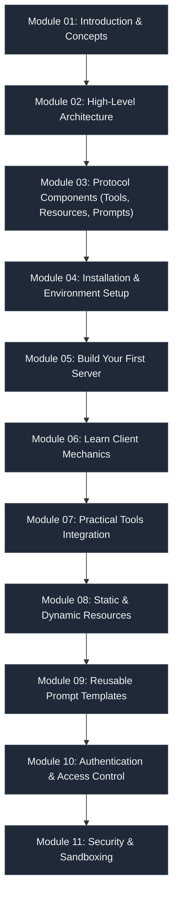

# 🌐 Model Context Protocol (MCP) Learning Path

> A comprehensive, hands-on developer guide to mastering the Model Context Protocol (MCP). Learn how to bridge Large Language Models with databases, local file systems, REST APIs, and third-party SaaS services.

---

## 🚀 Welcome to the MCP Learning Path

The **Model Context Protocol (MCP)** is an open standard designed by Anthropic to establish a universal communication layer between **Large Language Models (LLMs)** and external systems. 

Historically, connecting AI models to custom databases, private APIs, and developer tools required writing custom integrations for each and every model-tool pair. This led to high maintenance costs and poor interoperability. **MCP acts as the USB-C standard for AI applications**, defining a common protocol for tool discovery, resource sharing, dynamic prompting, and secure context transfer.

This learning path is structured to take you from a conceptual understanding of MCP all the way to building production-ready MCP Servers and Clients.

---

## 🗺️ Learning Path Curriculum

| Module | Title | Focus | Key Topics | Links |
| :--- | :--- | :--- | :--- | :--- |
| **01** | **Introduction** | Conceptual Foundations | What is MCP, History, Evolution, AI Tool Calling, Agents & Context | [Overview](./Module%2001%20Introduction/00%20Overview.md) \| [What is MCP](./Module%2001%20Introduction/01%20What%20is%20MCP.md) \| [Architecture](./Module%2001%20Introduction/02%20MCP%20Architecture.md) \| [Official Resources](./Module%2001%20Introduction/08%20Official%20Resources.md) |
| **02** | **MCP Architecture** | High-Level Design | Clients, Servers, Hosts, STDIO/HTTP/WebSocket Transports, JSON-RPC 2.0 | [Architecture Guide](./Module%2002%20-%20MCP%20Architecture/README.md) |
| **03** | **MCP Components** | Core Protocol Mechanics | Tools, Resources, Prompts, Sampling, and Logging | [Components Guide](./Module%2003%20-%20MCP%20Components/README.md) |
| **04** | **Installation** | Environment Setup | Python, TypeScript, Docker, VS Code, Claude Desktop, Cursor, OpenAI Setup | [Installation Guide](./Module%2004%20-%20Installation/Installation.md) |
| **05** | **Setting Up Your First MCP Server** | Hands-On Implementation | Building an MCP Server from scratch, registering tools/resources, testing | [First Server Guide](./Module%2005%20-%20Setting%20Up%20Your%20First%20MCP%20Server/README.md) |
| **06** | **MCP Client** | Client-Side Mechanics | Client Responsibilities, Lifecycle, Discovery, execution & TypeScript/Python | [Client Guide](./Module%2006%20-%20Client/README.md) |
| **07** | **MCP Tools** | Practical Tool Implementations | Real-world servers: Calculator, Weather, SQLite, GitHub, Slack, Notion | [Tools Directory](./Module%2007%20-%20Tools/README.md) |
| **08** | **Resources** | Static & Dynamic Resources | Expose resources: PDF, CSV, JSON, Image, Markdown, Database examples | [Resources Directory](./Module%2008%20-%20Resources/README.md) |
| **09** | **Prompt Templates** | Reusable AI Prompts | Code Review, PR Review, Summarizer, Meeting Notes, Research Assistant templates | [Prompts Directory](./Module%2009%20-%20Prompt%20Templates/README.md) |
| **10** | **Authentication** | Access Control & Credentials | API Keys, OAuth, JWT, Secrets, Environment Variables | [Authentication Directory](./Module%2010%20-%20Authentication/README.md) |
| **11** | **Security** | Safe Execution & Safety | Permissions, Validation, Sandboxing, Safe Tool Execution, Secret Management | [Security Directory](./Module%2011%20-%20Security/README.md) |

---

## 📊 Visual Learning Roadmap



---

## 🛠️ Stack & Technologies Covered

- **Languages:** Python (FastMCP, `mcp`), TypeScript (`@modelcontextprotocol/sdk`)
- **Transport Protocols:** STDIO (Standard I/O), HTTP, WebSockets, Streamable HTTP
- **Communication Protocol:** JSON-RPC 2.0
- **Deployment & Environments:** Docker, VS Code, Claude Desktop, Cursor AI IDE, OpenAI
- **External Integrations:** Filesystem, SQLite Databases, GitHub API, Email, Slack Webhooks, Notion, Google Drive, Google Calendar

---

## 💡 Key Conceptual Model

```
       ┌────────────────────────┐
       │   User / Host (IDE)    │
       └───────────┬────────────┘
                   │
                   ▼
       ┌────────────────────────┐
       │       MCP Client       │
       └───────────┬────────────┘
                   │  JSON-RPC 2.0 (STDIO / WebSockets)
                   ▼
       ┌────────────────────────┐
       │       MCP Server       │
       └───────┬───┬───┬────────┘
               │   │   │
     ┌─────────┘   │   └─────────┐
     ▼             ▼             ▼
┌─────────┐   ┌─────────┐   ┌─────────┐
│  Tools  │   │Resources│   │ Prompts │
└─────────┘   └─────────┘   └─────────┘
```

---

## ⚡ Quick Start

To check your environment readiness and run your first MCP server:

### 1. Verify Prerequisites
Make sure you have Node.js and Python installed:
```bash
python --version
node --version
```

### 2. Run the Demo Calculator Server (TypeScript)
Navigate to Module 07, install dependencies, and build:
```bash
cd "Module 07 - Tools/01-Calculator/TypeScript"
npm install
npm run build
```

### 3. Connect to Claude Desktop or Cursor
To test local servers, add them to your client configuration file (e.g., `claude_desktop_config.json`):
```json
{
  "mcpServers": {
    "calculator": {
      "command": "node",
      "args": ["C:/path/to/Module 07 - Tools/01-Calculator/TypeScript/dist/server.js"]
    }
  }
}
```

---

> [!NOTE]
> Detailed tutorials and code templates are provided within each module. Follow the links in the curriculum table to dive into the specific guides!
